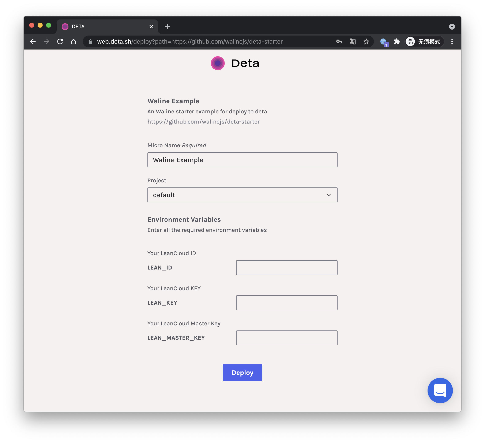
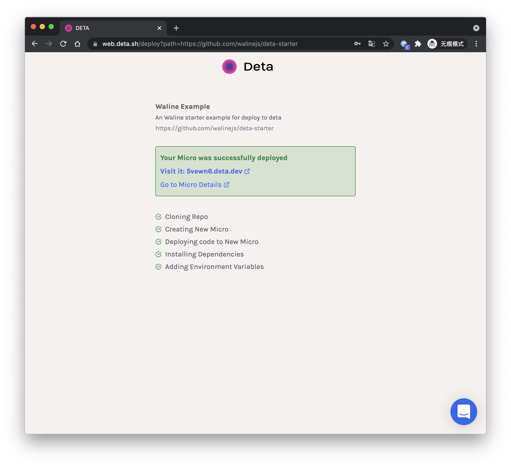
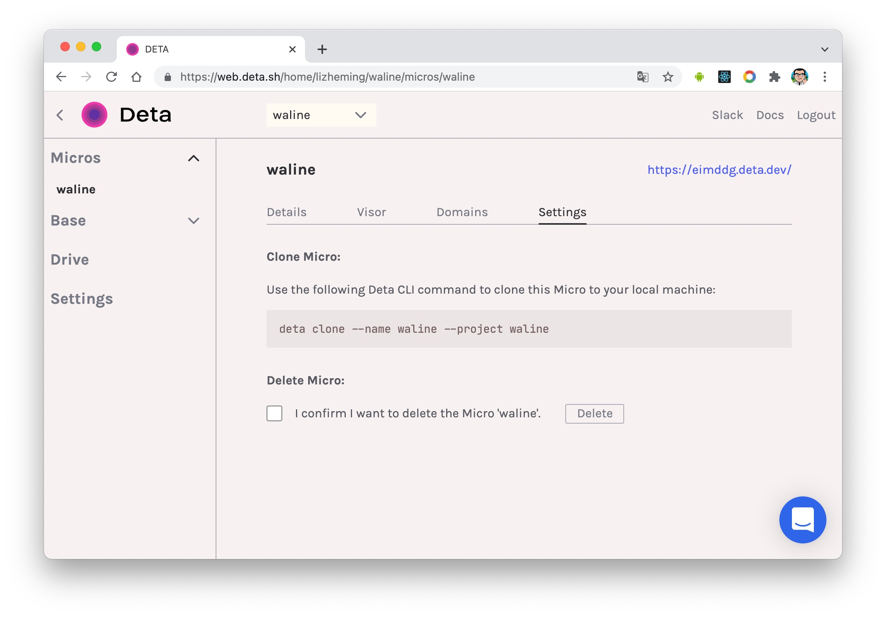

# Deta deployment

[Deta](https://www.deta.sh/) is a free Serverless platform, we can deploy Waline to Deta platform easily.

[](https://go.deta.dev/deploy?repo=https://github.com/walinejs/deta-starter)

Click this button and it'll redirect to deta platform to quickly deploy. You need select your deploy project and environment variables after login.



When everything is ok, just click <kbd>Deploy</kbd> button. It'll deploy successful after a moment. Then deta will show you deploy site url. Copy the site url and input it into client `serverURL` configuration. Then you can enjoy waline!



## How to update

Deta uses CLI command line tools to manage projects. Follow the [documentation](https://docs.deta.sh/docs/cli/install) guide to install Deta's command line tools.

```sh
# Mac or Linux
curl -fsSL https://get.deta.dev/cli.sh | sh

# Windows for powershell
iwr https://get.deta.dev/cli.ps1 -useb | iex
```

After installation, we use `deta login` to log in to the command line, during which a browser will be opened for login.

We need to clone the project before updating. Enter the setting page of our project, copy and execute the `deta clone` command on the page, and the project will be downloaded after a while.



After that, we can modify the project code locally, for example, modify the dependency version in `package.json` to the latest.

Finally, we can use the `deta deploy` command in the command line to implement the update deployment of the website.

## How to modify environment variables

Modifying environment variable also requires the CLI to operate.

After clone the project to the local according to the steps before said. Then add a `.env` file to the project, and write the environment variables that need to be modified in the file line by line in the form of `VAR_NAME=VALUE`. Finally, use `deta update -e .env` to complete the environment variable update.

For details, please refer to [Deta Environment Variables Documentation](https://docs.deta.sh/docs/micros/env_vars#setting-environment-variables).
