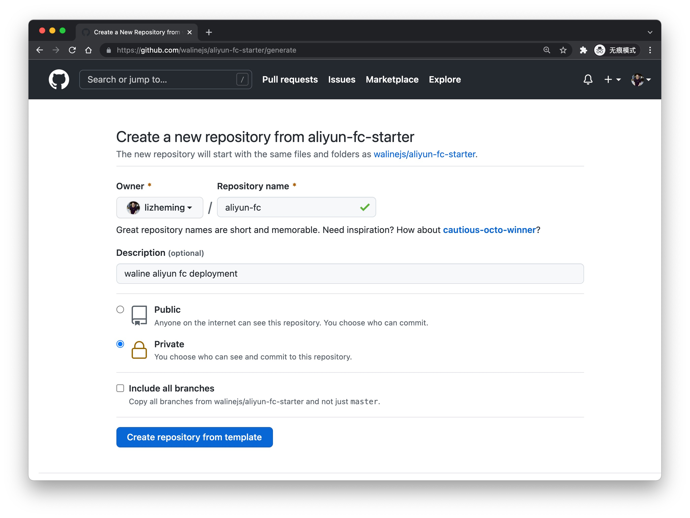
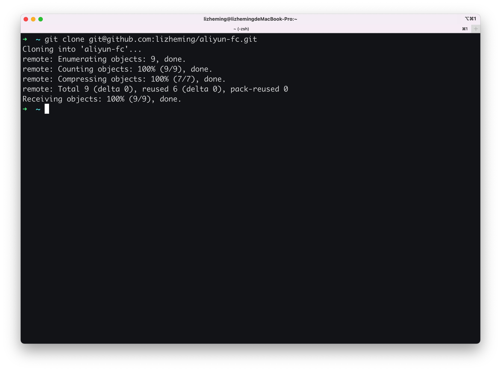
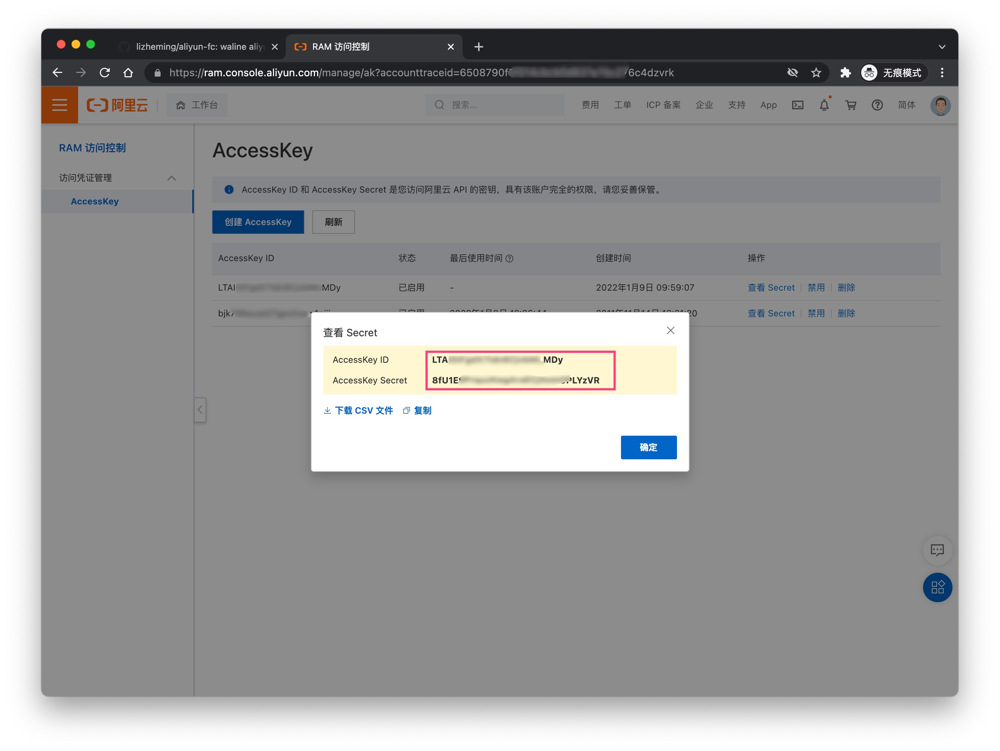
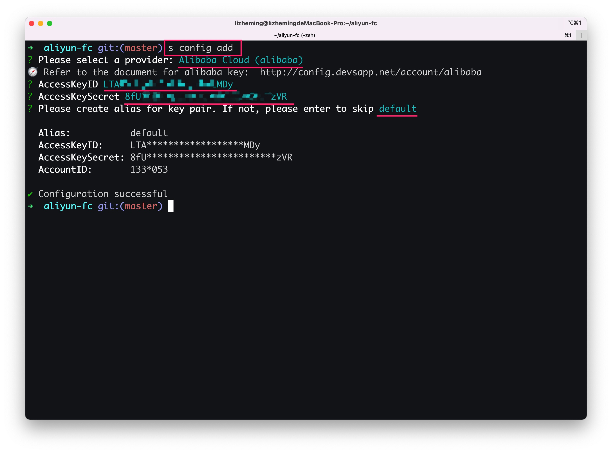
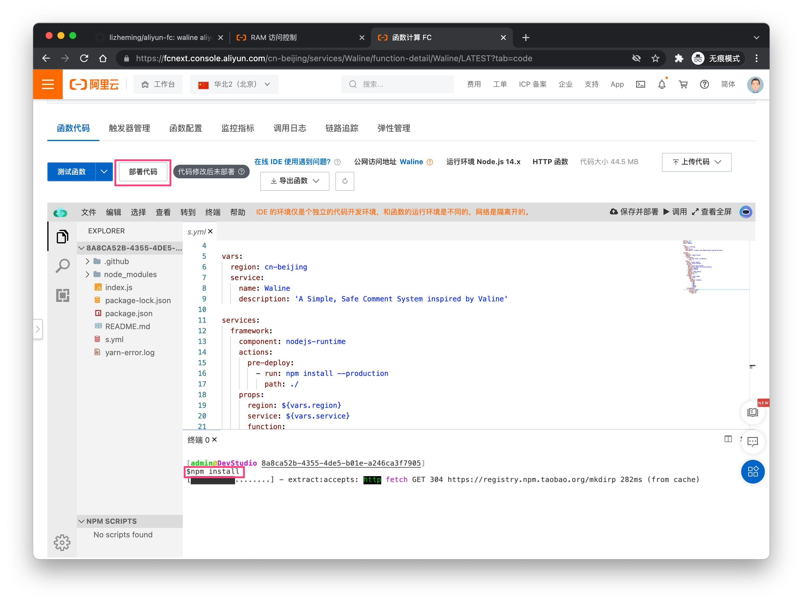

# 阿里云函数计算部署

[阿里云函数计算](https://fc.console.aliyun.com/) 是阿里云推出的 Serverless 平台。我们可以快速的将 Waline 部署到阿里云函数计算平台上。

## 如何部署

1. [aliyun-fc-starter](https://github.com/walinejs/aliyun-fc-starter/generate) 访问该地址基于官方模板创建仓库并将其克隆下来
     
   
2. 全局安装 Serverless Devs 开发者工具 `npm install -g @serverless-devs/s`
   
3. https://ram.console.aliyun.com/manage/ak 访问该网址获取到你账户的一对密钥，使用 s 命令添加。
   
   
4. 进入目录后执行 `s deploy` 稍待片刻后完成一次部署，此时控制台中红框展示的地址即为你最终的 serverURL
   
5. 点击“[编辑环境变量](https://fcnext.console.aliyun.com/cn-beijing/services/Waline/function-detail/Waline/LATEST?tab=config)”更新我们需要添加的环境变量并点击底部的保存按钮
   
6. 点击“[代码编辑](https://fcnext.console.aliyun.com/cn-beijing/services/Waline/function-detail/Waline/LATEST?tab=code)”进入编辑页，在编辑器底部的控制台中输入 `npm install` 安装依赖。安装完成之后点击顶部的<kbd>部署</kbd>按钮重新部署
   

至此就完成了部署，第四步中返回的地址即为你的部署地址。

## 如何更新

点击“[编辑环境变量](https://fcnext.console.aliyun.com/cn-beijing/services/Waline/function-detail/Waline/LATEST?tab=config)”更新我们需要添加的环境变量并点击底部的保存按钮

## 如何修改环境变量

点击“[代码编辑](https://fcnext.console.aliyun.com/cn-beijing/services/Waline/function-detail/Waline/LATEST?tab=code)”进入编辑页，在编辑器底部的控制台中输入 `npm install` 安装依赖。安装完成之后点击顶部的<kbd>部署</kbd>按钮重新部署

