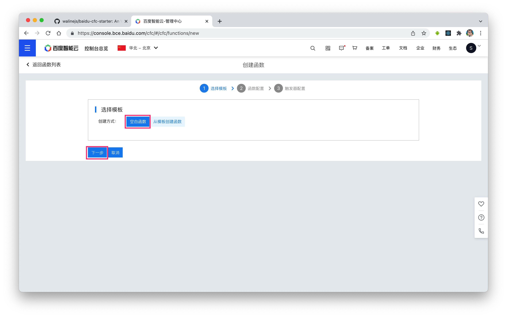
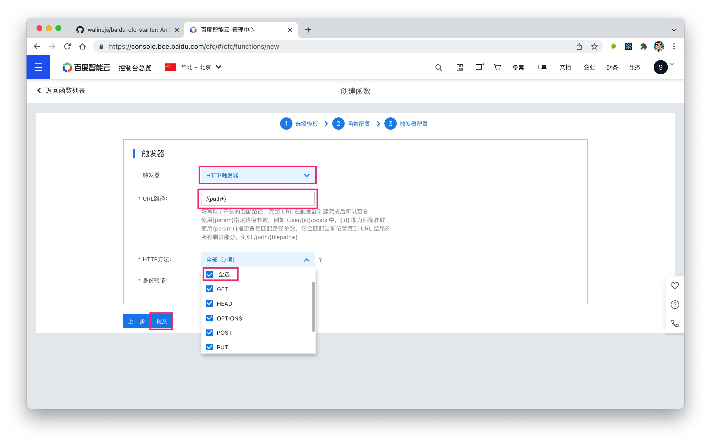
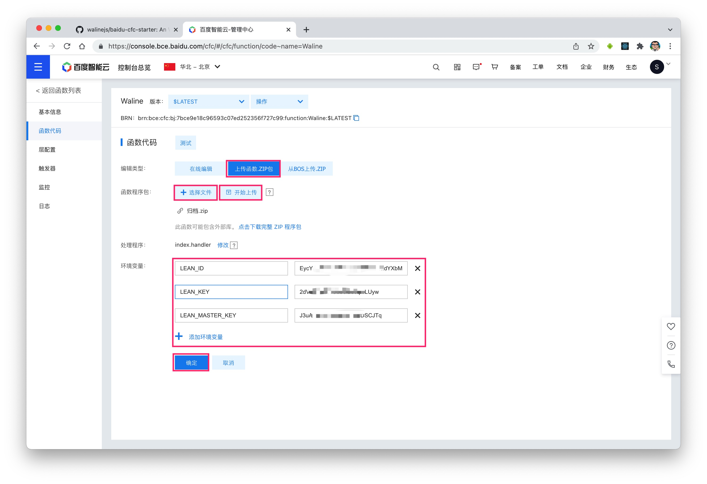
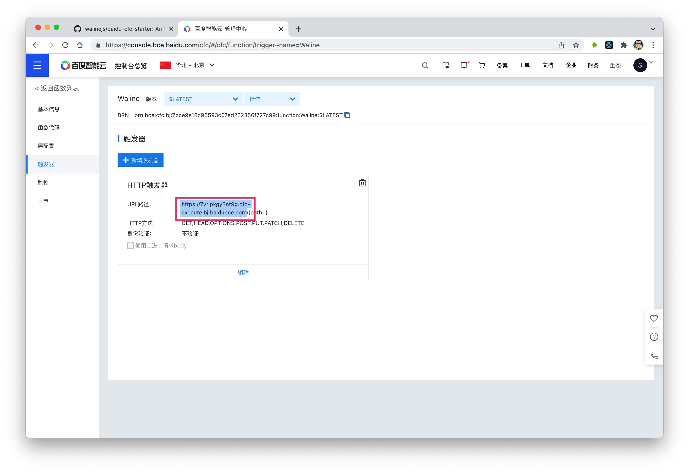

# 百度云函数计算部署

[百度云函数计算](https://console.bce.baidu.com/cfc/#/cfc/functions) 是百度云推出的 Serverless 平台。我们可以快速的将 Waline 部署到百度云函数计算平台上。

## 如何部署

1. Clone 该项目 <https://github.com/walinejs/baidu-cfc-starter>
   
2. 进入目录后执行 `npm install` 安装依赖
   
3. 安装依赖后进入目录全选所有文件后选择压缩，生成 zip 压缩包待后续使用
   
4. 进入[百度云函数计算](https://console.bce.baidu.com/cfc/#/cfc/functions)，选择<kbd>创建函数</kbd>
   
5. 选择<kbd>空白函数</kbd>后点击<kbd>下一步</kbd>
   
6. 输入函数名称，运行时选择 `Node.js 12`，超时时间设置为 300 秒后点击<kbd>下一步</kbd>
   
7. 触发器选择“HTTP 触发器”，URL 路径填写 `/{path+}`，HTTP 方法全选后点击<kbd>提交</kbd>
   
8. 稍待片刻页面会提示函数创建成功，此时点击“进度代码编辑页”准备部署代码
   
9. 编辑类型选择 <kbd>上传函数.ZIP 包</kbd>，点击<kbd>选择文件</kbd>按钮后选择之前已经打包好的 .zip 包代码，点击<kbd>开始上传</kbd>。

   环境变量中输入你想要配置的环境变量，下图的示例是配置 LeanCloud 存储服务环境变量。

   最后点击<kbd>确定</kbd>按钮完成代码部署。

   

10. 部署完毕后点击左侧的 <kbd>触发器</kbd> 菜单，图中的“URL 路径”处的地址即为你最终的服务地址。下图中的地址为 <https://7vrjpkgy3nt9g.cfc-execute.bj.baidubce.com>。
    

## 如何更新

点击左侧菜单的“函数代码”可以进行在线编辑，编辑完成之后点保存即可完成部署。

## 如何修改环境变量

点击左侧菜单的“函数代码”可以在代码编辑页面底部进行环境变量的管理，保存后会立即生效。

