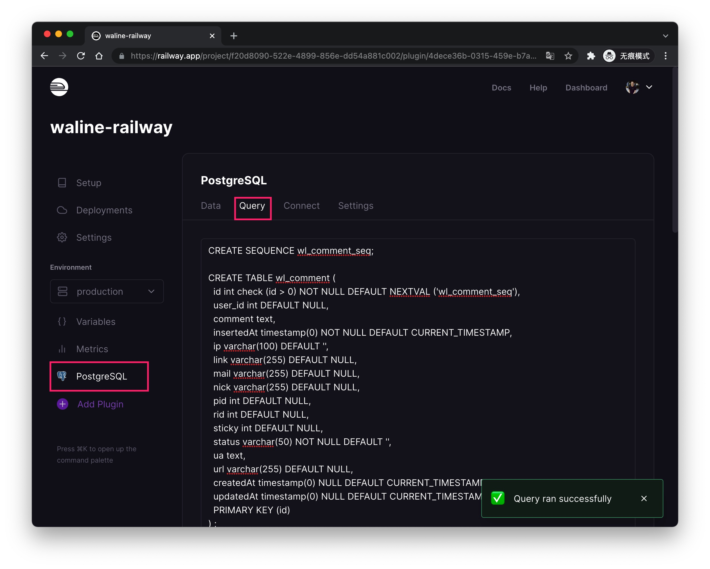
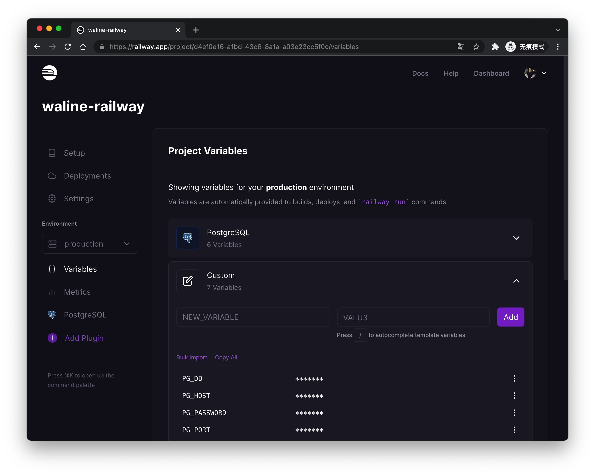

[Railway](https://railway.app/) 是一个可免费使用的 Serverless 部署平台。我们可以快速的将 Waline 部署到 Railway 平台上。

[](https://railway.app/new/template?template=https%3A%2F%2Fgithub.com%2Fwalinejs%2Frailway-starter&plugins=postgresql&envs=PG_HOST%2CPG_PORT%2CPG_USER%2CPG_PASSWORD%2CPG_DB%2CPG_PREFIX%2CPORT&referralCode=lizheming&PG_HOSTDefault=%24%7B%7B+PGHOST+%7D%7D&PG_HOSTDesc=Don%27t+modify+it&PG_PORTDefault=%24%7B%7B+PGPORT+%7D%7D&PG_PORTDesc=Don%27t+modify+it&PG_USERDefault=%24%7B%7B+PGUSER+%7D%7D&PG_USERDesc=Don%27t+modify+it&PG_PASSWORDDefault=%24%7B%7B+PGPASSWORD+%7D%7D&PG_PASSWORDDesc=Don%27t+modify+it&PG_DBDefault=%24%7B%7B+PGDATABASE+%7D%7D&PG_DBDesc=Don%27t+modify+it&PG_PREFIXDefault=wl_&PG_PREFIXDesc=Don%27t+modify+it&PORTDefault=3000&PORTDesc=Don%27t+modify+it)

点击上方按钮，跳转至 Railway 平台快速部署。登录之后会让你选择新建仓库的名称，环境变量部分不需要改动，直接点击下方的 <kbd>Deploy</kbd> 按钮进行部署即可。

进入管理界面后，选择 <kbd>PostgreSQL</kbd> - <kbd>Query</kbd>，将 [waline.pgsql](https://github.com/walinejs/waline/blob/main/assets/waline.pgsql) 中的内容粘贴至输入框中，点击底部的 <kbd>Run Query</kbd> 按钮完成数据库的初始化。

最后在 <kbd>Deployments</kbd> - <kbd>Domains</kbd> 中就可以获取到访问的地址了。

## 如何更新

进入到 GitHub 仓库中，修改 package.json 文件中的 `@waline/vercel` 版本号为最新版本即可。

## 如何修改环境变量

可以通过 <kbd>Variables</kbd> Tab 进入环境变量管理页，修改完成之后会自动重新部署。

