Willkommen bei Waline. In nur wenigen Schritten können Sie Waline aktivieren, um Kommentare und Seitenaufrufe auf Ihrer Website bereitzustellen.

<!-- more -->

## Server-Bereitstellung

[](https://vercel.com/new/clone?repository-url=https%3A%2F%2Fgithub.com%2Fwalinejs%2Fwaline%2Ftree%2Fmain%2Fexample)

1. Klicken Sie auf die Schaltfläche oben, um zu Vercel zu gehen und den Server bereitzustellen.

   ::: note

   Wenn Sie nicht angemeldet sind, fordert Vercel Sie auf, sich zu registrieren oder anzumelden. Bitte verwenden Sie Ihr GitHub-Konto für eine schnelle Anmeldung.

   :::

1. Geben Sie einen Vercel-Projektnamen ein, der Ihnen gefällt, und klicken Sie auf `Create`, um fortzufahren:

   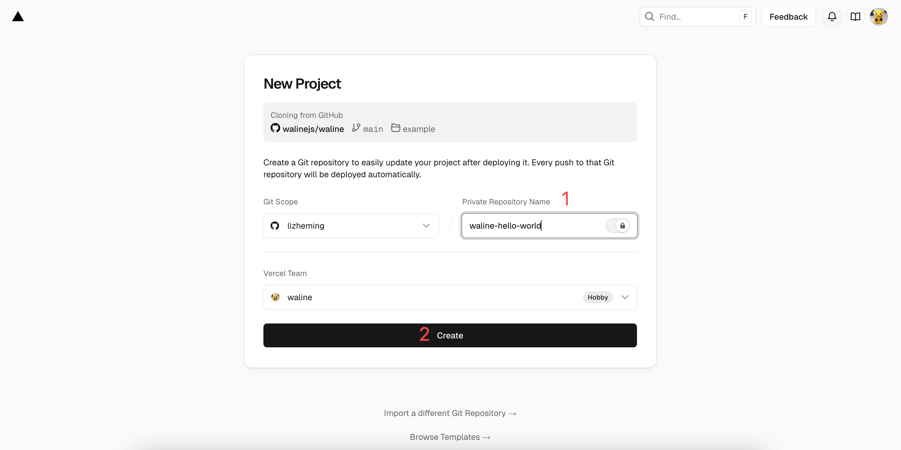

1. Vercel wird nun ein neues Repository basierend auf der Waline-Vorlage erstellen und initialisieren. Der Repository-Name wird der soeben eingegebene Projektname sein.

   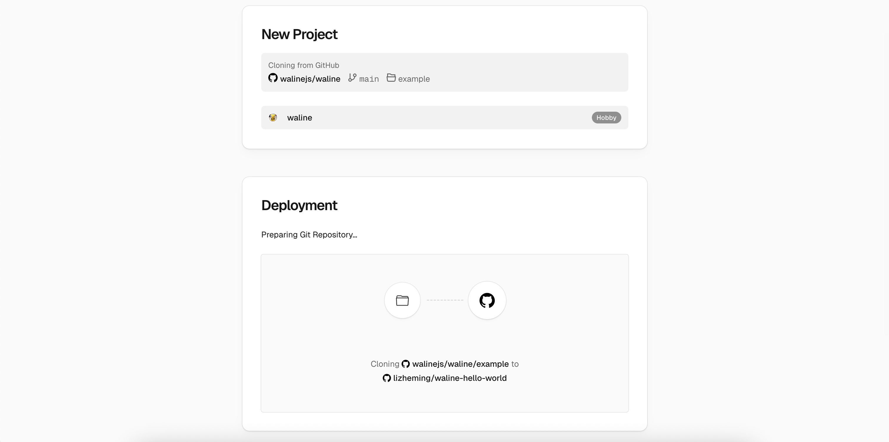

   Nach ein oder zwei Minuten erscheint Feuerwerk auf dem Bildschirm, um eine erfolgreiche Bereitstellung zu feiern. Klicken Sie auf `Go to Dashboard`, um zum Anwendungs-Dashboard zu springen.

   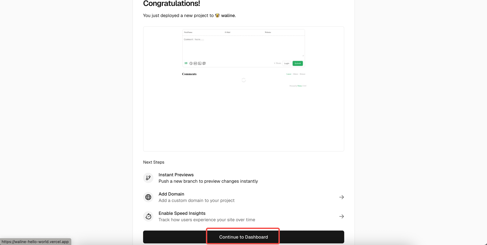

## Datenbank erstellen

1. Klicken Sie oben auf `Storage`, um zur Speicherkonfigurationsseite zu gelangen, und wählen Sie dann `Create Database`. Wählen Sie `Neon` als `Marketplace Database Providers` und klicken Sie auf `Continue`, um fortzufahren.

   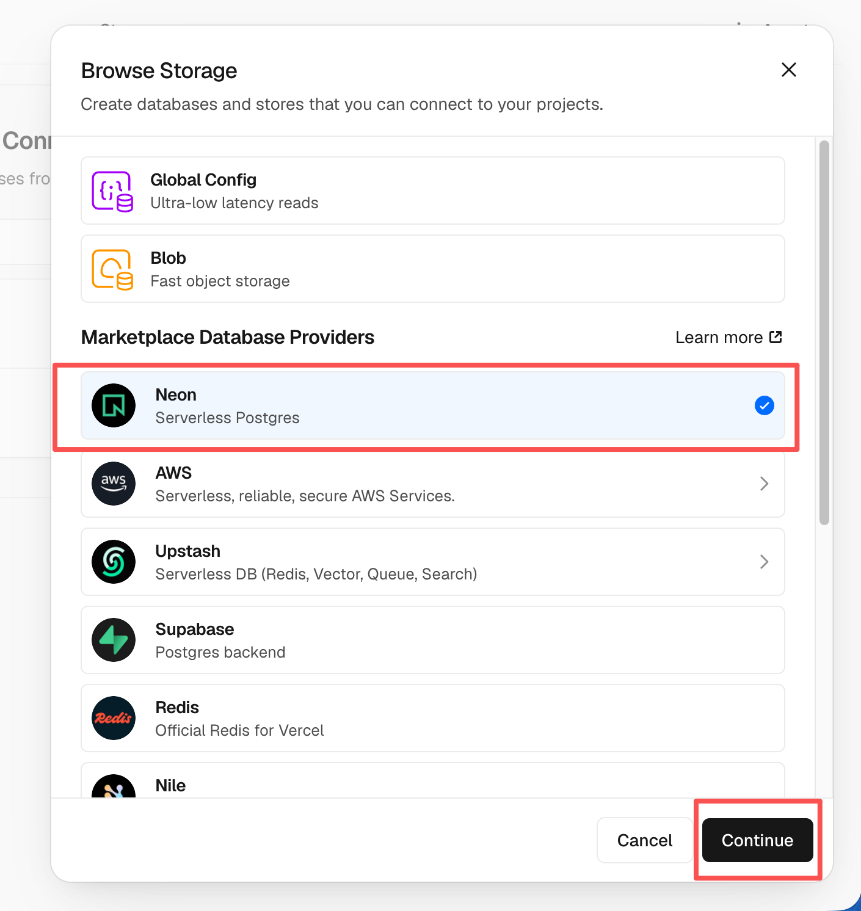

1. Sie werden aufgefordert, ein Neon-Konto zu erstellen. Klicken Sie auf `Accept and Create`, um es zu akzeptieren und zu erstellen. Als Nächstes wählen Sie den Datenbankplan aus, einschließlich Region und Kontingent. Sie können alles als Standard belassen und auf `Continue` klicken.

   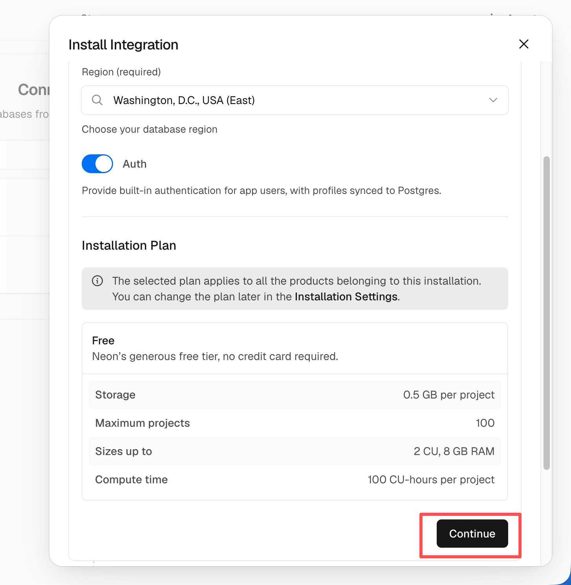

1. Sie werden dann aufgefordert, den Datenbanknamen zu definieren. Sie können ihn auch unverändert lassen und auf `Continue` klicken.

   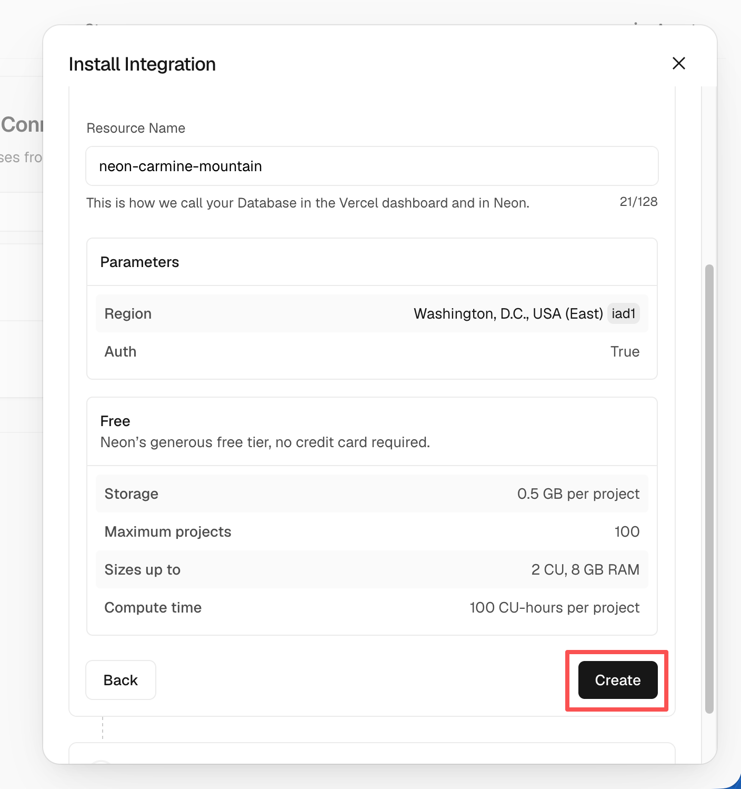

1. Jetzt sollten Sie den soeben erstellten Datenbankdienst unter `Storage` sehen. Klicken Sie darauf und wählen Sie `Open in Neon`, um zu Neon zu springen. Wählen Sie in der Neon-Oberfläche `SQL Editor` aus der linken Seitenleiste, fügen Sie die SQL-Anweisungen aus [waline.pgsql](https://github.com/walinejs/waline/blob/main/assets/waline.pgsql) in den Editor ein und klicken Sie auf `Run`, um die Tabellen zu erstellen.

   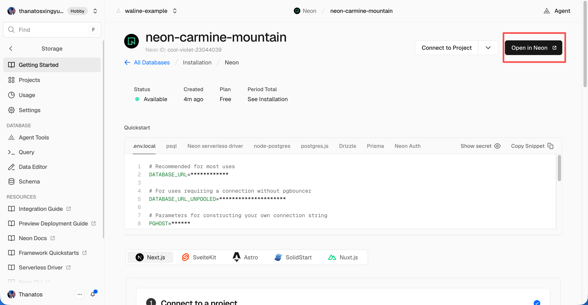

   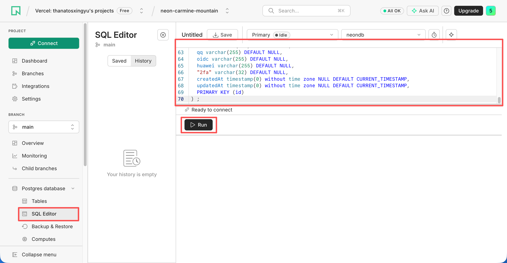

1. Nach kurzer Zeit werden Sie benachrichtigt, dass die Erstellung erfolgreich war. Gehen Sie zurück zu Vercel, klicken Sie oben auf `Deployments` und klicken Sie auf die Schaltfläche `Redeploy` rechts neben der neuesten Bereitstellung. Dieser Schritt stellt sicher, dass der neu konfigurierte Datenbankdienst wirksam wird.

   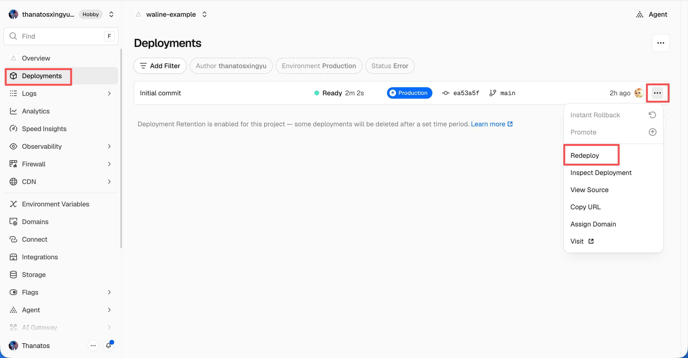

1. Sie werden zur Seite `Overview` weitergeleitet und die Bereitstellung wird gestartet. Nach einem Moment ändert sich der `STATUS` auf `Ready`. Klicken Sie auf `Visit`, um die bereitgestellte Website zu öffnen. Diese URL ist Ihre Serveradresse.

   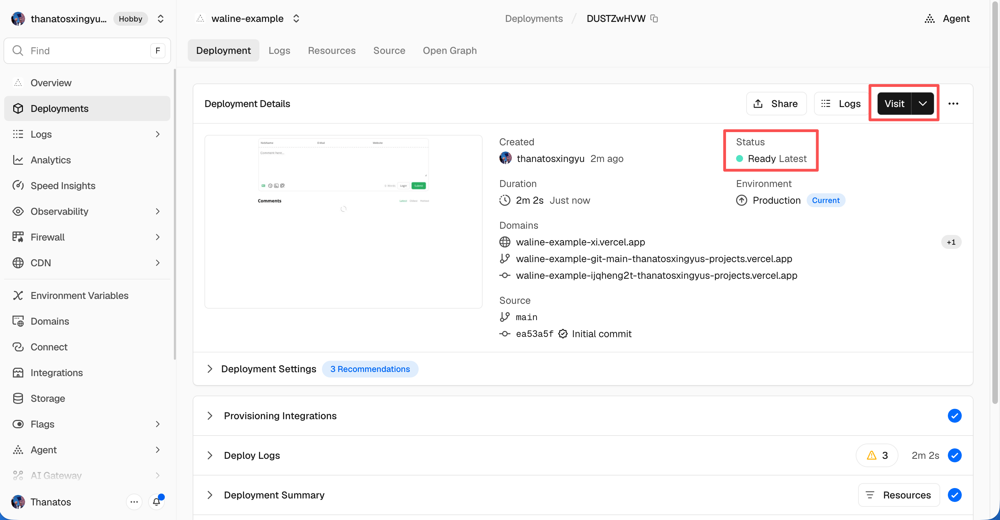

## Benutzerdefinierte Domain binden

1. Klicken Sie oben auf `Settings` → `Domains`, um zur Domain-Konfigurationsseite zu gelangen.

1. Geben Sie die Domain ein, die Sie binden möchten, und klicken Sie auf `Add`.

   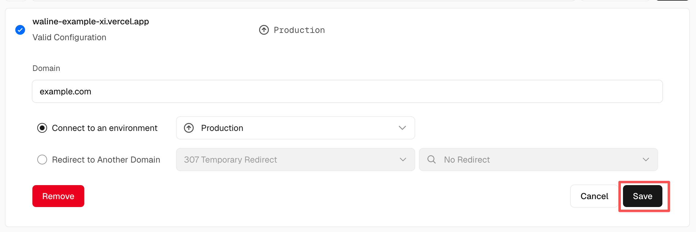

1. Fügen Sie einen neuen `CNAME`-Eintrag bei Ihrem Domain-Anbieter hinzu:

   | Typ   | Name    | Wert                 |
   | ----- | ------- | -------------------- |
   | CNAME | example | cname.vercel-dns.com |

1. Warten Sie, bis der DNS-Eintrag wirksam wird. Sie können dann mit Ihrer eigenen Domain auf Waline zugreifen 🎉
   - Kommentarsystem: example.ihredomain.com
   - Kommentarverwaltung: example.ihredomain.com/ui

   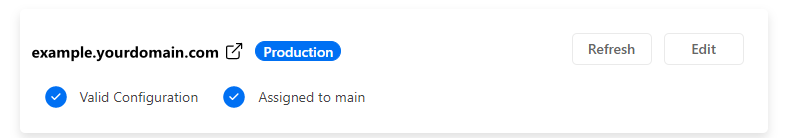

## Import in HTML

So können Sie Waline zu Ihrer Webseite oder Website hinzufügen:

1. Importieren Sie das Stylesheet `https://unpkg.com/@waline/client@v3/dist/waline.css` im `<head>`

1. Erstellen Sie ein `<script>`-Tag und initialisieren Sie mit `init()` von `https://unpkg.com/@waline/client@v3/dist/waline.js`, während Sie die erforderlichen Optionen `el` und `serverURL` übergeben.
   - Die Option `el` ist das Element, das für das Rendering von Waline verwendet wird. Sie können einen CSS-Selektor in Form einer Zeichenfolge oder ein HTMLElement-Objekt festlegen.
   - `serverURL` ist der Link zu Ihrem Bereitstellungsserver, den Sie gerade in Vercel erstellt haben.
   - Für weitere Optionen besuchen Sie die [Seite mit Komponenteneigenschaften](https://waline.js.org/de/reference/client/props.html)

   Hier ist ein Beispiel:

   ```html {3-7,12-18}:line-numbers
   <head>
     <!-- ... -->
     <link rel="stylesheet" href="https://unpkg.com/@waline/client@v3/dist/waline.css" />
   </head>
   <body>
     <!-- ... -->
     <div id="waline"></div>
     <script type="module">
       import { init } from 'https://unpkg.com/@waline/client@v3/dist/waline.js';

       init({
         el: '#waline',
         serverURL: 'https://ihre-domain.vercel.app',
         lang: 'de',
       });
     </script>
   </body>
   ```

1. Der Kommentardienst wird nun erfolgreich auf Ihrer Website ausgeführt :tada:!

## Kommentarverwaltung (Management)

1. Nachdem die Bereitstellung abgeschlossen ist, besuchen Sie bitte `<serverURL>/ui/register`, um sich zu registrieren. Die erste Person, die sich registriert, wird als Administrator festgelegt.

1. Nachdem Sie sich als Administrator angemeldet haben, können Sie auf das Kommentarverwaltungs-Dashboard zugreifen. Sie können Kommentare hier bearbeiten, markieren oder löschen.

1. Benutzer können sich auch über das Kommentarfeld für ein Konto registrieren und werden nach der Anmeldung auf ihre Profilseite weitergeleitet.

## Video-Tutorial

Ein enthusiastischer Waline-Benutzer hat das folgende Video-Tutorial erstellt. Wenn die obigen Anweisungen nicht klar sind, können Sie sich auf das Video beziehen:

<VidStack src="https://www.youtube.com/watch?v=SzEHzsme8uY" />
