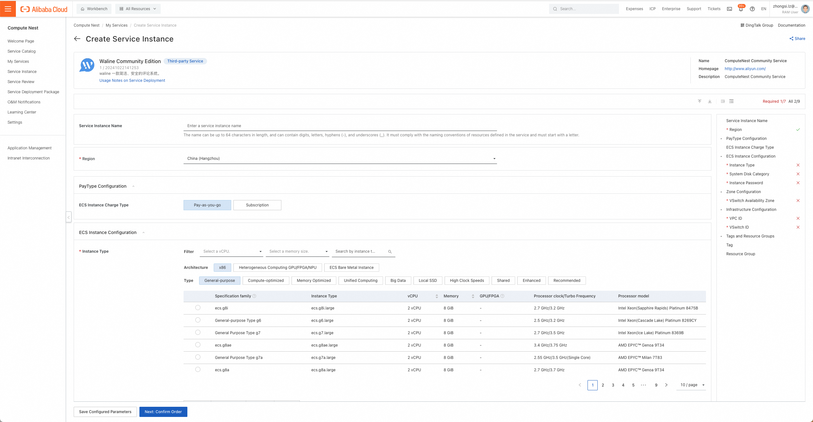
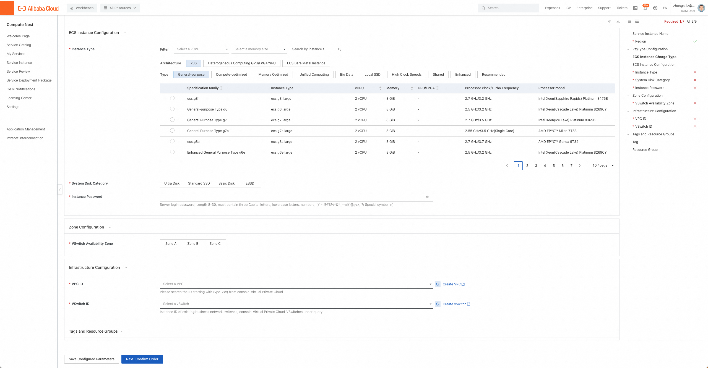
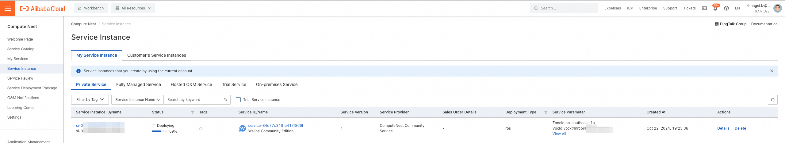

[Compute Nest](https://computenest.console.aliyun.com/) is a Platform as a Service (PaaS) solution Alibaba Cloud provides for service providers and their customers to manage services.

Service providers can publish private services on Compute Nest, and their customers can deploy these services easily. Service providers can also publish fully-managed services where they can implement hosted O&M for the resources of their customers.

Compute Nest provides service capabilities to cater to each stage of the lifecycle management of services. Service providers can manage different stages using different functional modules based on their requirements. This helps service providers improve operational efficiency, reduce operating costs, and provide simple and convenient services for customers.

<!-- more -->

## How to deploy

1. Confirmation before deployment: To deploy a Waline community edition service instance, you need to
   access and create some Alibaba Cloud resources. Therefore, your account must contain permissions for the following
   resources. Description: this permission is required only when your account is a RAM account.

   | Permission Policy Name          | Remark                                                                  |
   | ------------------------------- | ----------------------------------------------------------------------- |
   | AliyunECSFullAccess             | Permissions to manage ECS                                               |
   | AliyunVPCFullAccess             | Permissions to manage a VPC                                             |
   | AliyunROSFullAccess             | Manage permissions for the Resource Orchestration Service (ROS)         |
   | AliyunComputeNestUserFullAccess | Manage user-side permissions for the compute nest service (ComputeNest) |

1. Access the Waline service on Alibaba Compute Nest [Deployment Link](https://computenest.console.aliyun.com/service/instance/create/default?type=user&ServiceName=Waline%20Community%20Edition)，fill in the deployment parameters as prompted
1. Select the payment type, ECS (i.e. cloud server) instance specifications, system disk type, and instance password as needed.
   
1. Select the availability zone where the ECS instance is deployed, and select the VPC (private network) and switch ID where the ECS instance is located. If there are no available VPCs and switches in your account, you can directly jump to the relevant Alibaba Cloud product console to create them by clicking "Create VPC" and "Create vSwitch" in the Compute Nest console. Click Next: Confirm Order.
   
1. After confirming the deployment parameters and reviewing the estimated price, click Create Now.
1. Click the "Service Instance" TAB on the left to enter the service instance list page to view the service instance deployment progress.
   
1. Click the instance ID, enter the details interface, and click "Experience Ip Address" to experience the Waline service.
   
