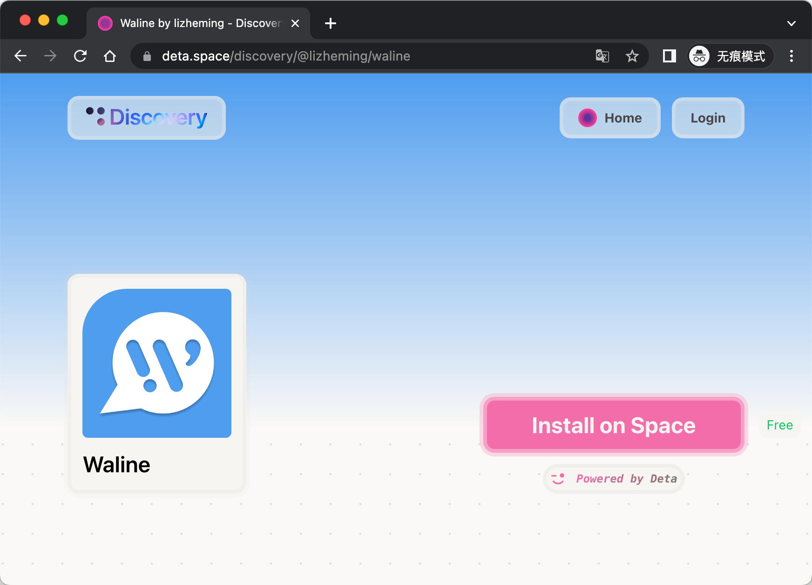
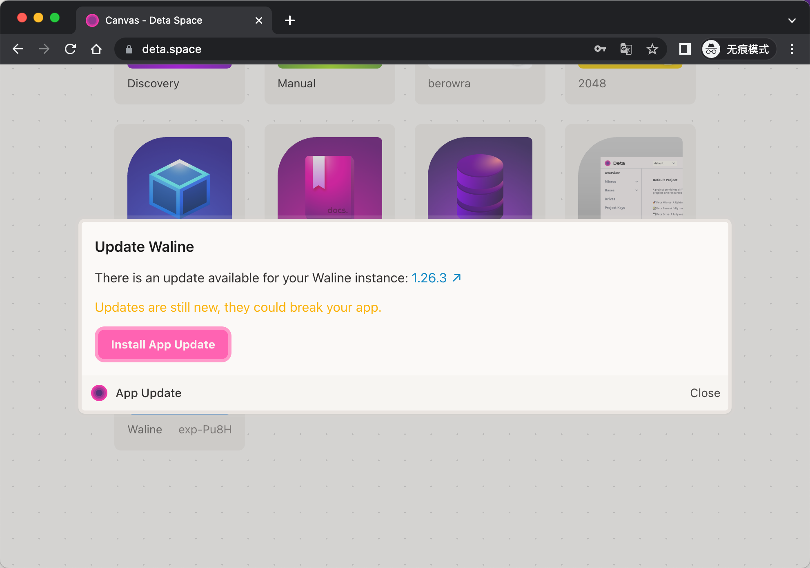
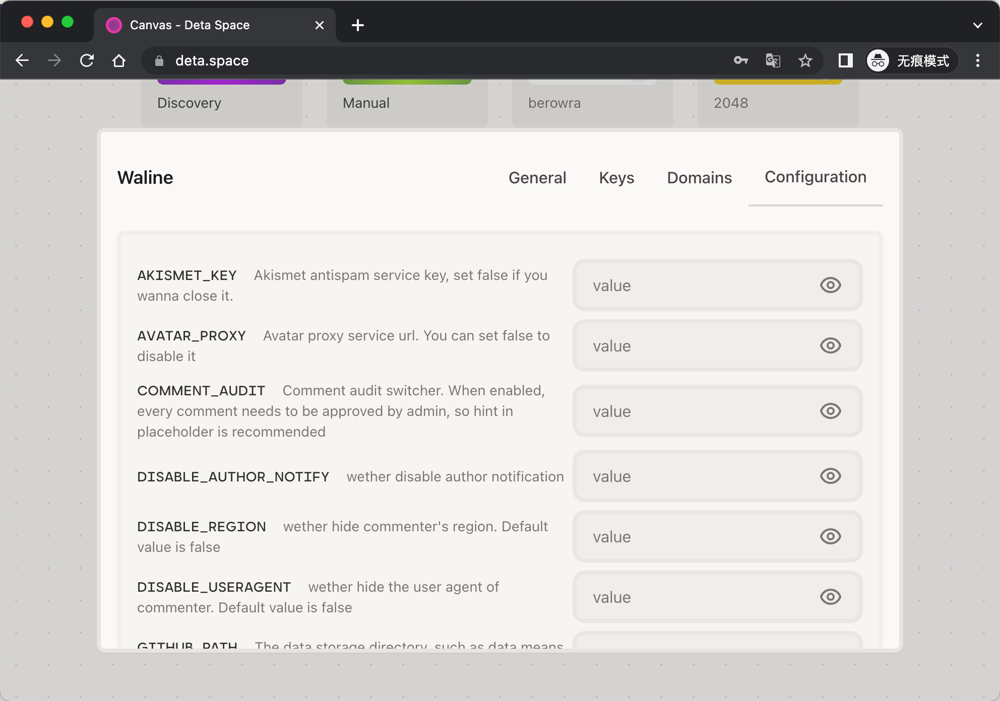

[Deta](https://deta.space/) is a free-to-use serverless deployment platform. We can quickly deploy Waline to the Deta platform.

<!-- more -->

## How to deploy

Click the button above to jump to the Waline page of the Deta application market, click <kbd>Install on Space</kbd> to automatically install the application after logging in.

Wait for a while to see the application on the https://deta.space homepage, and click it to open the deployed website address. Fill it in the `serverURL` configuration of the front-end script to complete the entire configuration.

## How to update

When there is an update, you will see a yellow bubble prompt on your application list page, click More to see the <kbd>Update App</kbd> option.

After clicking, select <kbd>Install App Update</kbd> and wait for a while to update successfully.

## How to modify environment variables

Click <kbd>...</kbd> - <kbd>Settings</kbd> - <kbd>Configuration</kbd> under the application list Waline App to configure all environment variables. After the configuration is complete, click <kbd>Save Changes</kbd> at the bottom to save.

