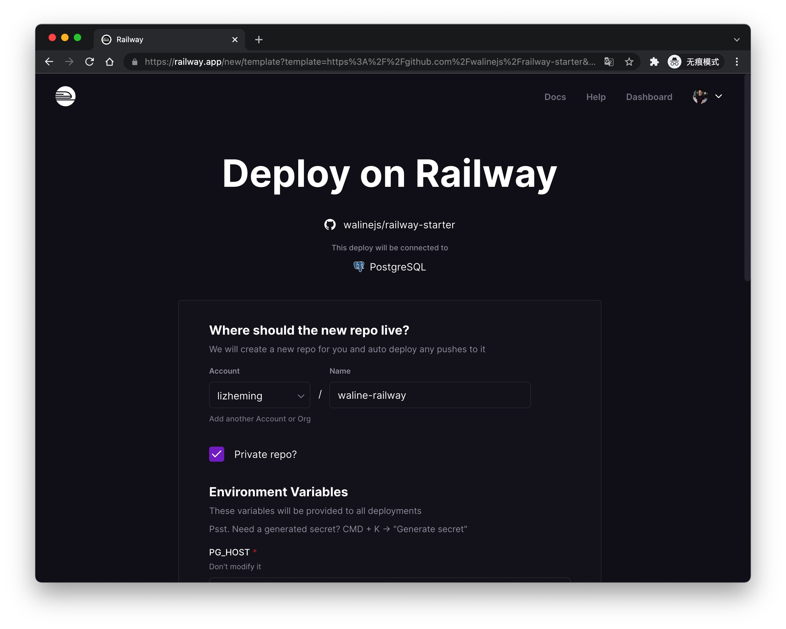

[Railway](https://railway.app/) is a free Serverless platform, we can deploy Waline to Railway platform easily.

<!-- more -->

## How to Deploy

Click this button and it'll redirect to railway.app platform to quickly deploy. You can input your new GitHub repo name or just use default after login, then click <kbd>Deploy</kbd> button at the bottom to deploy. You should notice that the part of environment variables should not be modified.

After a moment you will redirect to dashboard page. Click <kbd>PostgreSQL</kbd> - <kbd>Query</kbd> and paste [waline.pgsql](https://github.com/walinejs/waline/blob/main/assets/waline.pgsql) this file content into textarea, then click <kbd>Run Query</kbd> button at the bottom to initialized database.

At last you can click <kbd>Deployments</kbd> - <kbd>Domains</kbd> to get server URL. Copy the site url and input it into client `serverURL` configuration. Then you can enjoy waline!

## How to Update

Go to the corresponding GitHub repository and modify the version number of `@waline/vercel` in the package.json file to the latest.

## How to Modify Environment Variables

Click <kbd>Variables</kbd> Tab to go to enviroment variables management page. It will deploy automatically after variable was changed.

