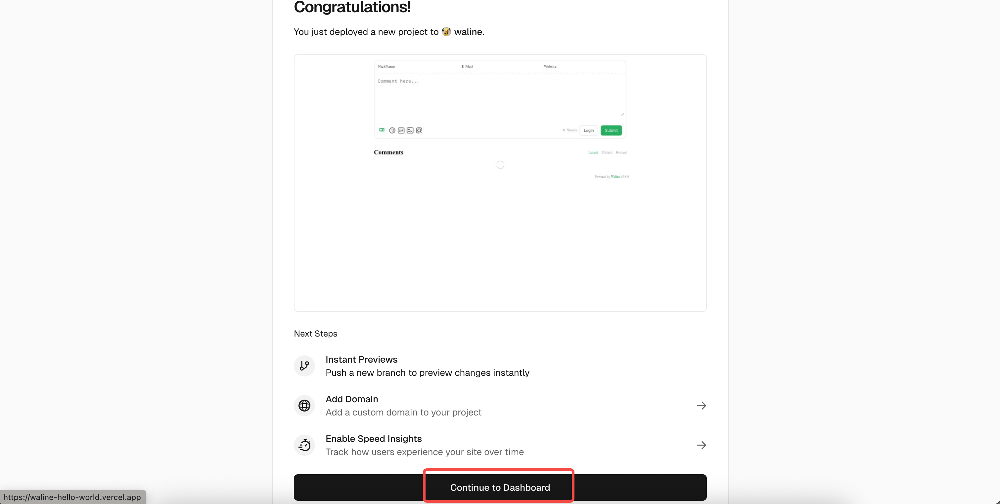
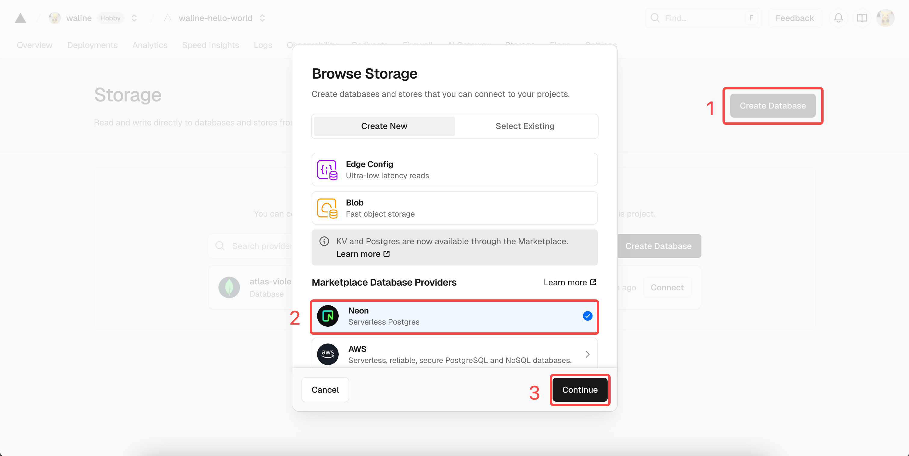
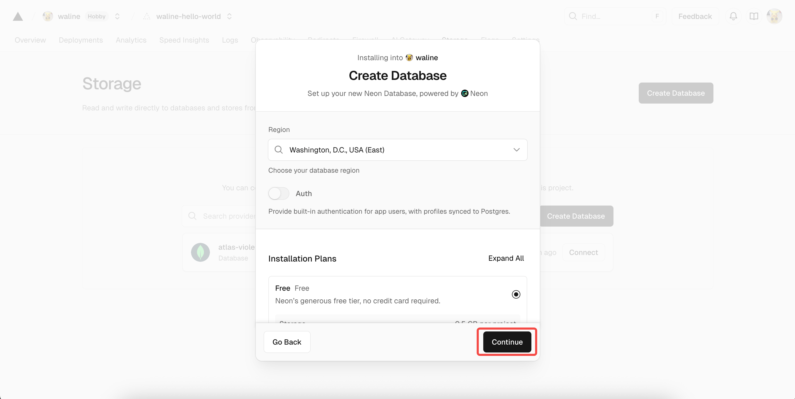
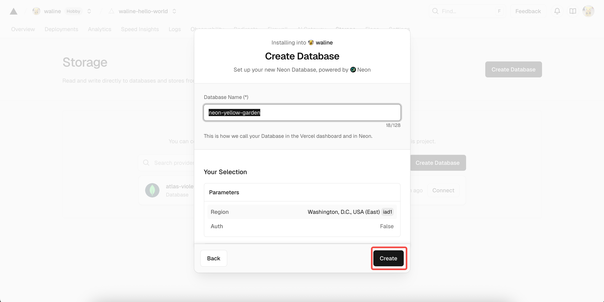
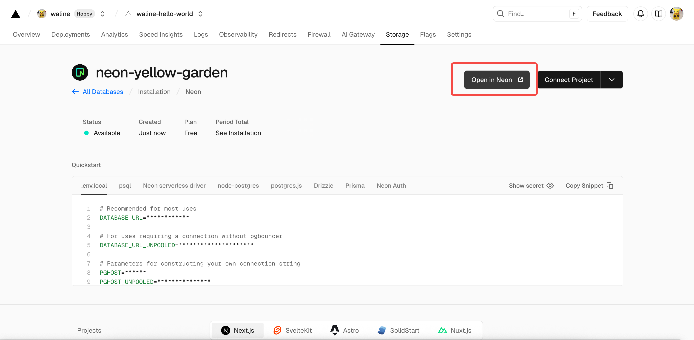
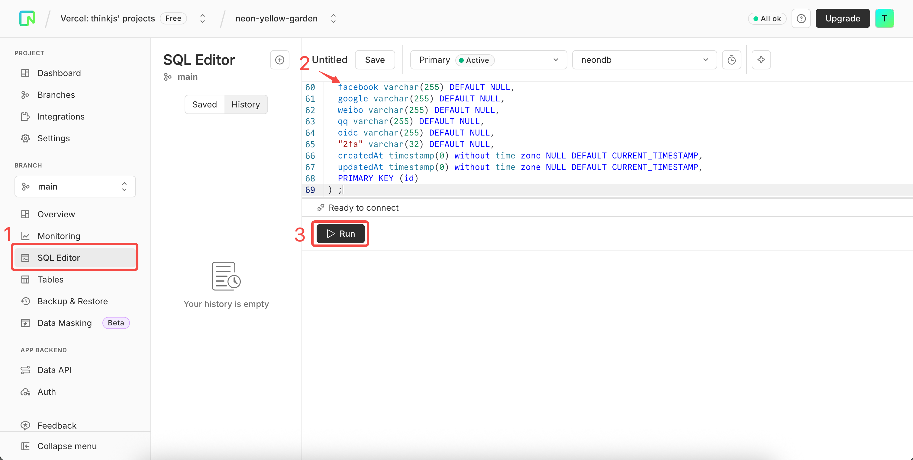
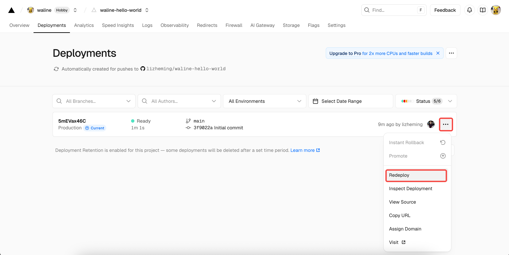

Welcome to Waline. In just a few steps, you can enable Waline to provide comments and pageviews on your website.

<!-- more -->

## LeanCloud settings (Database)

1. [sign in](https://console.leancloud.app/login) or [sign up](https://console.leancloud.app/register) LeanCloud and enter [Console](https://console.leancloud.app/apps).

1. Click [Create app](https://console.leancloud.app/apps) button to create a new app and enter a name you like:

   

1. Enter the app, then select `Settings` > `App Keys` at the left bottom corner. You will see `APP ID`, `APP Key` and `Master Key` of your app. We will use them later

   

## Deploy to Vercel (Server)

[](https://vercel.com/new/clone?repository-url=https%3A%2F%2Fgithub.com%2Fwalinejs%2Fwaline%2Ftree%2Fmain%2Fexample)

1. Click the blue button above, it will redirect you to vercel to deploy with waline template.

   ::: note

   If you haven't logined, we recommend you to sign in with GitHub.

   :::

1. Input your Vercel project name then click `Create`.

   

1. Repo which named you input before will be created and initiallized automatically base on waline example template by Vercel.

   

   After one minute or two, vercel should finish the deployment. Click `Go to Dashboard` button to redirect to your application dashboard.

   

1. Click `Settings` menu on the top, and `Environment Variables` button on the side to go to envrionment variables setting page. Then set `LEAN_ID`, `LEAN_KEY` and `LEAN_MASTER_KEY`. The variables' value should be the ones you got in the previous step. `APP ID` is the value of `LEAN_ID`, and `APP Key` to `LEAN_KEY`, `Master Key` to `LEAN_MASTER_KEY`.

   

1. To let your environment variables setting active, you need redeploy your application. Click `Deployments` menu on the top and find the latest deployment at the top of list, click `Redeploy` button in the right dropdown menu.

   

1. If everything is ok, vercel will redirect to `Overview` page to start redeployment. Wait a moment the `STATUS` will change to `Ready`. Now you can click `Visit` to visit the site. This link is your server address.

   

## Assign Domain (Optional)

1. Click <kbd>Settings</kbd> - <kbd>Domains</kbd> to go to domain setting page.

1. Input domain you want to assign and click <kbd>Add</kbd> button.

   

1. Add a new `CANME` record in your domain service server.

   | Type  | Name    | Value                |
   | ----- | ------- | -------------------- |
   | CNAME | example | cname.vercel-dns.com |

1. You can use your own domain to visit waline comment system after go into effect. :tada:

   - serverURL：example.yourdomain.com
   - admin panel：example.yourdomain.com/ui

   

## Importing in HTML (Client)

Make the following settings on your web page:

1. Use CDN to import Waline:

   - `https://unpkg.com/@waline/client@v2/dist/waline.js`.
   - `https://unpkg.com/@waline/client@v2/dist/waline.css`.

1. Create a `<script>` tag and initialize with `Waline.init()` while passing in the necessary `el` and `serverURL` options.

   - The `el` option is the element used for Waline rendering. You can set a CSS selector in the form of a string or an HTMLElement object.
   - `serverURL` is the link of the server, which you just got.

   ```html {3-7,12-18}:line-numbers
   <head>
     <!-- ... -->
     <script src="https://unpkg.com/@waline/client@v2/dist/waline.js"></script>
     <link
       rel="stylesheet"
       href="https://unpkg.com/@waline/client@v2/dist/waline.css"
     />
     <!-- ... -->
   </head>
   <body>
     <!-- ... -->
     <div id="waline"></div>
     <script>
       Waline.init({
         el: '#waline',
         serverURL: 'https://your-domain.vercel.app',
       });
     </script>
   </body>
   ```

1. The comment service will now run successfully on your website :tada:!

## Comment management (Management)

1. After the deployment is complete, please visit `<serverURL>/ui/register` to register. The first person to register will be set as an administrator.
1. After you log in as administrator, you can see the comment management interface. You can edit, mark or delete comments here.
1. Users can also register their account through comment box, and they will be redirected to their profile page after logging in.
