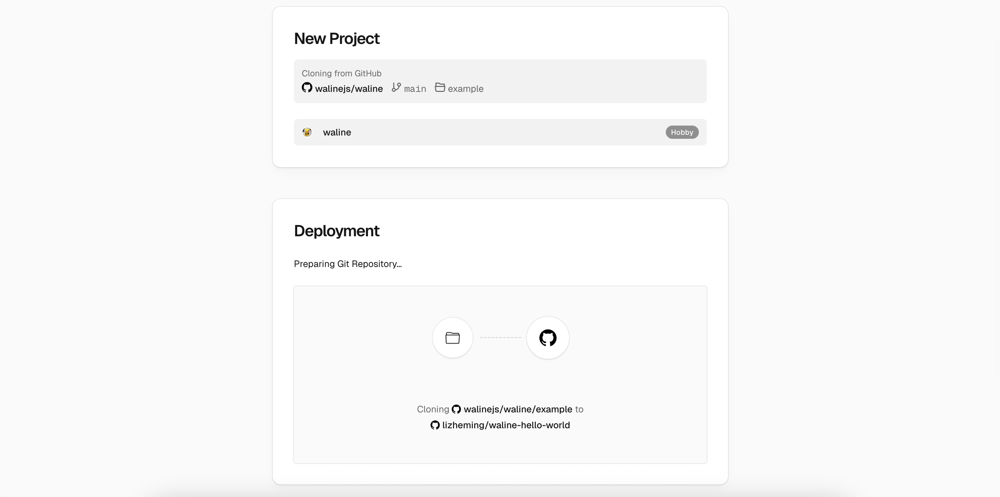
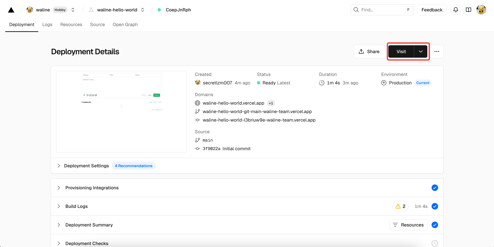
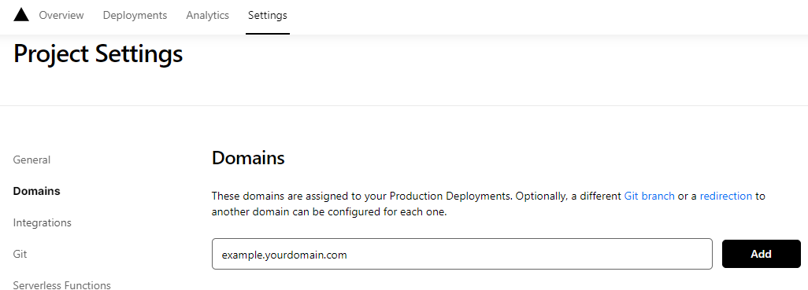

Welcome to Waline. In just a few steps, you can enable Waline to provide comments and pageviews on your site.

<!-- more -->

## Server Deploy

[](https://vercel.com/new/clone?repository-url=https%3A%2F%2Fgithub.com%2Fwalinejs%2Fwaline%2Ftree%2Fmain%2Fexample)

1. Click the button above to go to Vercel and deploy the server.

   ::: note

   If you are not logged in, Vercel will prompt you to sign up or log in. Please use your GitHub account for quick login.

   :::

1. Enter a Vercel project name you like and click `Create` to continue:

   

1. Vercel will now create and initialize a new repository based on the Waline template. The repository name will be the project name you just entered.

   

   After one or two minutes, fireworks will appear on the screen to celebrate a successful deployment. Click `Go to Dashboard` to jump to the application dashboard.

   

## Create a Database

1. Click `Storage` at the top to enter the storage configuration page, then choose `Create Database`. Select `Neon` as the `Marketplace Database Providers`, and click `Continue` to proceed.

   

1. You will be prompted to create a Neon account. Click `Accept and Create` to accept and create it. Next, you will choose the database plan, including region and quota. You can leave everything as default and click `Continue`.

   

1. You will then be asked to define the database name. You can also leave it unchanged and click `Continue`.

   

1. Now you should see the database service you just created under `Storage`. Click it and select `Open in Neon` to jump to Neon. In the Neon interface, choose `SQL Editor` from the left sidebar, paste the SQL statements from [waline.pgsql](https://github.com/walinejs/waline/blob/main/assets/waline.pgsql) into the editor, and click `Run` to create the tables.

   

   

1. After a short while, you will be notified that the creation was successful. Go back to Vercel, click `Deployments` at the top, and click the `Redeploy` button on the right of the latest deployment. This step ensures that the newly configured database service takes effect.

   

1. You will be redirected to the `Overview` page and the deployment will start. After a moment, the `STATUS` will change to `Ready`. Click `Visit` to open the deployed website. This URL is your server address.

   

## Bind a Custom Domain

1. Click `Settings` → `Domains` at the top to enter the domain configuration page.

1. Enter the domain you want to bind and click `Add`.

   

1. Add a new `CNAME` record at your domain provider:

   | Type  | Name    | Value                |
   | ----- | ------- | -------------------- |
   | CNAME | example | cname.vercel-dns.com |

1. Wait for the DNS record to take effect. You can then access Waline using your own domain 🎉
   - Comment system: example.yourdomain.com
   - Comment management: example.yourdomain.com/ui

   

## Importing in HTML

Here is how you can add Waline to your web page or website:

1. Import the stylesheet `https://unpkg.com/@waline/client@v3/dist/waline.css` in the `<head>`

1. Create a `<script>` tag and initialize with `init()` from `https://unpkg.com/@waline/client@v3/dist/waline.js` while passing in the necessary `el` and `serverURL` options.
   - The `el` option is the element used for Waline rendering. You can set a CSS selector in the form of a string or an HTMLElement object.
   - `serverURL` is the link to your deployment server, which you just created in Vercel.
   - For more options, visit the [Component Props page](https://waline.js.org/en/reference/client/props.html)

   Here is an example:

   ```html {3-7,12-18}:line-numbers
   <head>
     <!-- ... -->
     <link rel="stylesheet" href="https://unpkg.com/@waline/client@v3/dist/waline.css" />
   </head>
   <body>
     <!-- ... -->
     <div id="waline"></div>
     <script type="module">
       import { init } from 'https://unpkg.com/@waline/client@v3/dist/waline.js';

       init({
         el: '#waline',
         serverURL: 'https://your-domain.vercel.app',
         lang: 'en',
       });
     </script>
   </body>
   ```

1. The comment service will now run successfully on your website :tada:!

## Comment Management (Management)

1. After the deployment is complete, please visit `<serverURL>/ui/register` to register. The first person to register will be set as an administrator.

1. After you log in as administrator, you'll be able to access the comment management dashboard. You can edit, mark or delete comments here.

1. Users can also register for an account via the comment box, and will be redirected to their profile page after logging in.

## Video Tutorial

An enthusiastic Waline user made the following video tutorial. If the instructions above aren't clear, you can refer to the video:

<VidStack src="https://www.youtube.com/watch?v=SzEHzsme8uY" />
