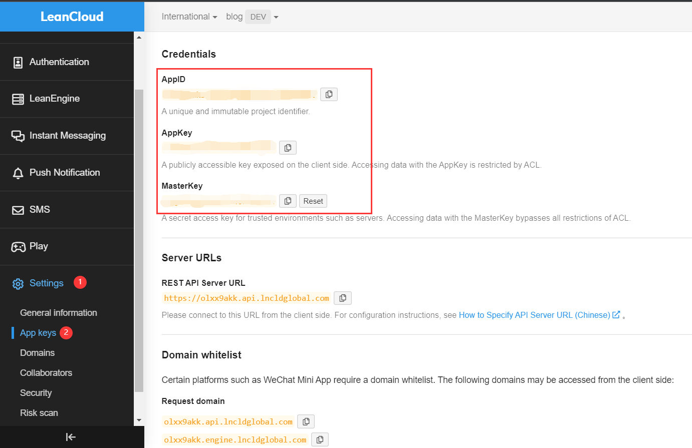

Welcome to Waline. In just a few steps, you can enable Waline to provide comments and pageviews on your site.

<!-- more -->

## LeanCloud Settings (Database)

1. [sign in](https://console.leancloud.app/login) or [sign up](https://console.leancloud.app/register) for LeanCloud and go to the [Console](https://console.leancloud.app/apps).

1. Click the [Create app](https://console.leancloud.app/apps) button to create a new app. Enter the app name of your choice, and select the Developer price plan:

   

1. Enter the app, then select `Settings` > `App Keys` at the left bottom corner. You will see `APP ID`, `APP Key` and `Master Key` for your app. Note these credentials, as you will need them later.

   

## Deploy to Vercel (Server)

[](https://vercel.com/new/clone?repository-url=https%3A%2F%2Fgithub.com%2Fwalinejs%2Fwaline%2Ftree%2Fmain%2Fexample)

1. Click the "Deploy" button above. You will be redirected to Vercel to deploy the Waline template.

   ::: note

   If you haven't logged in, we recommend signing in with GitHub.

   :::

1. Enter a Vercel project name of your choice, then click `Create`.

   

1. Vercel will create a new repository based on the Waline template with the project name you entered earlier.

   

   After a minute or two, Vercel should finish the deployment. Click on the `Go to Dashboard` button to be redirected to your application dashboard.

   

1. Click on your project's `Settings` tab at the top. On the left-hand sidebar, select `Environment Variables` to go to environment variables settings page. You will need to create three new environment variables: `LEAN_ID`, `LEAN_KEY` and `LEAN_MASTER_KEY`. The values of each variables correspond to the credentials saved from LeanCloud: `APP ID` is the value for the `LEAN_ID` variable, `APP Key` for `LEAN_KEY`, and `Master Key` for `LEAN_MASTER_KEY`. You can learn more about [other variables here](https://waline.js.org/en/reference/server/env.html).

   

1. Once the environment variables have been configured, you'll need to redeploy your application. Click on your project's `Deployments` tab at the top, find the latest deployment at the top of list, and select `Redeploy` in the dropdown menu on the right.

   

1. If everything is ok, Vercel will redirect you to the `Overview` page to start redeployment. Wait for the `STATUS` to change to `Ready`. You can now click `Visit` to visit the site. This link is your server address.

   

## Assign Domain (Optional)

1. Go to <kbd>Settings</kbd> > <kbd>Domains</kbd> to go to domain setting page.

1. Enter the domain you want to assign and click the <kbd>Add</kbd> button.

   

1. Add a new `CNAME` record in your domain name service provider.

   | Type  | Name    | Value                |
   | ----- | ------- | -------------------- |
   | CNAME | example | cname.vercel-dns.com |

1. Once that's set, you can visit your new waline comment system using your own domain. :tada:

   - serverURL：example.your-domain.com
   - admin panel：example.your-domain.com/ui

   

## Importing in HTML (Client)

Here is how you can add Waline to your web page or website:

1. Import the stylesheet `https://unpkg.com/@waline/client@v3/dist/waline.css` in the `<head>`

1. Create a `<script>` tag and initialize with `init()` from `https://unpkg.com/@waline/client@v3/dist/waline.js` while passing in the necessary `el` and `serverURL` options.

   - The `el` option is the element used for Waline rendering. You can set a CSS selector in the form of a string or an HTMLElement object.
   - `serverURL` is the link to your deployment server, which you just created in Vercel.
   - For more options, visit the [Component Props page](https://waline.js.org/en/reference/client/props.html)

   Here is an example:

   ```html {3-7,12-18}:line-numbers
   <head>
     <!-- ... -->
     <link
       rel="stylesheet"
       href="https://unpkg.com/@waline/client@v3/dist/waline.css"
     />
   </head>
   <body>
     <!-- ... -->
     <div id="waline"></div>
     <script type="module">
       import { init } from 'https://unpkg.com/@waline/client@v3/dist/waline.js';

       init({
         el: '#waline',
         serverURL: 'https://your-domain.vercel.app',
         lang: 'en',
       });
     </script>
   </body>
   ```

1. The comment service will now run successfully on your website :tada:!

## Comment Management (Management)

1. After the deployment is complete, please visit `<serverURL>/ui/register` to register. The first person to register will be set as an administrator.

1. After you log in as administrator, you'll be able to access the comment management dashboard. You can edit, mark or delete comments here.

1. Users can also register for an account via the comment box, and will be redirected to their profile page after logging in.

## Video Tutorial

An enthusiastic Waline user made the following video tutorial. If the instructions above aren't clear, you can refer to the video:

<VidStack src="https://www.youtube.com/watch?v=SzEHzsme8uY" />
