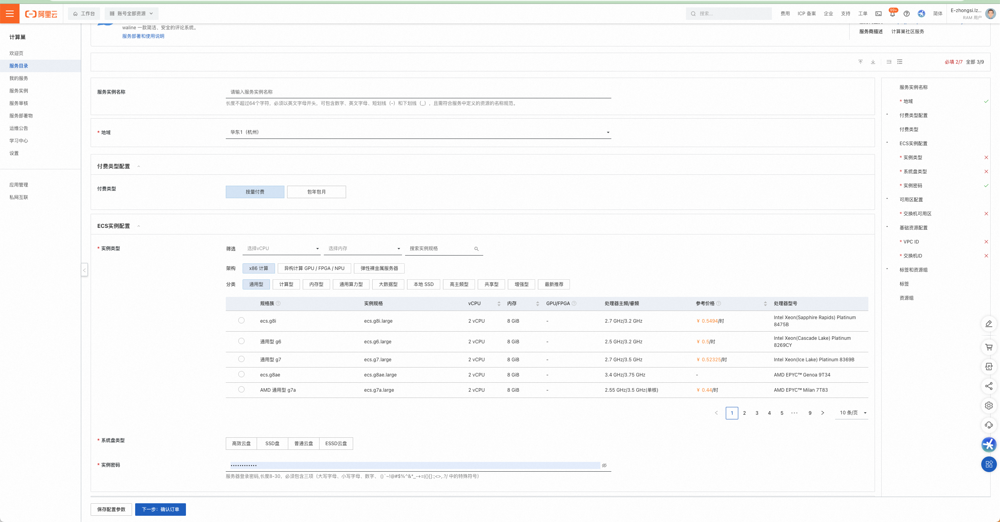
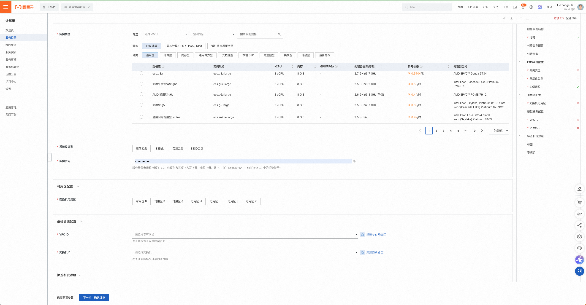
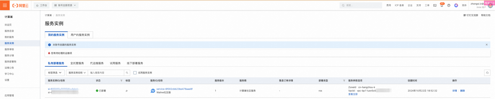
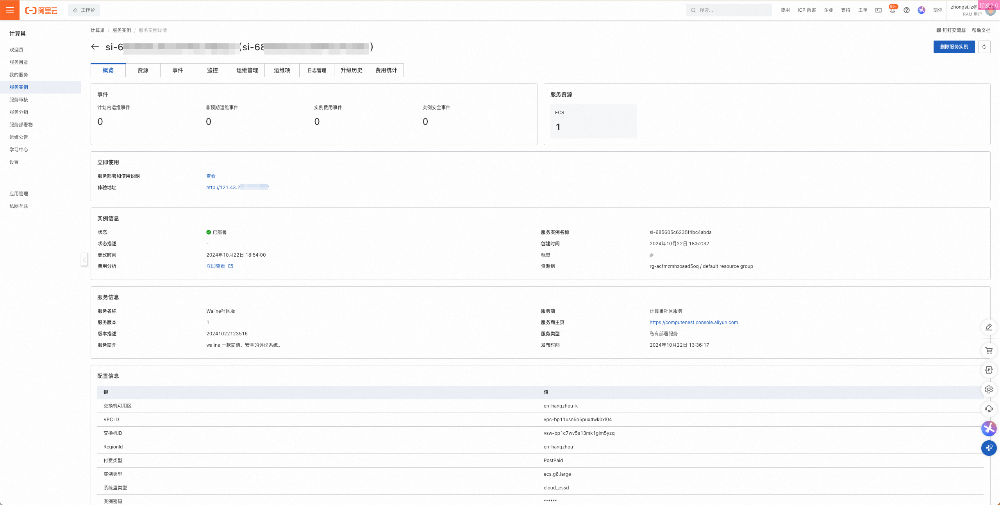

[阿里云计算巢](https://computenest.console.aliyun.com/) 服务是一个开放给服务商（包括：企业应用服务商、IT集成服务商、交付服务商和管理服务提供商等）和用户的服务管理PaaS平台。计算巢服务为服务商和用户提供了高效、便捷、安全的服务使用体验，服务商能更好地在阿里云上部署、交付和管理服务，用户能集中管理在阿里云上订阅的各类服务商提供的服务。

<!-- more -->

## 如何部署

1. 部署前确认：部署 Waline 服务实例，需要对部分阿里云资源进行访问和创建操作。因此您的账号需要包含如下资源的权限。 说明：当您的账号是 RAM 账号时，才需要添加此权限。

   | 权限策略名称                    | 备注                                      |
   | ------------------------------- | ----------------------------------------- |
   | AliyunECSFullAccess             | 管理云服务器服务（ECS）的权限             |
   | AliyunVPCFullAccess             | 管理专有网络（VPC）的权限                 |
   | AliyunROSFullAccess             | 管理资源编排服务（ROS）的权限             |
   | AliyunComputeNestUserFullAccess | 管理计算巢服务（ComputeNest）的用户侧权限 |

1. 访问计算巢 Waline 服务[部署链接](https://computenest.console.aliyun.com/service/instance/create/default?type=user&ServiceName=Waline社区版)，按提示填写部署参数
1. 根据需要选择付费类型，ECS（即云服务器）实例规格、系统盘类型、实例密码。
   
1. 选择部署 ECS 实例的可用区，并选择 ECS 实例所在的 VPC（即专有网络）和交换机 ID。如果您的账户下没有可用的VPC和交换机，您可在计算巢控制台"新建专有网路"和"新建交换机"直接跳转到相关阿里云产品控制台进行创建。同时点击下一步。
   
1. 确认部署参数并查看预估价格后，点击立即创建。
1. 点击左侧 TAB "服务实例"，进入服务列表页可查看服务实例部署进度。
1. 点击实例 ID 进入到详情界面，点击"体验地址"即可体验Waline服务。
