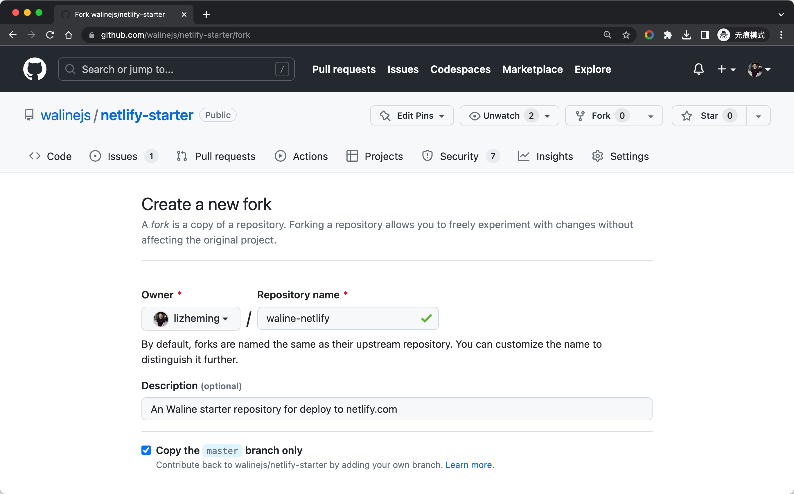
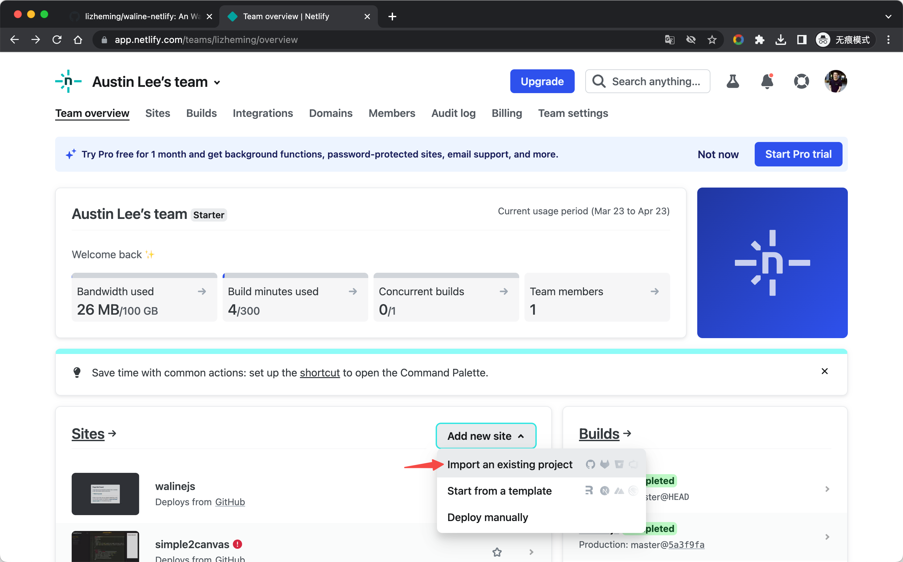
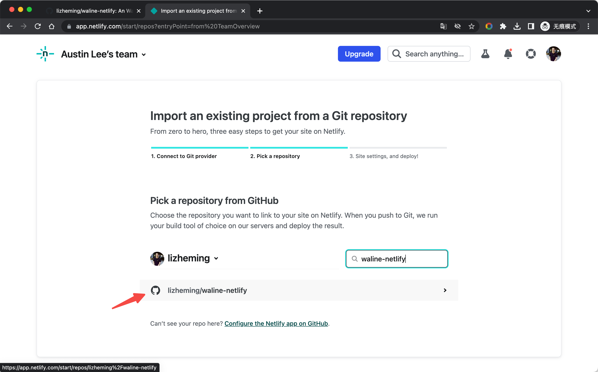
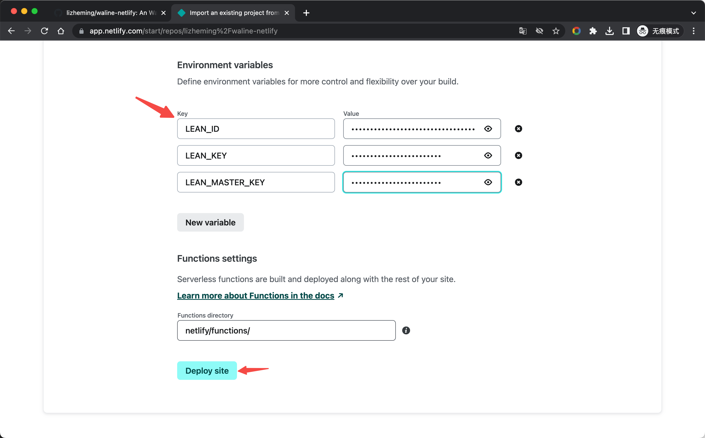
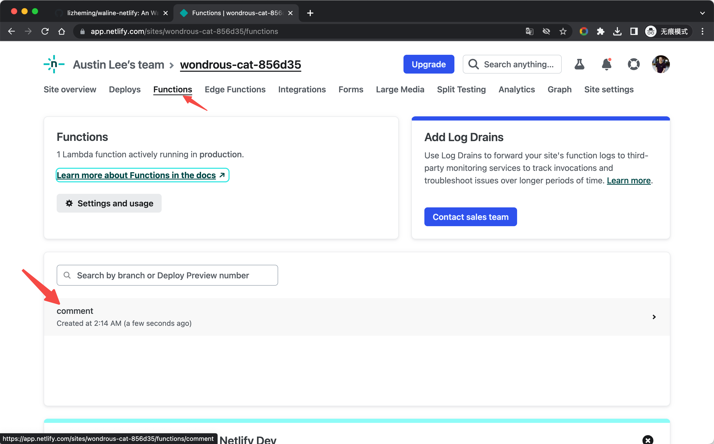
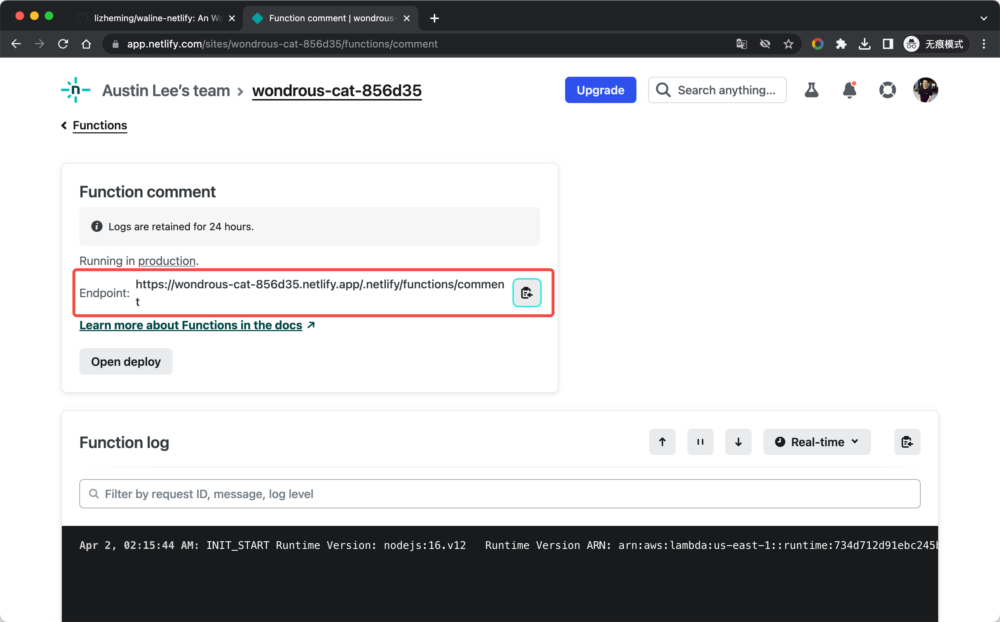
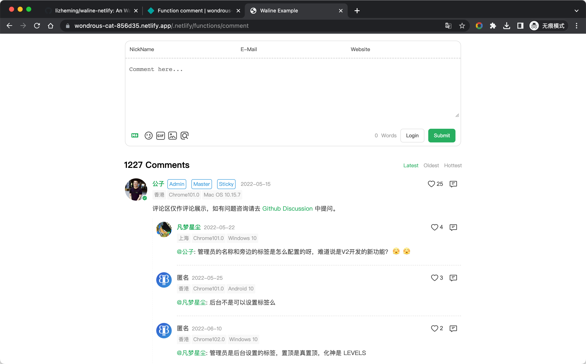
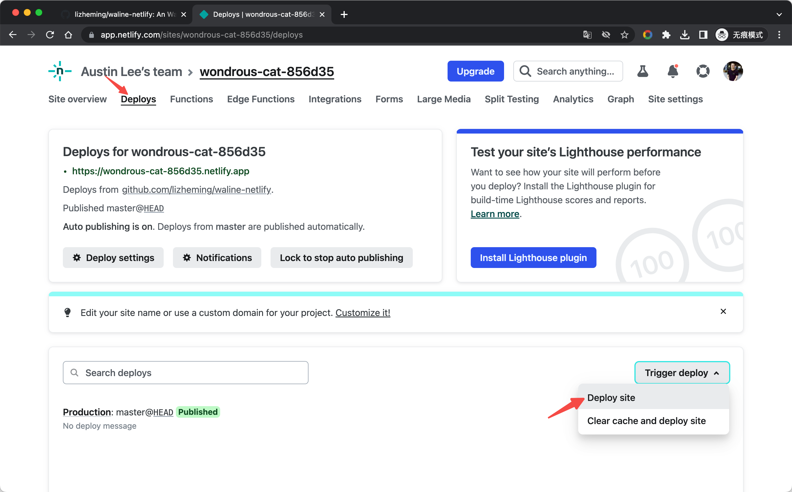

[Netlify](https://netlify.com) 是知名的静态网站部署服务提供商，[Edge Functions](https://www.netlify.com/blog/edge-functions-explained/) 是 Netlify 平台推出的一种服务，它允许在网站的边缘节点上运行 JavaScript 代码。

<!-- more -->

## 如何部署

点击 [Fork](https://github.com/walinejs/netlify-starter/fork) 按钮创建 netlify 启动脚手架。

<https://app.netlify.com> 登录 Netlify 控制台，选择 <kbd>Add new site</kbd> - <kbd>Import an exist project</kbd> 添加网站。选择 GitHub 认证读取我们的 GitHub 项目列表。在列表中搜索我们刚才 Fork 生成的仓库名，点击该项目开始基于该仓库创建我们的 Netlify 网站。

 

创建 Netlify 网站之前，需要我们填入一些配置信息。除了环境变量，其它信息我们使用默认的即可。以 LeanCloud 部署服务为例，我们在这里增加上 Waline 需要的数据库服务环境变量。点击底部的 <kbd>Deploy site</kbd> 开始部署网站。

稍待片刻后我们的 Netlify 网站就部署成功了。我们可以点击顶部的 <kbd>Functions</kbd> 导航栏切换到云函数列表，其中 `comment` 则是我们部署好的 Waline 服务。点击它进入该云函数的详情页。

在详情页中，`Endpoint` 列出来的地址即为我们的 Waline 服务的部署地址。点击右边的复制按钮，在新标签页中打开它，测试下评论发布，一切成功~ 接下来就将这个域名配置在客户端中就可以愉快的评论了！

 

## 如何更新

进入到 GitHub 仓库中，修改 package.json 文件中的 `@waline/vercel` 版本号为最新版本即可。

## 如何修改环境变量

点击顶部的 `Site settings` 导航栏，选择 `Environments variables` 侧边栏，进入环境变量管理页。点击 `Add a variable` 按钮我们可以添加环境变量。

编辑完环境变量后，我们需要进入 `Deploys` 页面，选择 `Trigger deploy` - `Deploy site` 对网站进行重新部署才能使环境变量生效。

 
