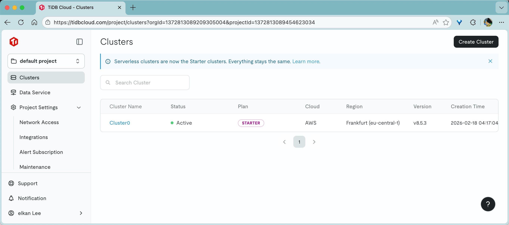
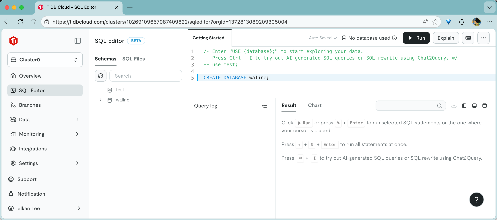
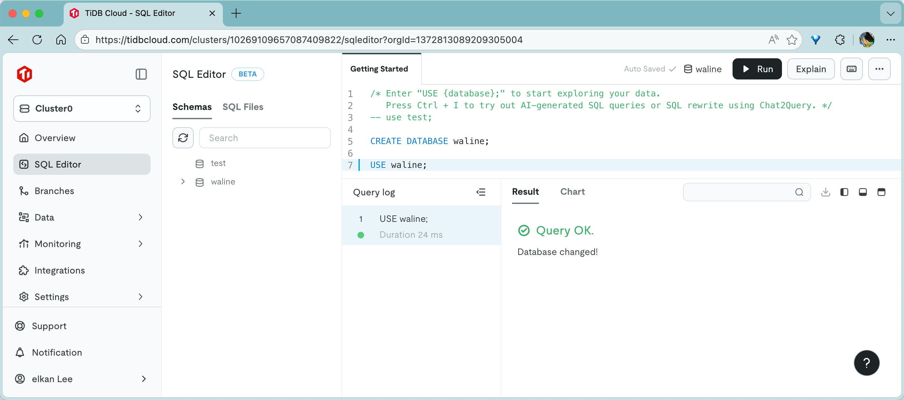
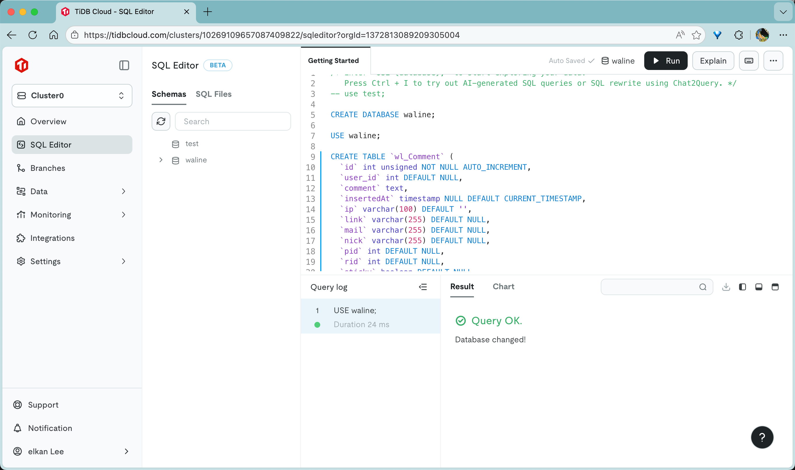
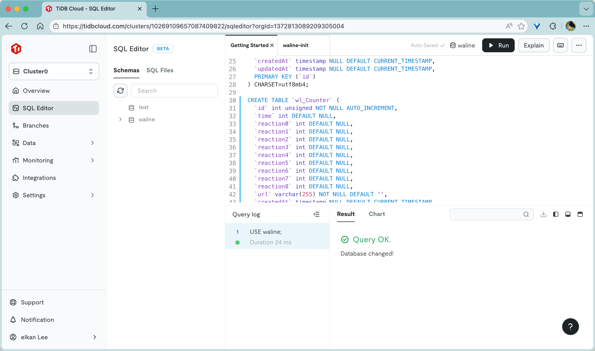
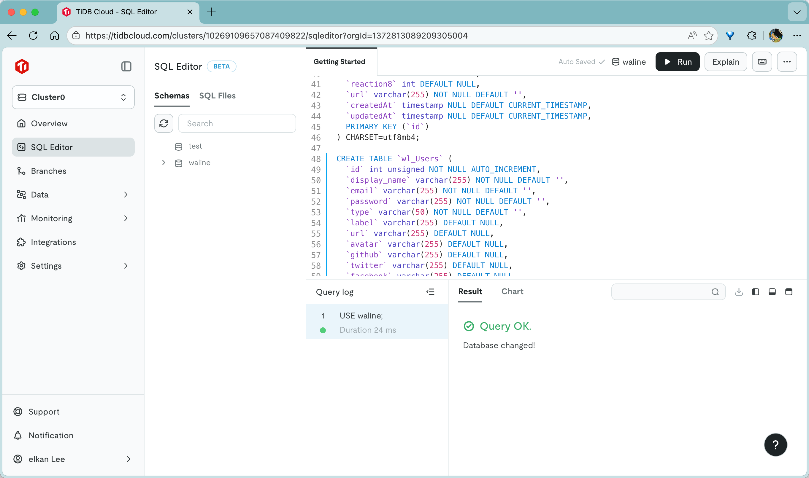
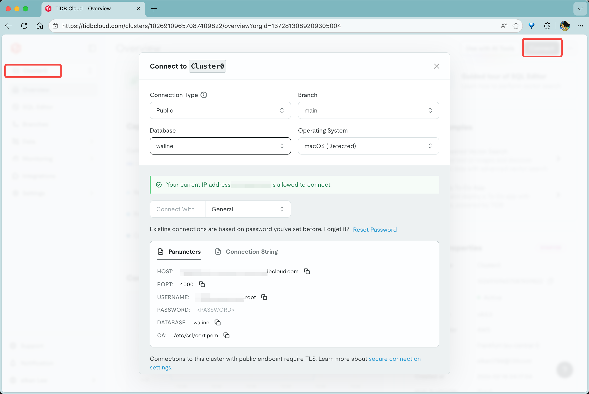

[TiDB](https://github.com/pingcap/tidb) 是一款开源的 NewSQL 数据库。[TiDB Cloud](https://tidbcloud.com/) 则是官方提供的在线版本，它提供了 5GB 的免费额度。下面介绍下如何在 TiDB Cloud 上创建 Waline 数据库。

## 创建数据库

1. 登录 [TiDB Cloud](https://tidbcloud.com) 后会自动创建实 TiDB 实例，直接点击 <kbd>cluster0</kbd> 进入实例

   

2. 左侧列表选择 <kbd>Chat2Query</kbd> 并将 [waline.tidb](https://github.com/walinejs/waline/blob/main/assets/waline.tidb) 内容按照 `;` 为语句分布贴近界面执行。每贴一句点击右上角的<kbd>运行</kbd>蓝色按钮，或者使用 <kbd>Ctrl\/Command</kbd> + <kbd>Enter</kbd> 快捷键执行
   
   
   
   
   

至此 Waline 数据库就已经创建完成！

## 获取连接配置

点击左侧的 <kbd>Overview</kbd> 按钮进入首页，选择右上角的 <kbd>Connect</kbd> 获取连接信息。

Connect with 选择 `Node.js`。此外还需要点击右下角的 <kbd>Reset password</kbd> 生成下密码。

这样你就能获取到连接相关的配置了。

