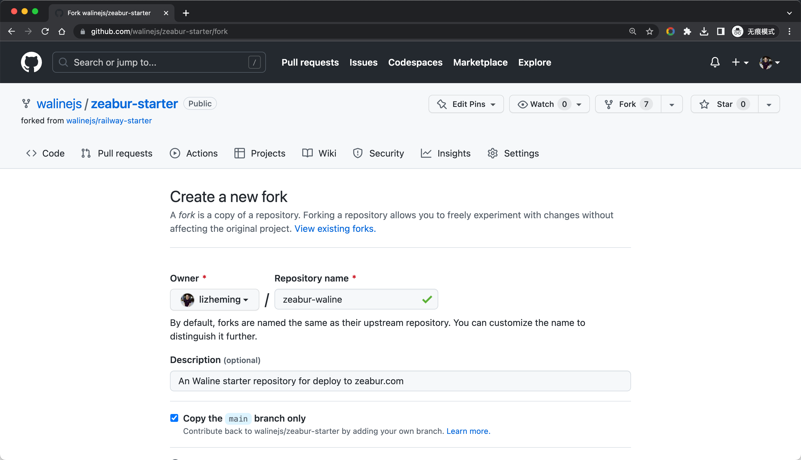
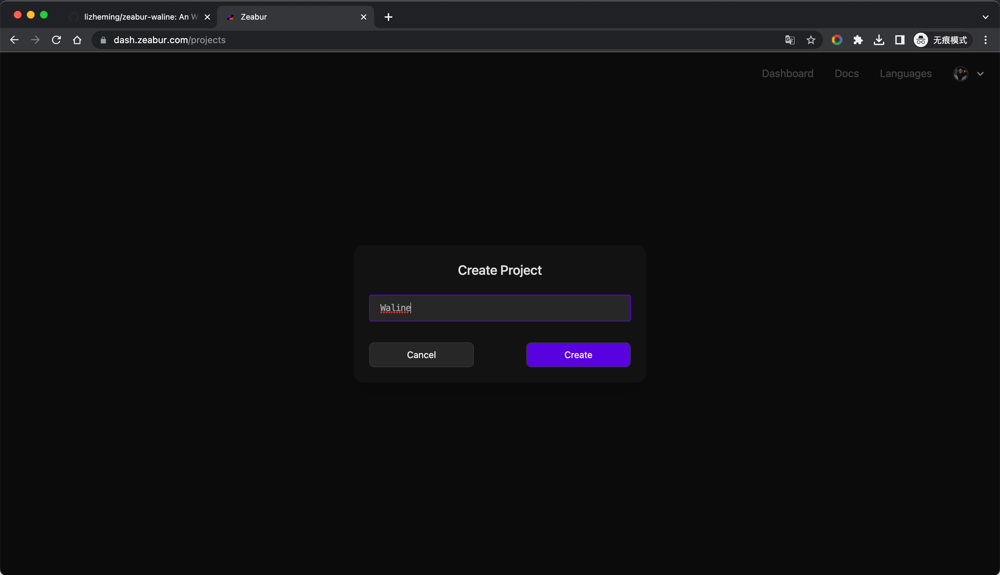
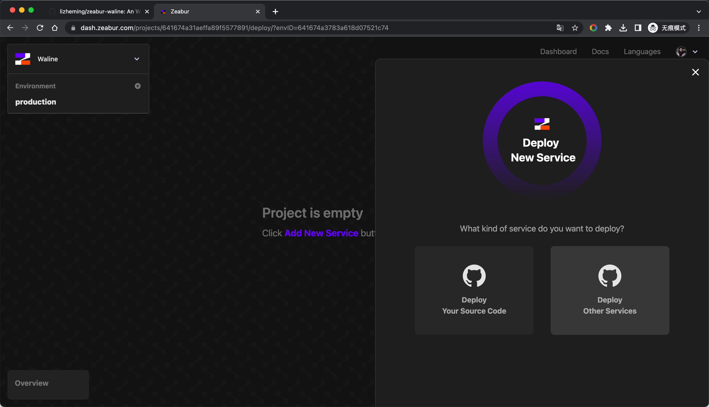
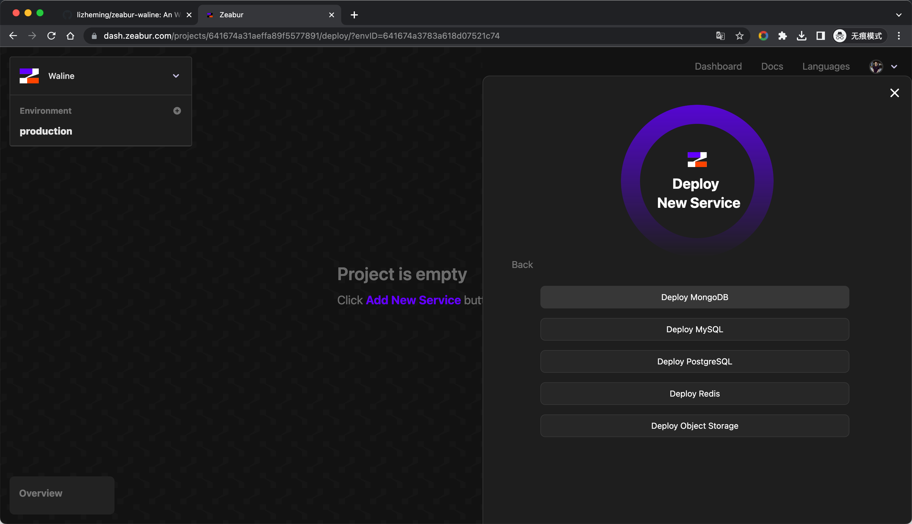
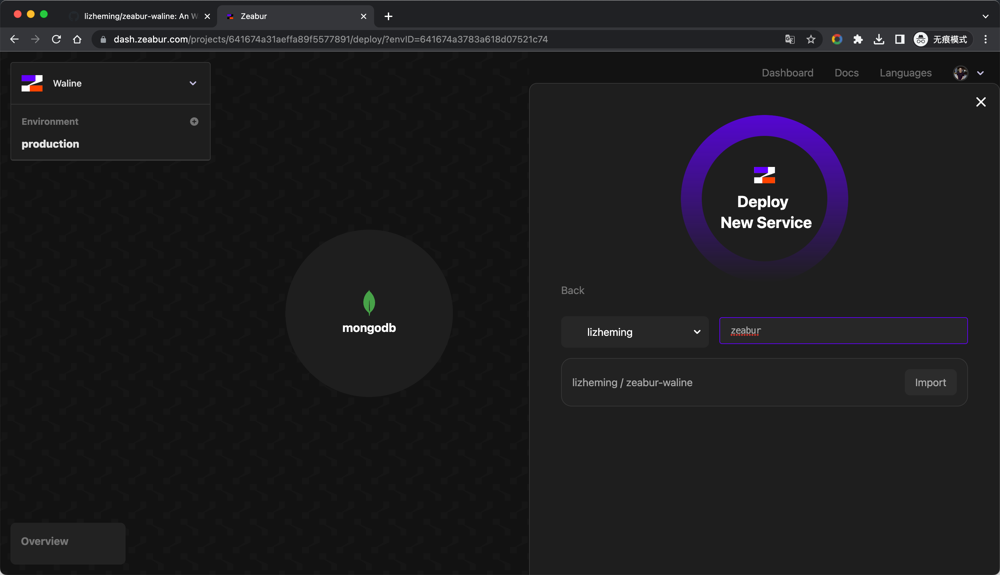
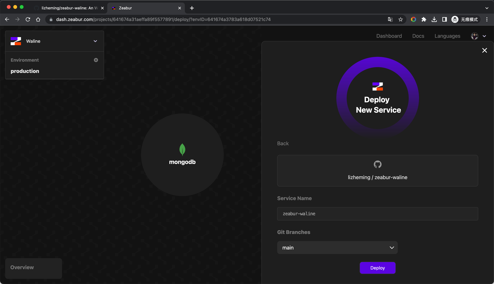
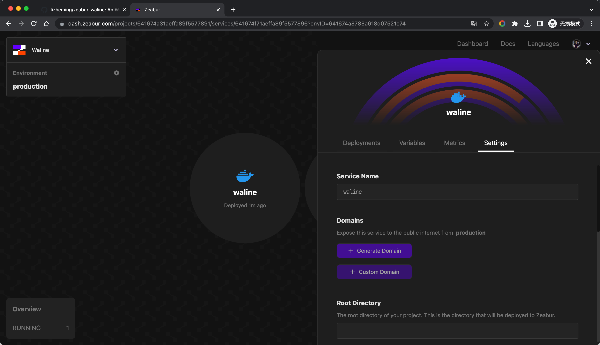
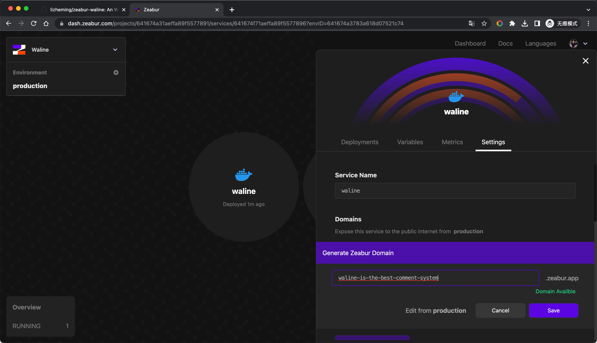
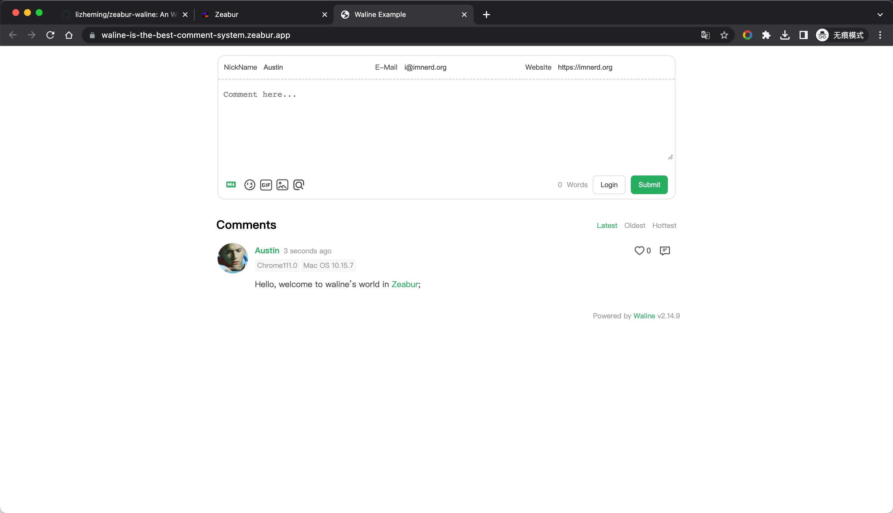
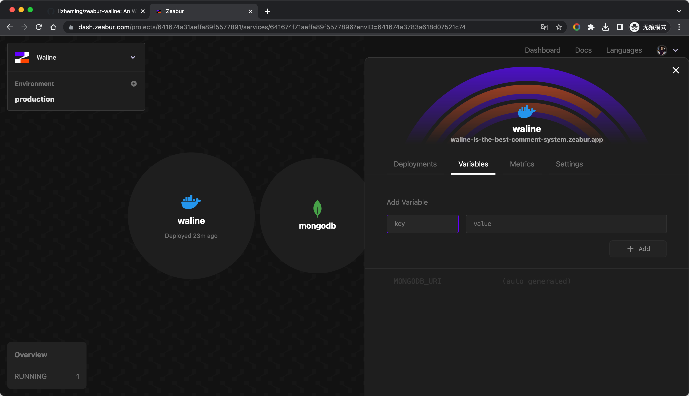

[Zeabur](https://zeabur.com) 是一个帮助开发者们可以一键部署自己的服务的平台。整体和 Railway 比较类似，但是比它多了更多的功能，不需要绑定信用卡，免费额度也要比它高。

<!-- more -->

## 如何部署

点击 [Fork](https://github.com/walinejs/zeabur-starter/fork) 按钮创建 Zeabur 启动脚手架。

<https://dash.zeabur.com> 登录 Zeabur 控制台，如果没有项目需要先为新项目设置名称。

进入之后点击 <kbd>Add New Service</kbd> 创建服务，选择 <kbd>Deploy Other Service</kbd> - <kbd>Deploy MongoDB</kbd> 先创建数据库服务。

为我们的 MongoDB 数据库服务起个名字，点击 <kbd>Deploy</kbd> 按钮，我们的数据库服务就部署好了。

 

接下来我们继续点击 <kbd>Add New Service</kbd> 创建 Waline 服务，这次我们选择点击 <kbd>Deploy Your Source Code</kbd>。在接下来的 GitHub 项目列表中找到最开始我们 Fork 出来的项目，点击对应的 <kbd>Import</kbd> 按钮。

为我们的 Waline 服务起个名字，点击 <kbd>Deploy</kbd> 按钮，我们的 Waline 服务就部署好了。

 

不要着急关闭 Waline 服务的面板，服务部署完毕之后，我们还需要给服务添加访问域名。点击 <kbd>Domains</kbd> 选项卡下的 <kbd>Generate Domain</kbd> 按钮，输入自己想要的域名前缀并点击 <kbd>Save</kbd> 按钮，就给我们的服务添加好访问域名了。

 

一切就绪，接下来就是见证奇迹的时刻。打开我们刚才设置的访问域名，测试下评论发布，一切成功~ 接下来就将这个域名配置在客户端中就可以愉快的评论了！

## 如何更新

进入到 GitHub 仓库中，修改 package.json 文件中的 `@waline/vercel` 版本号为最新版本即可。

## 如何修改环境变量

可以通过 <kbd>Variables</kbd> Tab 进入环境变量管理页，修改完成之后会自动重新部署。

