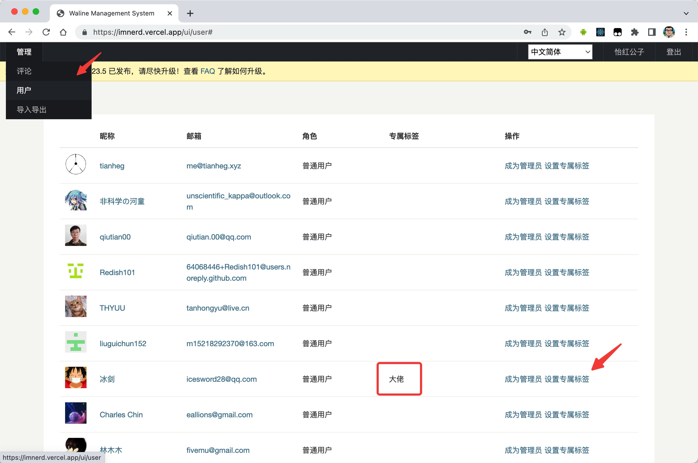
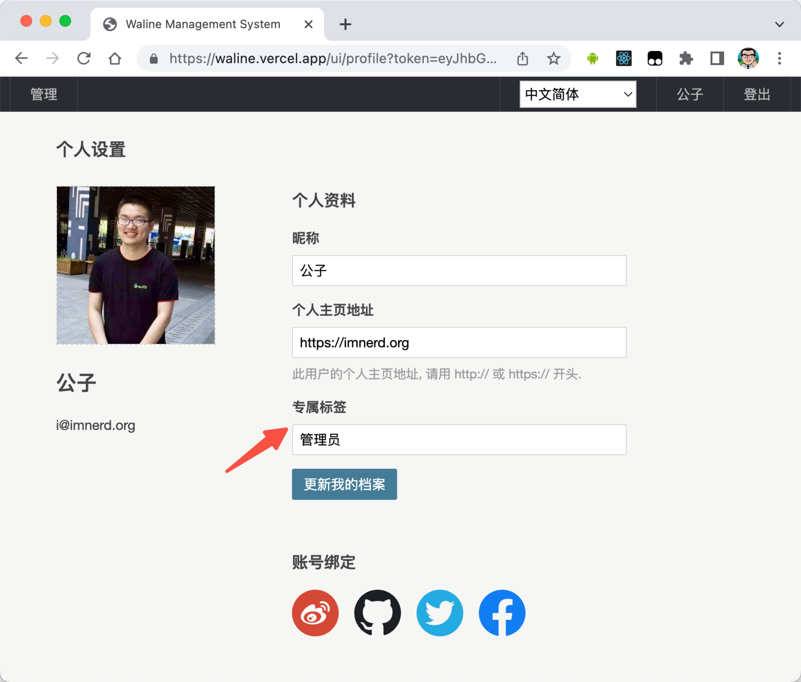

Waline 支持你为登录用户，根据其互动情况设置等级标签和自定义标签。

<!-- more -->

## 等级标签

你需要在服务端配置 `LEVELS` 变量开启这个功能，详见 [服务端环境变量配置](../../reference/server/env.md#显示)。

你可以通过 locales 选项自定义这些等级标签，详见 [多语言](./i18n.md#自定义语言)

## 专属标签

你可以通过管理端为每位登录用户设定专属标签。

作为登录用户，也可以自己在个人资料页中修改自己的专属标签。

