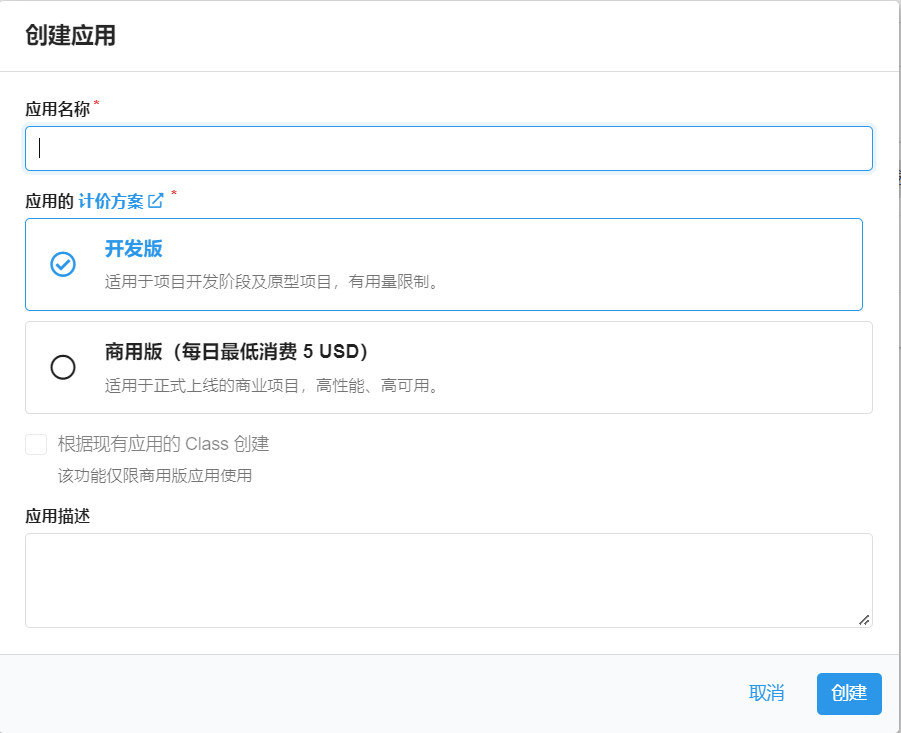

欢迎使用 Waline，只需几个步骤，你就可以在你的网站中启用 Waline 提供评论与浏览量服务。

<!-- more -->

## LeanCloud 设置 (数据库)

1. [登录](https://console.leancloud.app/login) 或 [注册](https://console.leancloud.app/register) `LeanCloud 国际版` 并进入 [控制台](https://console.leancloud.app/apps)

1. 点击左上角 [创建应用](https://console.leancloud.app/apps) 并起一个你喜欢的名字 (请选择免费的开发版):

   

1. 进入应用，选择左下角的 `设置` > `应用 Key`。你可以看到你的 `APP ID`,`APP Key` 和 `Master Key`。请记录它们，以便后续使用。

   

::: warning 国内版需要完成备案接入

如果你正在使用 Leancloud 国内版 ([leancloud.cn](https://leancloud.cn))，我们推荐你切换到国际版 ([leancloud.app](https://leancloud.app))。否则，你需要为应用额外绑定**已备案**的域名，同时购买独立 IP 并完成备案接入:

- 登录国内版并进入需要使用的应用
- 选择 `设置` > `域名绑定` > `API 访问域名` > `绑定新域名` > 输入域名 > `确定`。
- 按照页面上的提示按要求在 DNS 上完成 CNAME 解析。
- 购买独立 IP 并提交工单完成备案接入。(独立 IP 目前价格为 ￥ 50/个/月)


:::

## Vercel 部署 (服务端)

[](https://vercel.com/new/clone?repository-url=https%3A%2F%2Fgithub.com%2Fwalinejs%2Fwaline%2Ftree%2Fmain%2Fexample)

1. 点击上方按钮，跳转至 Vercel 进行 Server 端部署。

   ::: note

   如果你未登录的话，Vercel 会让你注册或登录，请使用 GitHub 账户进行快捷登录。

   :::

1. 输入一个你喜欢的 Vercel 项目名称并点击 `Create` 继续:

   

1. 此时 Vercel 会基于 Waline 模板帮助你新建并初始化仓库，仓库名为你之前输入的项目名。

   

   一两分钟后，满屏的烟花会庆祝你部署成功。此时点击 `Go to Dashboard` 可以跳转到应用的控制台。

   

1. 点击顶部的 `Settings` - `Environment Variables` 进入环境变量配置页，并配置三个环境变量 `LEAN_ID`, `LEAN_KEY` 和 `LEAN_MASTER_KEY` 。它们的值分别对应上一步在 LeanCloud 中获得的 `APP ID`, `APP KEY`, `Master Key`。

   

   ::: note

   如果你使用 LeanCloud 国内版，请额外配置 `LEAN_SERVER` 环境变量，值为你绑定好的域名。

   :::

1. 环境变量配置完成之后点击顶部的 `Deployments` 点击顶部最新的一次部署右侧的 `Redeploy` 按钮进行重新部署。该步骤是为了让刚才设置的环境变量生效。

   

1. 此时会跳转到 `Overview` 界面开始部署，等待片刻后 `STATUS` 会变成 `Ready`。此时请点击 `Visit` ，即可跳转到部署好的网站地址，此地址即为你的服务端地址。

   

## 绑定域名 (可选)

1. 点击顶部的 `Settings` - `Domains` 进入域名配置页

1. 输入需要绑定的域名并点击 `Add`

   

1. 在域名服务器商处添加新的 `CNAME` 解析记录

   | Type  | Name    | Value                |
   | ----- | ------- | -------------------- |
   | CNAME | example | cname.vercel-dns.com |

1. 等待生效，你可以通过自己的域名来访问了:tada:

   - 评论系统：example.yourdomain.com
   - 评论管理：example.yourdomain.com/ui

   

## HTML 引入 (客户端)

在你的网页中进行如下设置:

1. 使用 CDN 引入 Waline:

   - `https://unpkg.com/@waline/client@v2/dist/waline.js`。
   - `https://unpkg.com/@waline/client@v2/dist/waline.css`。

1. 创建 `<script>` 标签使用 `Waline.init()` 初始化，并传入必要的 `el` 与 `serverURL` 选项。

   - `el` 选项是 Waline 渲染使用的元素，你可以设置一个字符串形式的 CSS 选择器或者一个 HTMLElement 对象。
   - `serverURL` 是服务端的地址，即上一步获取到的值。

   ```html {3-7,12-18}:line-numbers
   <head>
     <!-- ... -->
     <script src="https://unpkg.com/@waline/client@v2/dist/waline.js"></script>
     <link
       rel="stylesheet"
       href="https://unpkg.com/@waline/client@v2/dist/waline.css"
     />
     <!-- ... -->
   </head>
   <body>
     <!-- ... -->
     <div id="waline"></div>
     <script>
       Waline.init({
         el: '#waline',
         serverURL: 'https://your-domain.vercel.app',
       });
     </script>
   </body>
   ```

1. 评论服务此时就会在你的网站上成功运行 :tada:

## 评论管理 (管理端)

1. 部署完成后，请访问 `<serverURL>/ui/register` 进行注册。首个注册的人会被设定成管理员。
1. 管理员登陆后，即可看到评论管理界面。在这里可以修改、标记或删除评论。
1. 用户也可通过评论框注册账号，登陆后会跳转到自己的档案页。
