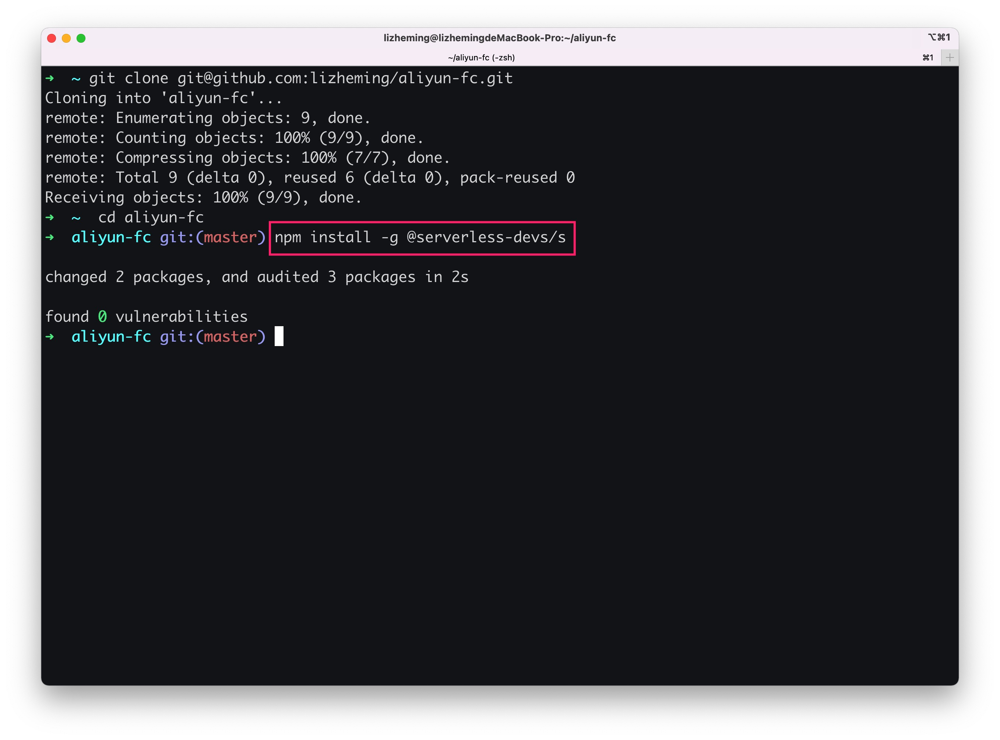
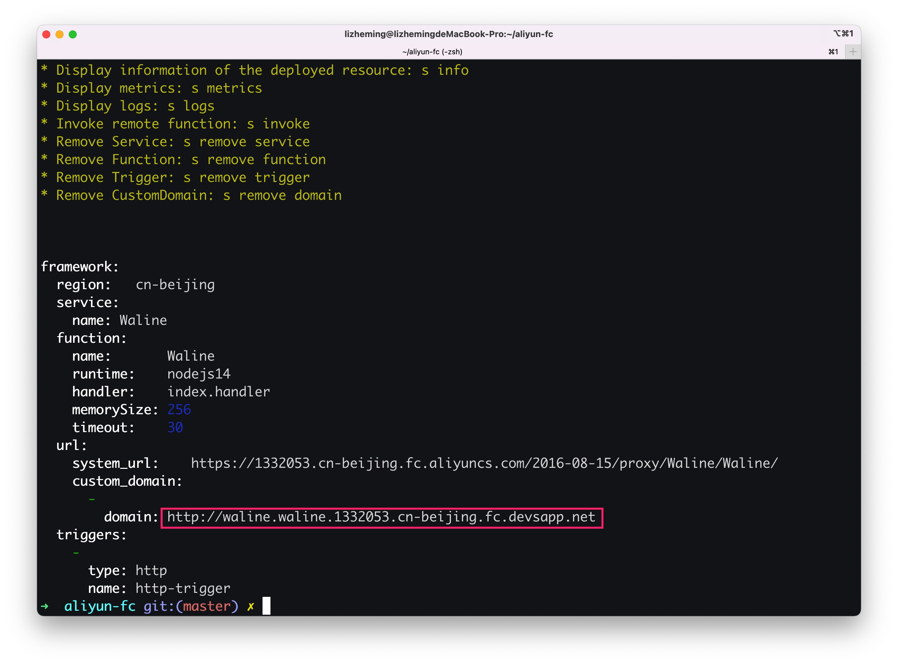
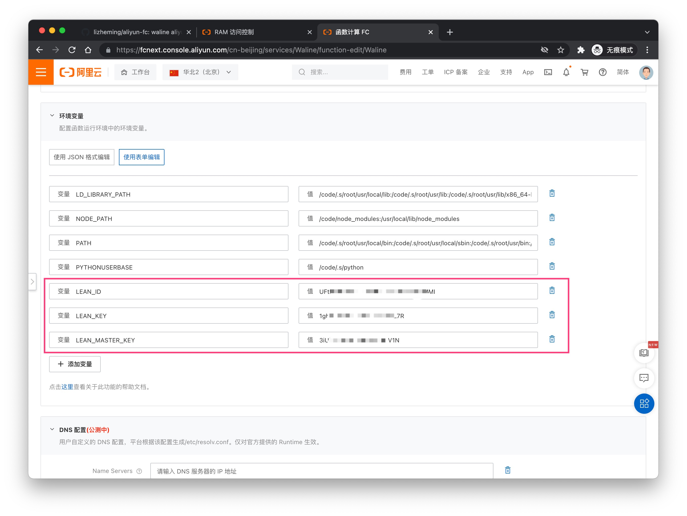

[阿里云函数计算](https://fc.console.aliyun.com/) 是阿里云推出的 Serverless 平台。我们可以快速的将 Waline 部署到阿里云函数计算平台上。

## 如何部署

1. [aliyun-fc-starter](https://github.com/walinejs/aliyun-fc-starter/generate) 访问该地址基于官方模板创建仓库并将其克隆下来

     
   

1. 全局安装 Serverless Devs 开发者工具 `npm install -g @serverless-devs/s`

   

1. https://ram.console.aliyun.com/manage/ak 访问该网址获取到你账户的一对密钥，使用 s 命令添加。
   
   

1. 进入目录后执行 `s deploy` 稍待片刻后完成一次部署，此时控制台中红框展示的地址即为你最终的 serverURL

   

1. 点击“[编辑环境变量](https://fcnext.console.aliyun.com/cn-beijing/services/Waline/function-detail/Waline/LATEST?tab=config)”更新我们需要添加的环境变量并点击底部的保存按钮

   

1. 点击“[代码编辑](https://fcnext.console.aliyun.com/cn-beijing/services/Waline/function-detail/Waline/LATEST?tab=code)”进入编辑页，在编辑器底部的控制台中输入 `npm install` 安装依赖。安装完成之后点击顶部的<kbd>部署</kbd>按钮重新部署

   

至此就完成了部署，第四步中返回的地址即为你的部署地址。

### Windows 环境缺少 VC++

由于 @serverless-devs/s 依赖于 node-gyp ，根据 <https://github.com/nodejs/node-gyp#on-windows>，我们需要安装 VC++环境。

> 值得注意的是，VC++ 环境需要占用大量的存储资源，因此我更建议你使用 _Windows Subsystem for Linux_ 或 Linux 云服务器

1. 前往 <https://visualstudio.microsoft.com> 下载 Visual Studio 安装包
1. 在安装包中勾选 _使用 C++的桌面开发_ ，勾选全部 MSVC 套件，开始安装。
1. 使用 `npm config set msvs_version 2022` 设置版本信息，例如我下载的 Visual Studio Community 2022，即需填写 2022 版本
1. 继续 `s deplay` 的安装过程

### 缺少 Python

由于 @serverless-devs/s 依赖于 node-gyp ，根据 <https://github.com/nodejs/node-gyp#configuring-python-dependency>，我们也需要安装 Python 环境。

> Python 作为一个优秀的脚本性语言，是很值得安装的。

node-gyp 支持 3.7/3.8/3.9/3.10 版本的 Python，你可以通过搜索引擎获取大量的帮助，因此在此不申明详细步骤。

如果你的系统有多个 Python，那你需要使用以下命令指定使用 python 的路径。

```bash
npm config set python /path/to/executable/python
```

如果 `NODE_GYP_FORCE_PYTHON` 环境变量被设置为 Python 可执行文件的路径，则将使用它而不是任何其他已配置或内置的 Python 。即使它不是兼容版本，也不会进行搜索。

## 如何更新

点击“[编辑环境变量](https://fcnext.console.aliyun.com/cn-beijing/services/Waline/function-detail/Waline/LATEST?tab=config)”更新我们需要添加的环境变量并点击底部的保存按钮


## 如何修改环境变量

点击“[代码编辑](https://fcnext.console.aliyun.com/cn-beijing/services/Waline/function-detail/Waline/LATEST?tab=code)”进入编辑页，在编辑器底部的控制台中输入 `npm install` 安装依赖。安装完成之后点击顶部的<kbd>部署</kbd>按钮重新部署


