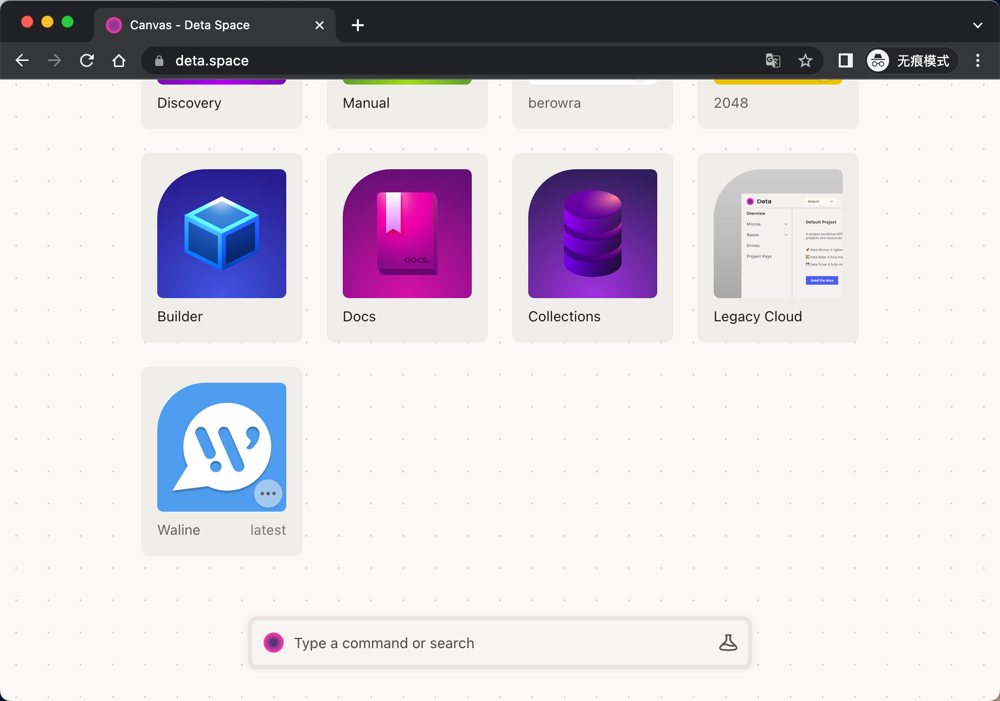
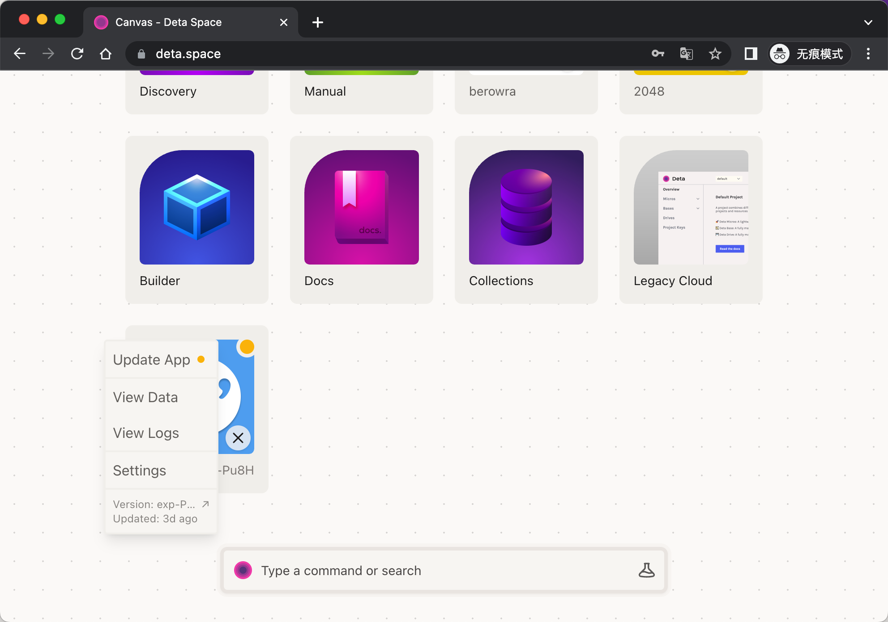

[Deta](https://www.deta.sh/) 是一个可免费使用的 Serverless 部署平台。我们可以快速的将 Waline 部署到 Deta 平台上。

[](https://go.deta.dev/deploy?repo=https://github.com/walinejs/deta-starter)

点击上方按钮，跳转至 Deta 平台快速部署。登录之后会让你选择部署的位置，同时需要你输入环境变量。



填写好后点击 <kbd>Deploy</kbd> 按钮，稍等片刻会提示你部署成功，并为你展示部署后的网站地址。将其填入前端脚本的 `serverURL` 配置中，即可完成全部配置。



## 如何更新

Deta 使用 CLI 命令行工具对项目进行管理。按照[文档](https://docs.deta.sh/docs/cli/install)指示安装 Deta 的命令行工具。

```sh
# Mac or Linux
curl -fsSL https://get.deta.dev/cli.sh | sh

# Windows for powershell
iwr https://get.deta.dev/cli.ps1 -useb | iex
```

装好之后我们使用 `deta login` 来登录命令行，期间会打开浏览器用于登录。

更新之前我们需要将项目克隆下来。进入到我们的项目的设置页，复制并执行页面中的 `deta clone` 命令，稍等一会儿项目就下载下来了。


之后我们可以在本地对项目代码进行修改，比如将 `package.json` 中的依赖版本修改至最新。

最后我们在命令行中使用 `deta deploy` 命令即可实现网站的更新部署。

## 如何修改环境变量

修改换进变量同样需要使用 CLI 进行操作。

按照刚才的步骤将项目克隆到本地后，在项目中新增 `.env` 文件，将需要修改的环境变量使用 `VAR_NAME=VALUE` 的形式一行一个写在文件中。最后使用 `deta update -e .env` 即可完成环境变量更新。

具体可参考 [Deta 环境变量文档](https://docs.deta.sh/docs/micros/env_vars#setting-environment-variables)。
