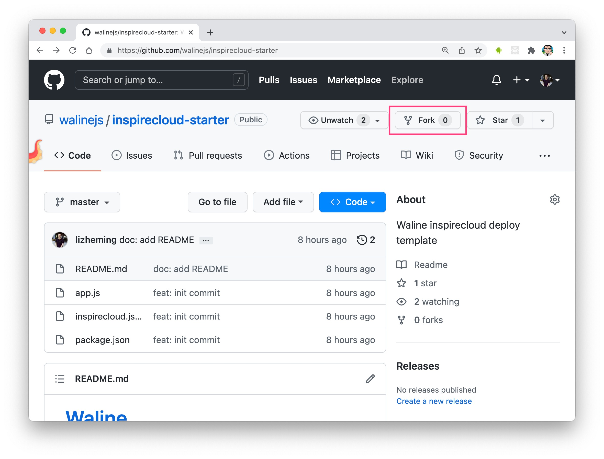
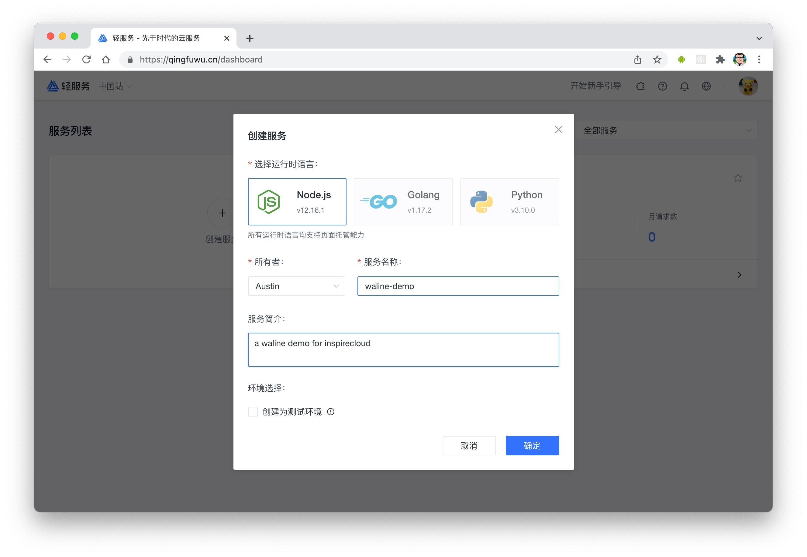
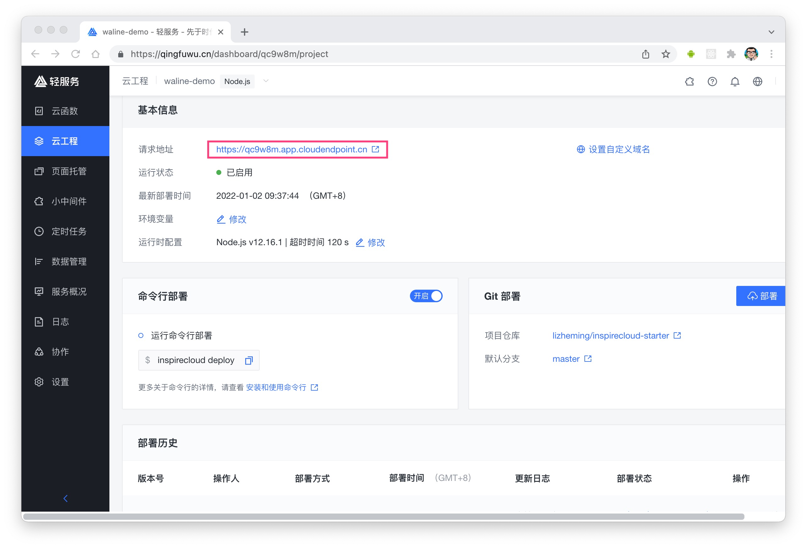

[轻服务](https://qingfuwu.cn) 是一款有免费额度的 Serverless 部署平台。我们可以快速的将 Waline 部署到轻服务平台上。

## 如何部署

1. Fork 该项目 <https://github.com/walinejs/inspirecloud-starter>
   
1. 进入[轻服务](https://qingfuwu.cn)网站，完成注册实名等相关流程后，在面板中选择创建服务，输入服务名称和简介并确定
   
1. 服务创建好后，点击 <kbd>云工程</kbd>-<kbd>快速创建</kbd> 进入部署环节
   
1. 部署弹窗如果没有做 GitHub 授权的话需要点击 GitHub 授权按钮进行授权 (图中为已授权后的效果) 。授权完毕后在仓库地址中输入你在第一步中 Fork 后的地址
   
1. 点击部署之后稍待片刻部署就完成了。页面中的请求地址就是你最终的服务地址
   

## 如何更新

在 Fork 的仓库中你根据需要修改项目，修改完毕之后进入云工程界面，点击部署按钮重新部署一次即可。轻服务会从仓库拉取最新的代码进行部署。

## 如何修改环境变量

在云工程界面中，点击环境变量修改按钮，可以快速方便的进行环境变量管理。

