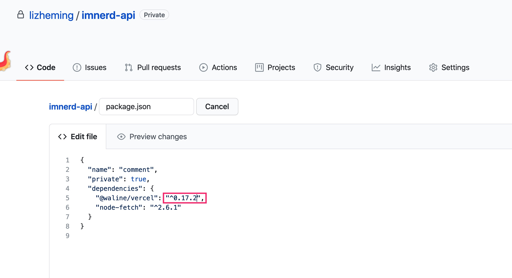
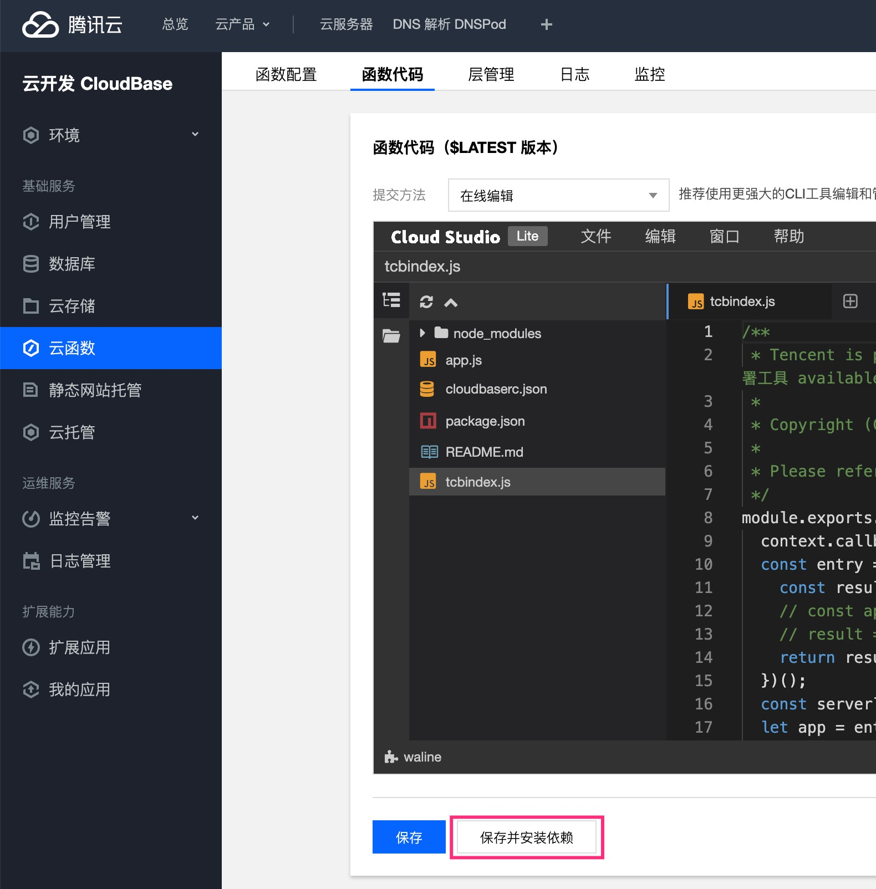

Waline memiliki posisi yang sangat jelas sejak lahir:

::: info Sistem komentar sederhana dengan backend.

:::

Semua versi yang dirilis setelahnya adalah modifikasi yang dibuat di sekitar posisi ini.

## Apa hubungannya dengan Valine?

::: info Waline = Valine dengan backend

:::

Berkonsultasi dengan versi open source Valine, daftar komentar di frontend ditulis ulang dengan React. Gaya dan struktur serta beberapa alat dan metode internal semuanya berasal dari Valine.

## Apakah saya masih perlu men-deploy Valine-Admin di LeanCloud?

Tidak. Waline adalah deployment tiga dalam satu dari penyimpanan data, server, dan klien. Antarmuka server sudah setara dengan mesin cloud LeanCloud Valine. Server sudah menyertakan manajemen komentar dan fitur notifikasi email yang disediakan oleh mesin cloud sebelumnya. Ini tidak memerlukan mesin cloud LeanCloud tambahan, sehingga tidak akan dibatasi oleh strategi tidur mesin cloud LeanCloud.

## Bagaimana cara melakukan upgrade?

Waline terutama terdiri dari dua bagian: frontend dan server.

### Frontend

Frontend menyisipkan daftar komentar dan kotak komentar dengan menyertakan skrip JS di halaman web. Dalam kebanyakan skenario, tautan akan menggunakan alamat versi terbaru CDN online, dan versi terbaru akan diterapkan secara otomatis, tanpa perlu pengguna memperbarui secara manual.

::: note Perlu diperbarui secara manual dalam situasi berikut

1. Nomor versi ditentukan secara paksa dalam alamat CDN. Dalam situasi ini, Anda perlu mengubah nomor versi secara manual ke yang terbaru.
1. Gunakan NPM untuk memerlukan dan mengemas modul ke dalam kode. Dalam situasi ini, Anda perlu mengubah nomor versi dalam dependensi untuk memastikan bahwa versi terbaru dari dependensi dapat diperoleh saat instalasi.

:::

### Server

Server mengacu pada layanan backend yang sesuai dengan `serverURL` yang dikonfigurasi dalam skrip frontend, dan pembaruannya akan sedikit berbeda tergantung pada lingkungan deployment yang berbeda. Pembaruan server akan lebih sering.

#### Vercel

Pergi ke repositori GitHub yang sesuai dan ubah nomor versi `@waline/vercel` dalam file package.json ke yang terbaru.

#### CloudBase

Masuk ke halaman pengeditan kode, klik <kbd>Simpan dan instal ulang dependensi</kbd>. Jika masih tidak berhasil, masuk ke <kbd>Aplikasi Saya</kbd> dan pilih <kbd>Deploy</kbd> untuk men-deploy ulang.

::: caution

Re-deployment akan menghapus file-file sebelumnya. Jika ada konfigurasi dalam file sebelumnya, file tersebut perlu dicadangkan terlebih dahulu.

:::

#### Docker

Jalankan `docker pull lizheming/waline` langsung untuk menarik image terbaru.

## Mengapa memposting komentar lambat?

Karena beberapa alasan teknis, deteksi spam dan notifikasi komentar semuanya adalah operasi serial saat memposting komentar. Deteksi spam menggunakan layanan yang disediakan oleh Akismet di luar negeri, yang mungkin lambat untuk diakses. Pengguna dapat mematikan fungsi deteksi spam melalui variabel lingkungan `AKISMET_KEY=false`. Selain layanan deteksi spam, notifikasi email dalam notifikasi komentar juga dapat menyebabkan timeout. Anda dapat mematikan notifikasi komentar untuk menguji apakah hal ini disebabkan oleh fitur ini.
