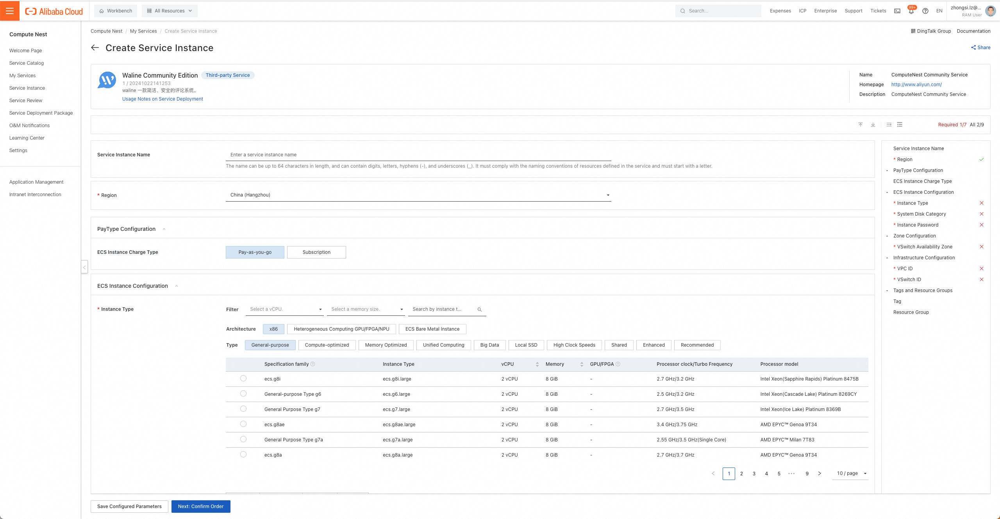
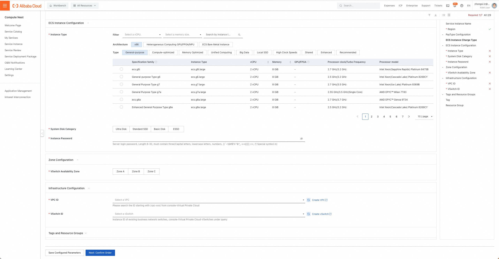
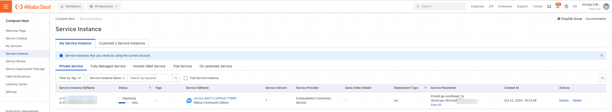
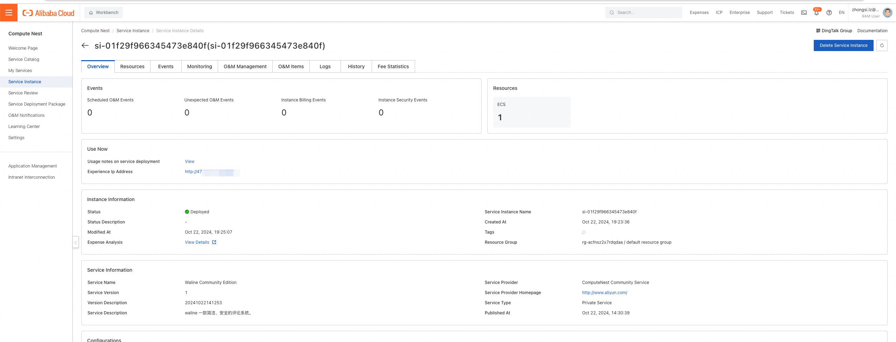

[Compute Nest](https://computenest.console.aliyun.com/) adalah solusi Platform as a Service (PaaS) yang disediakan Alibaba Cloud untuk penyedia layanan dan pelanggan mereka dalam mengelola layanan.

Penyedia layanan dapat mempublikasikan layanan privat di Compute Nest, dan pelanggan mereka dapat men-deploy layanan tersebut dengan mudah. Penyedia layanan juga dapat mempublikasikan layanan yang sepenuhnya dikelola di mana mereka dapat mengimplementasikan hosted O&M untuk sumber daya pelanggan mereka.

Compute Nest menyediakan kemampuan layanan untuk setiap tahap manajemen siklus hidup layanan. Penyedia layanan dapat mengelola berbagai tahap menggunakan modul fungsional yang berbeda sesuai kebutuhan mereka. Hal ini membantu penyedia layanan meningkatkan efisiensi operasional, mengurangi biaya operasional, dan menyediakan layanan yang sederhana dan nyaman bagi pelanggan.

<!-- more -->

## Cara Deploy

1. Konfirmasi sebelum deployment: Untuk men-deploy instans layanan Waline community edition, Anda perlu
   mengakses dan membuat beberapa sumber daya Alibaba Cloud. Oleh karena itu, akun Anda harus memiliki izin untuk sumber daya
   berikut. Catatan: izin ini hanya diperlukan ketika akun Anda adalah akun RAM.

   | Nama Kebijakan Izin             | Keterangan                                                            |
   | ------------------------------- | --------------------------------------------------------------------- |
   | AliyunECSFullAccess             | Izin untuk mengelola ECS                                              |
   | AliyunVPCFullAccess             | Izin untuk mengelola VPC                                              |
   | AliyunROSFullAccess             | Mengelola izin untuk Resource Orchestration Service (ROS)             |
   | AliyunComputeNestUserFullAccess | Mengelola izin sisi pengguna untuk layanan compute nest (ComputeNest) |

1. Akses layanan Waline di Alibaba Compute Nest melalui [Tautan Penerapan](https://computenest.console.aliyun.com/service/instance/create/default?type=user&ServiceName=Waline%20Community%20Edition), isi parameter deployment sesuai petunjuk
1. Pilih jenis pembayaran, spesifikasi instans ECS (yaitu server cloud), jenis disk sistem, dan password instans sesuai kebutuhan.
   
1. Pilih availability zone tempat instans ECS di-deploy, dan pilih VPC (jaringan privat) serta ID switch tempat instans ECS berada. Jika tidak ada VPC dan switch yang tersedia di akun Anda, Anda dapat langsung menuju konsol produk Alibaba Cloud yang relevan untuk membuatnya dengan mengklik "Create VPC" dan "Create vSwitch" di konsol Compute Nest. Klik Next: Confirm Order.
   
1. Setelah mengonfirmasi parameter deployment dan meninjau estimasi harga, klik Create Now.
1. Klik tab "Service Instance" di sebelah kiri untuk masuk ke halaman daftar instans layanan guna melihat progres deployment instans layanan.
   
1. Klik ID instans, masuk ke antarmuka detail, dan klik "Experience Ip Address" untuk menggunakan layanan Waline.
   
