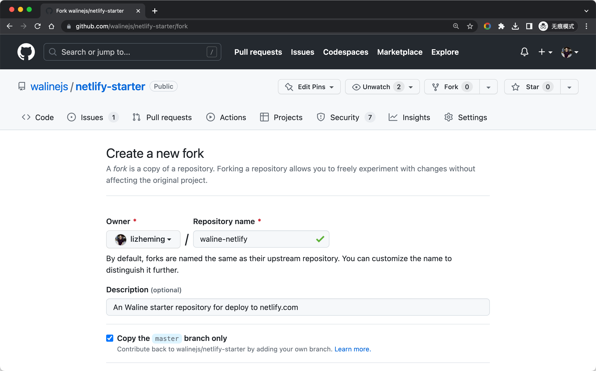
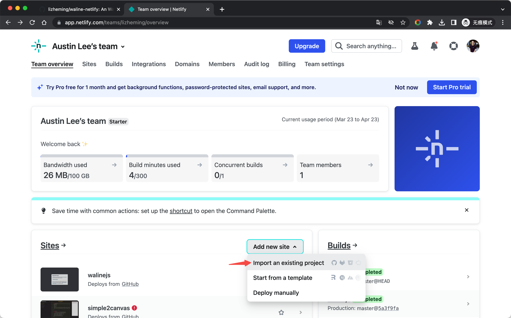
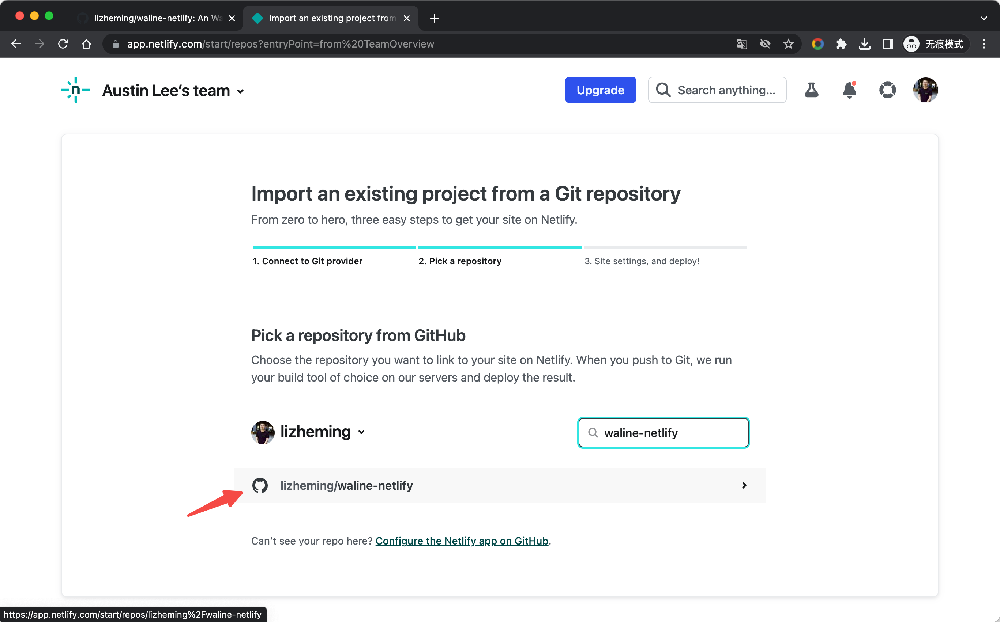
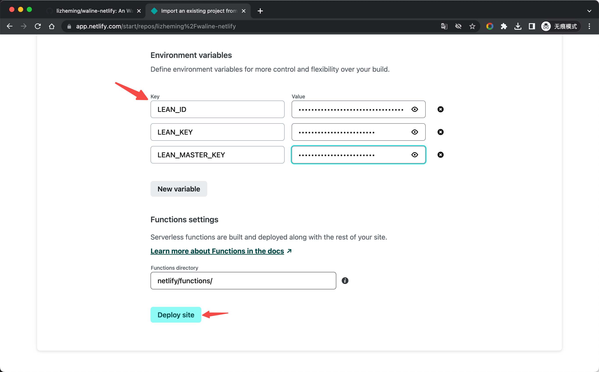
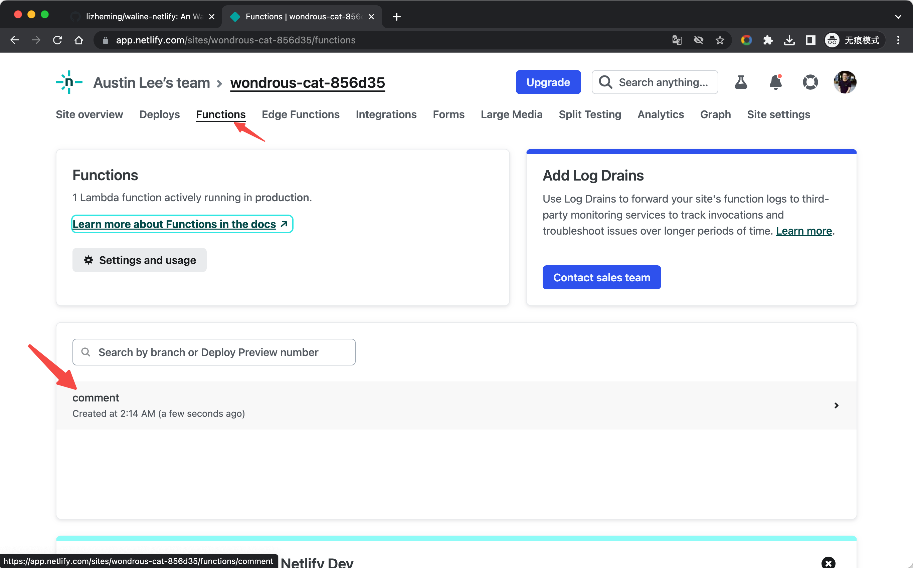
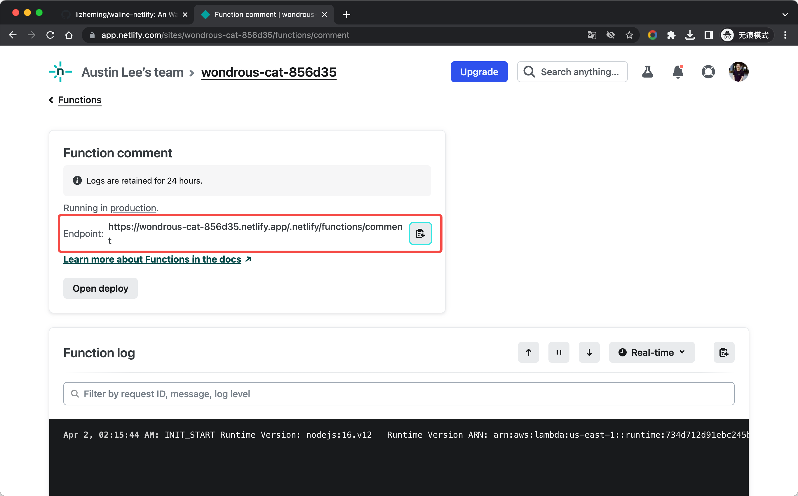
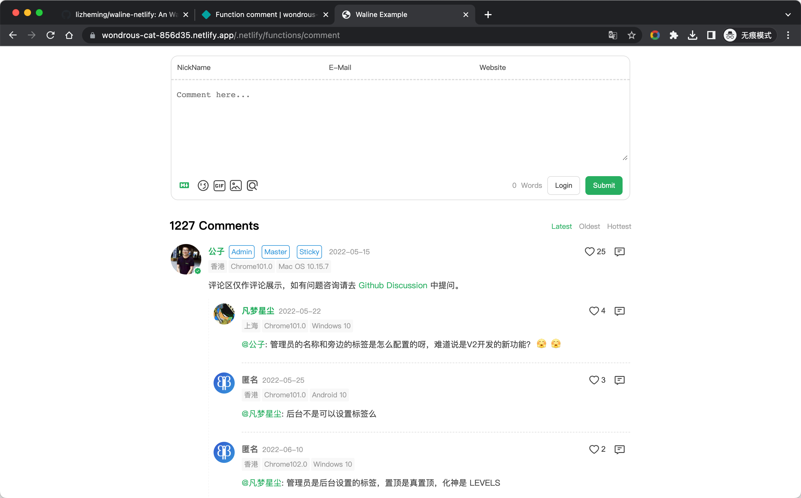
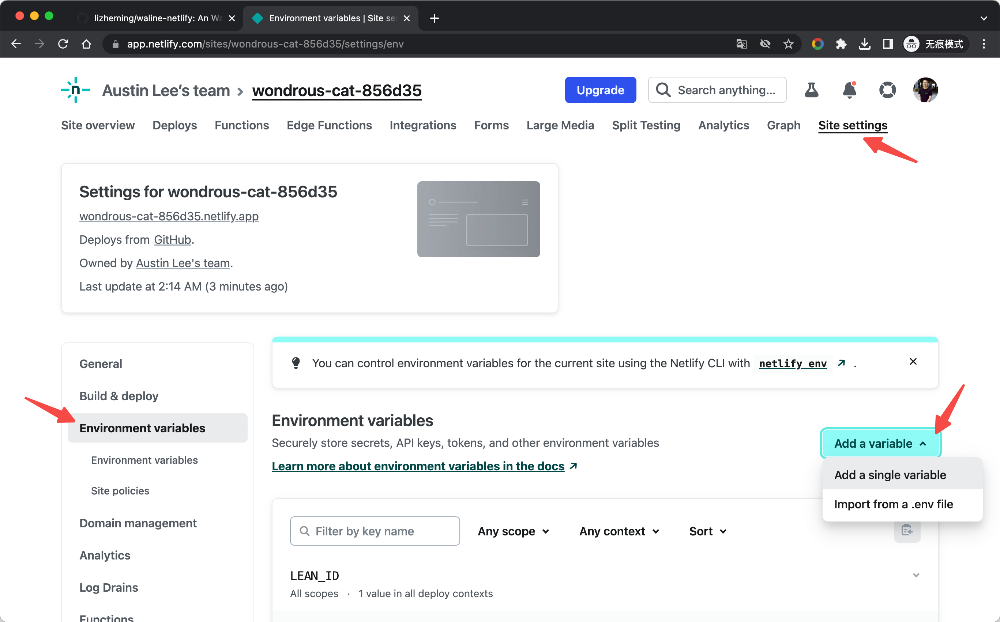
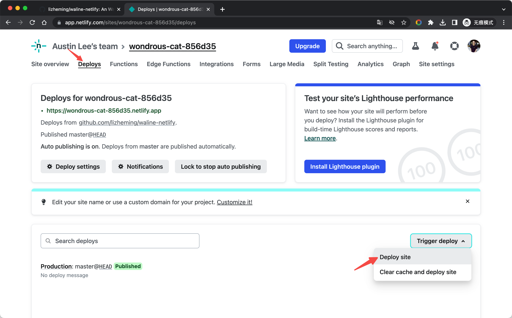

[Netlify](https://netlify.com) adalah penyedia layanan deployment website statis yang terkenal, dan [Edge Functions](https://www.netlify.com/blog/edge-functions-explained/) adalah layanan yang diluncurkan oleh Netlify yang memungkinkan kode JavaScript dijalankan di edge node website.

<!-- more -->

## Cara Deploy

Klik tombol [Fork](https://github.com/walinejs/netlify-starter/fork) untuk membuat scaffold starter netlify.

<https://app.netlify.com> Masuk ke konsol Netlify, pilih <kbd>Add new site</kbd> - <kbd>Import an exist project</kbd> untuk menambahkan situs. Pilih autentikasi GitHub untuk membaca daftar proyek GitHub kita. Cari nama gudang yang dihasilkan oleh Fork tadi dalam daftar, dan klik proyek tersebut untuk mulai membuat website Netlify kita berdasarkan gudang ini.

 

Sebelum membuat website Netlify, kita perlu mengisi beberapa informasi konfigurasi. Selain variabel lingkungan, kita dapat menggunakan default untuk informasi lainnya. Lihat [Dukungan Multi-Database](../database.md) untuk menambahkan variabel lingkungan layanan penyimpanan yang sesuai, kemudian klik <kbd>Deploy site</kbd> di bagian bawah untuk mulai men-deploy situs.

Setelah beberapa saat, website Netlify kita berhasil di-deploy. Kita dapat mengklik bilah navigasi <kbd>Functions</kbd> di bagian atas untuk beralih ke daftar cloud function, di mana `comment` adalah layanan Waline yang telah kita deploy. Klik untuk masuk ke halaman detail cloud function.

Di halaman detail, alamat yang tercantum di `Endpoint` adalah alamat deployment layanan Waline kita. Klik tombol salin di sebelah kanan, buka di tab baru, uji pengiriman komentar, dan semuanya berhasil~ Selanjutnya, konfigurasikan nama domain ini di klien dan Anda bisa berkomentar dengan senang!

 

## Cara Memperbarui

Buka repositori GitHub dan ubah nomor versi `@waline/vercel` di file package.json ke versi terbaru.

## Cara Mengubah Variabel Lingkungan

Klik bilah navigasi `Site settings` di bagian atas, pilih sidebar `Environments variables`, dan masuk ke halaman manajemen variabel lingkungan. Klik tombol `Add a variable` untuk menambahkan variabel lingkungan.

Setelah mengedit variabel lingkungan, kita perlu masuk ke halaman `Deploys`, pilih `Trigger deploy` - `Deploy site` untuk meng-redeploy website agar variabel lingkungan berlaku.

 
