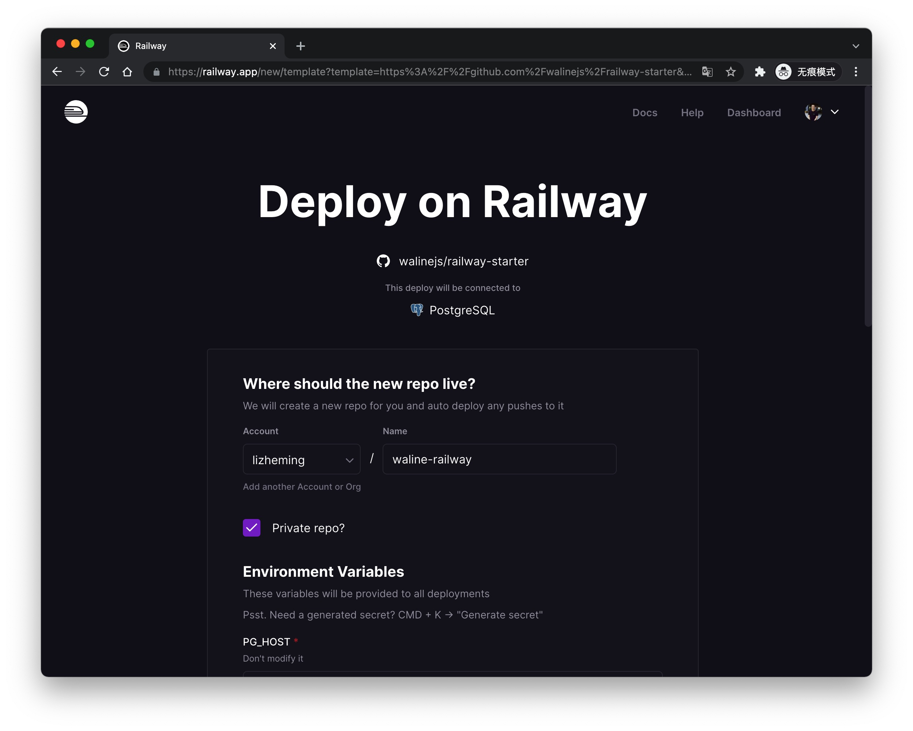
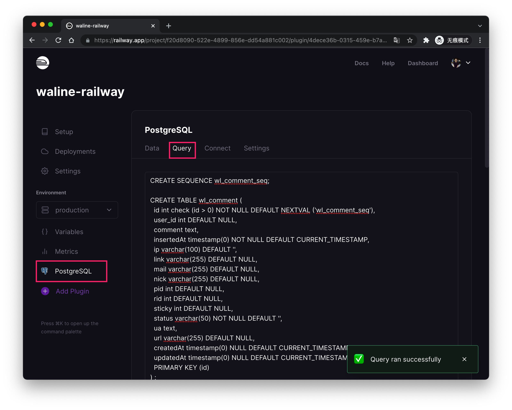
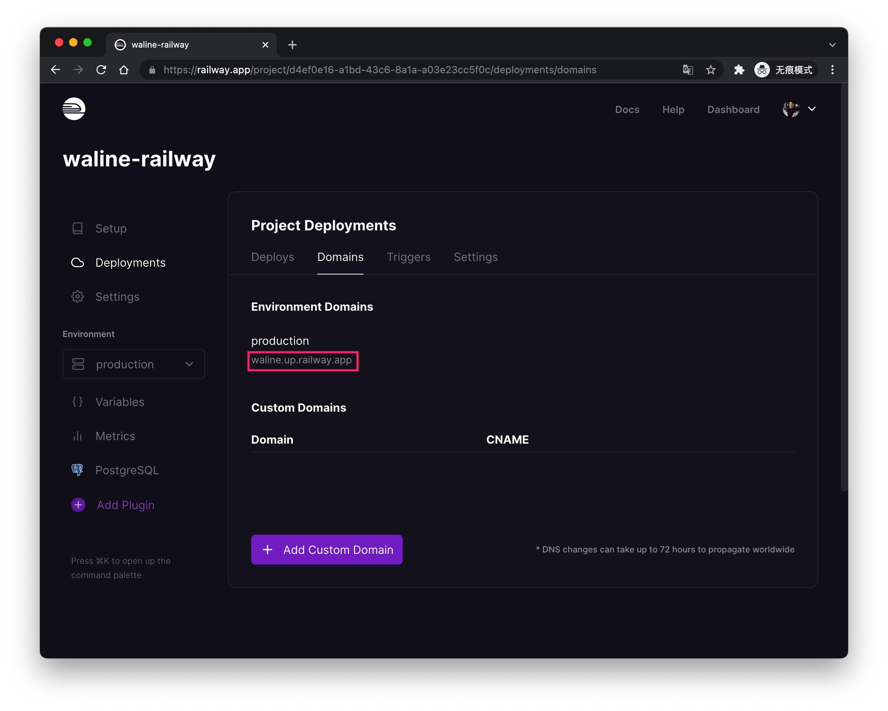
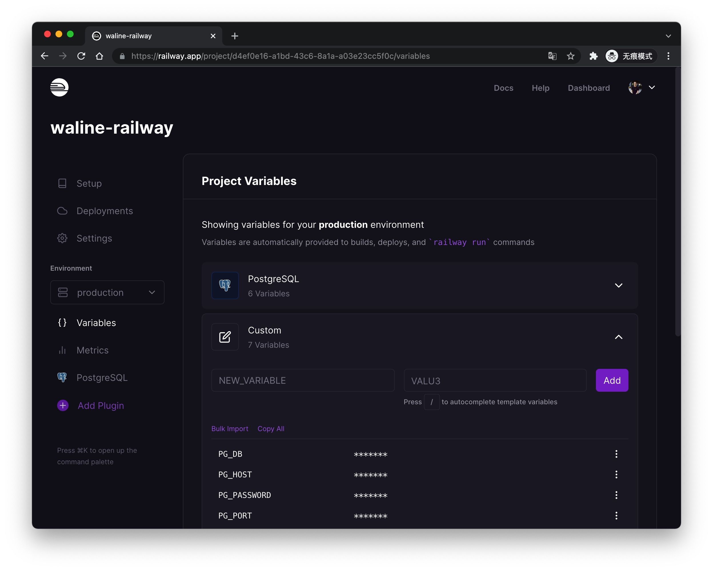

[Railway](https://railway.app/) adalah platform Serverless gratis, kita dapat men-deploy Waline ke platform Railway dengan mudah.

<!-- more -->

## Cara Deploy

Klik tombol ini dan Anda akan diarahkan ke platform railway.app untuk deployment cepat. Anda dapat memasukkan nama repositori GitHub baru atau menggunakan default setelah login, kemudian klik tombol <kbd>Deploy</kbd> di bagian bawah untuk mulai deploy. Perlu diperhatikan bahwa bagian variabel lingkungan tidak boleh diubah.

Setelah beberapa saat Anda akan diarahkan ke halaman dashboard. Klik <kbd>PostgreSQL</kbd> - <kbd>Query</kbd> dan tempelkan konten file [waline.pgsql](https://github.com/walinejs/waline/blob/main/assets/waline.pgsql) ke dalam textarea, kemudian klik tombol <kbd>Run Query</kbd> di bagian bawah untuk menginisialisasi database.

Terakhir Anda dapat mengklik <kbd>Deployments</kbd> - <kbd>Domains</kbd> untuk mendapatkan URL server. Salin URL situs dan masukkan ke konfigurasi `serverURL` klien. Kemudian Anda dapat menikmati waline!

## Cara Memperbarui

Buka repositori GitHub yang bersangkutan dan ubah nomor versi `@waline/vercel` di file package.json ke yang terbaru.

## Cara Mengubah Variabel Lingkungan

Klik tab <kbd>Variables</kbd> untuk masuk ke halaman manajemen variabel lingkungan. Deployment akan dilakukan secara otomatis setelah variabel diubah.

