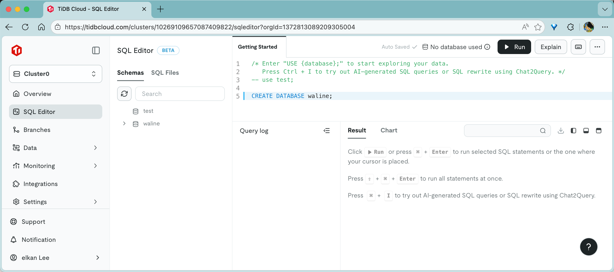
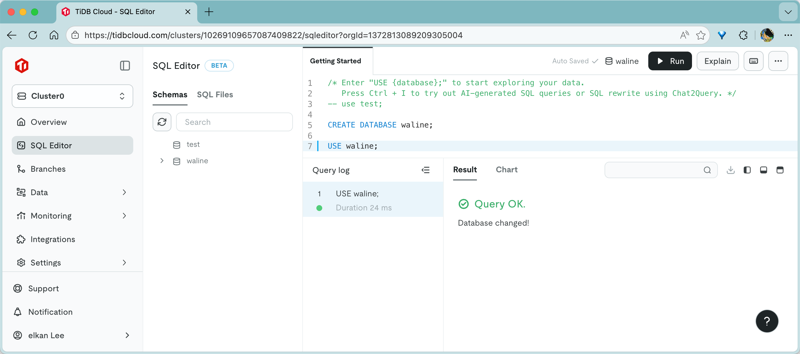
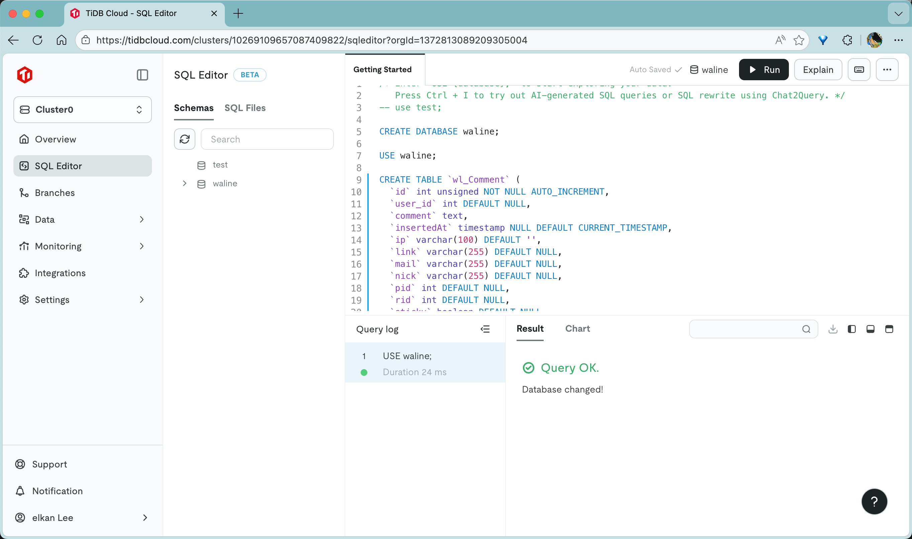
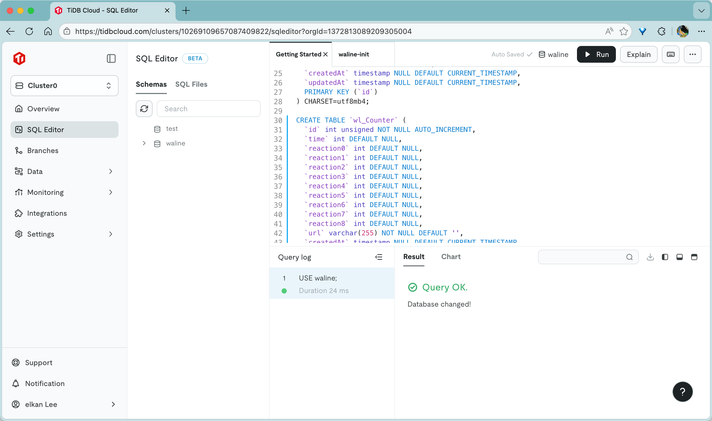
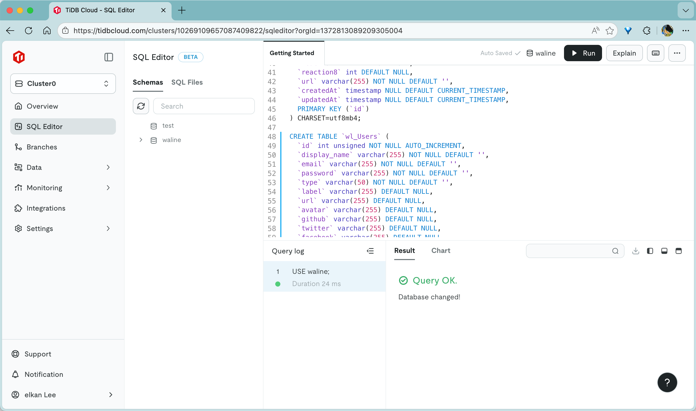
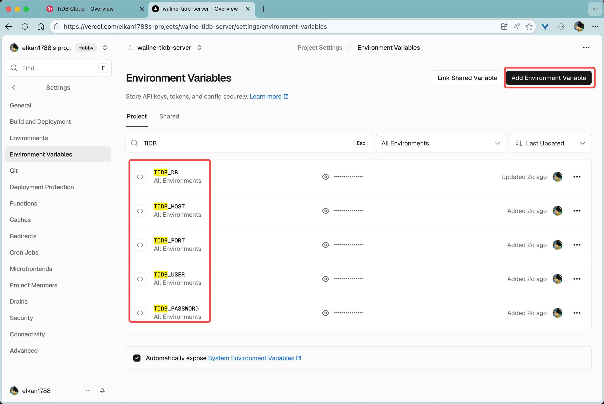

[TiDB](https://github.com/pingcap/tidb) adalah database NewSQL open source. [TiDB Cloud](https://tidbcloud.com/) adalah versi online resminya, yang menyediakan penyimpanan gratis 5GB untuk semua orang. Berikut ini menjelaskan cara membuat database Waline di TiDB Cloud.

## Membuat Database

1. Setelah masuk ke [TiDB Cloud](https://tidbcloud.com), sebuah instans TiDB akan dibuat secara otomatis, langsung klik <kbd>cluster0</kbd> untuk masuk ke instans

   

2. Pilih <kbd>SQL Editor</kbd> di daftar sebelah kiri dan ubah konten [waline.tidb](https://github.com/walinejs/waline/blob/main/assets/waline.tidb) dengan pembagian pernyataan `;` yang dieksekusi sesuai antarmuka. Klik tombol biru <kbd>Run</kbd> di sudut kanan atas untuk setiap kalimat, atau gunakan pintasan <kbd>Ctrl\/Command</kbd> + <kbd>Enter</kbd> untuk mengeksekusi
   
   
   
   
   

Sejauh ini database Waline telah berhasil dibuat!

## Mendapatkan Konfigurasi Koneksi

Klik tombol <kbd>Overview</kbd> di sebelah kiri untuk masuk ke halaman utama, dan pilih <kbd>Connect</kbd> di sudut kanan atas untuk mendapatkan informasi koneksi.

Atur "Connect with" ke `General`. Klik juga <kbd>Reset password</kbd> pada baris berikutnya untuk menghasilkan password baru.

Dengan cara ini, Anda dapat memperoleh konfigurasi terkait koneksi.

## Deployment Vercel

Buat akun Vercel, tambahkan proyek, dan deploy layanan Waline. Kemudian buka <kbd>Settings</kbd> proyek dan masuk ke `Environment Variables`. Klik <kbd>Add Environment Variable</kbd> dan tambahkan variabel berikut: `TIDB_HOST`, `TIDB_PORT`, `TIDB_DB`, `TIDB_USER`, dan `TIDB_PASSWORD`. Setelah menambahkan variabel-variabel ini, lakukan redeploy proyek.

