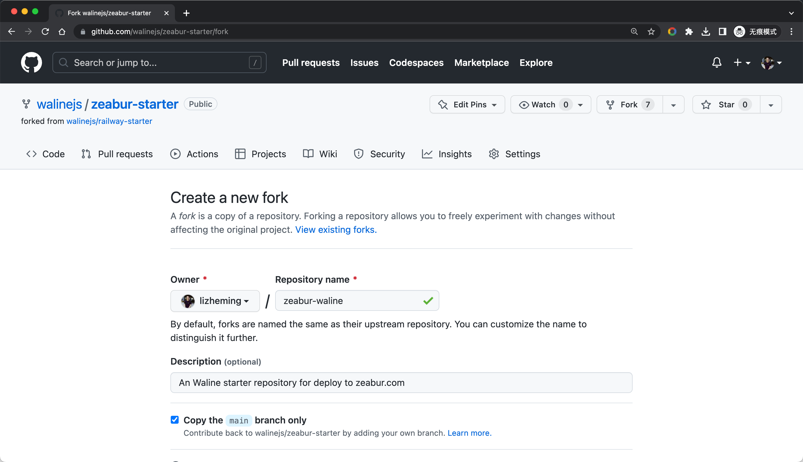
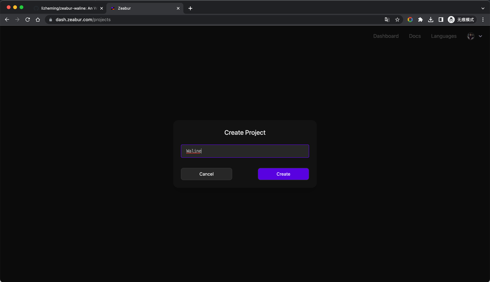
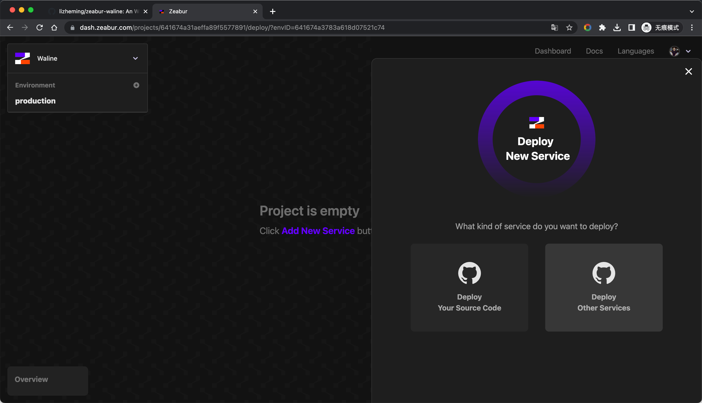
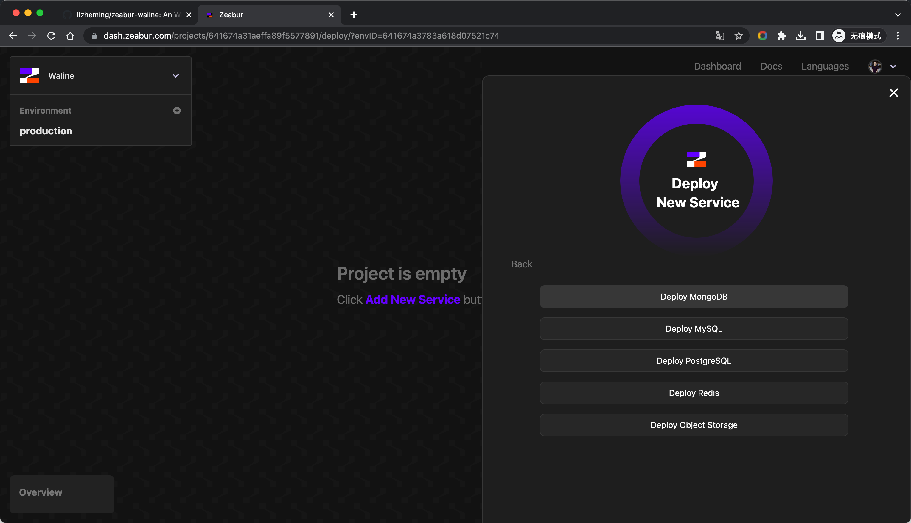
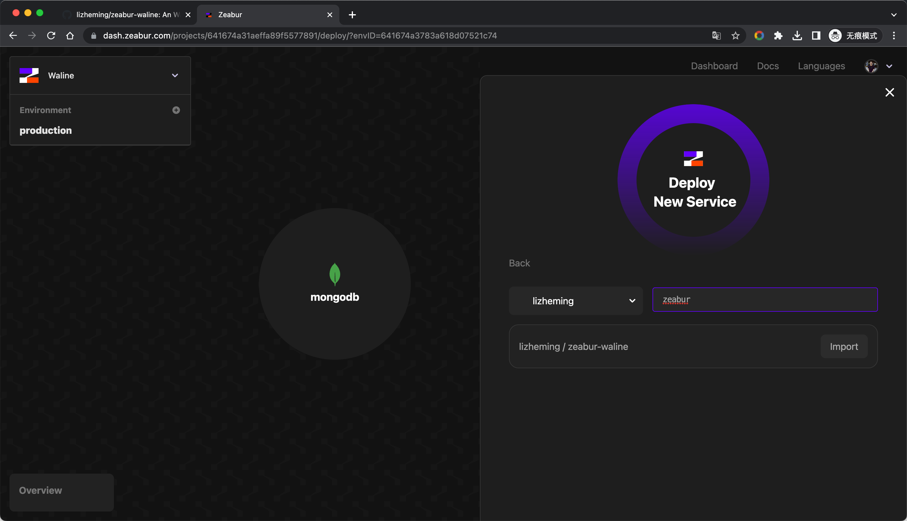
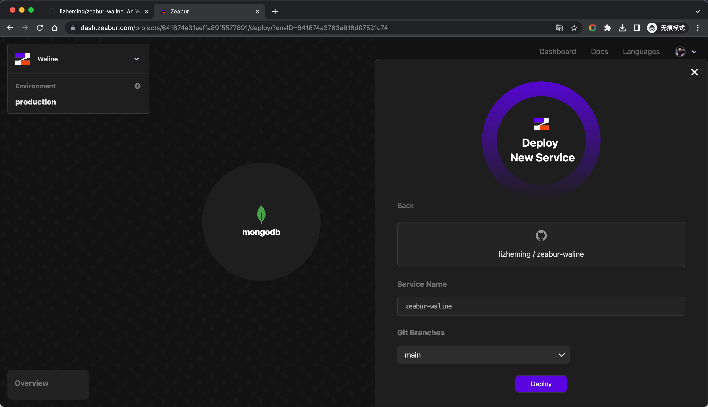
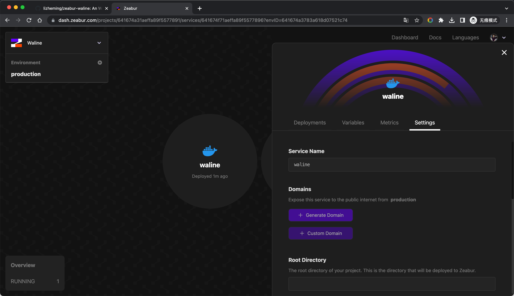
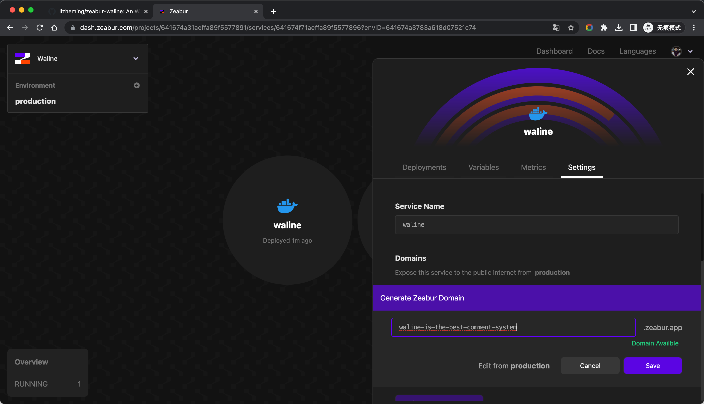
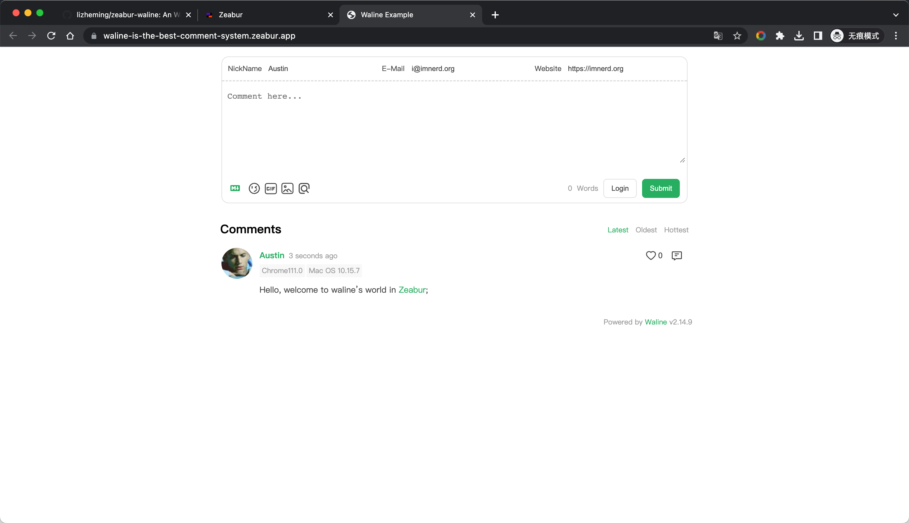
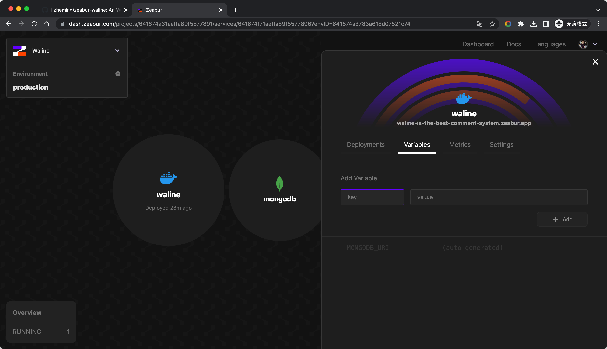

[Zeabur](https://zeabur.com) adalah platform yang membantu developer men-deploy layanan mereka sendiri dengan satu klik. Secara keseluruhan mirip dengan Railway, tetapi memiliki lebih banyak fungsi, tidak perlu mengikat kartu kredit, dan batas gratis lebih tinggi dari Railway.

<!-- more -->

## Deploy dengan satu klik

## Deploy dari awal

Klik tombol [Fork](https://github.com/walinejs/zeabur-starter/fork) untuk membuat scaffold starter Zeabur.

<https://dash.zeabur.com> Masuk ke konsol Zeabur. Jika belum ada proyek, Anda perlu menentukan nama untuk proyek baru terlebih dahulu.

Setelah masuk, klik <kbd>Add New Service</kbd> untuk membuat layanan, pilih <kbd>Deploy Other Service</kbd> - <kbd>Deploy MongoDB</kbd> untuk membuat layanan database terlebih dahulu.

Beri nama layanan database MongoDB kita, klik tombol <kbd>Deploy</kbd>, dan layanan database kita telah di-deploy.

 

Selanjutnya, kita lanjutkan mengklik <kbd>Add New Service</kbd> untuk membuat layanan Waline, kali ini kita pilih <kbd>Deploy Your Source Code</kbd>. Dalam daftar proyek GitHub berikut, temukan proyek yang kita fork di awal, dan klik tombol <kbd>Import</kbd> yang sesuai.

Beri nama layanan Waline kita, klik tombol <kbd>Deploy</kbd>, dan layanan Waline kita telah di-deploy.

 

Jangan terburu-buru menutup panel layanan Waline. Setelah layanan di-deploy, kita perlu menambahkan nama domain akses ke layanan. Klik tombol <kbd>Generate Domain</kbd> di bawah tab <kbd>Domains</kbd>, masukkan prefiks nama domain yang Anda inginkan dan klik tombol <kbd>Save</kbd> untuk menambahkannya sebagai nama domain akses layanan kita.

 

Semuanya sudah siap, dan langkah selanjutnya adalah menyaksikan keajaiban. Buka nama domain akses yang baru saja kita atur, uji untuk memposting komentar, semuanya berhasil~ Selanjutnya, konfigurasikan nama domain ini di klien dan Anda bisa berkomentar dengan senang!

## Cara Memperbarui

Buka repositori GitHub dan ubah nomor versi `@waline/vercel` di file package.json ke versi terbaru.

## Cara Mengubah Variabel Lingkungan

Anda dapat masuk ke halaman manajemen variabel lingkungan melalui tab <kbd>Variables</kbd>, dan akan di-redeploy secara otomatis setelah modifikasi.

