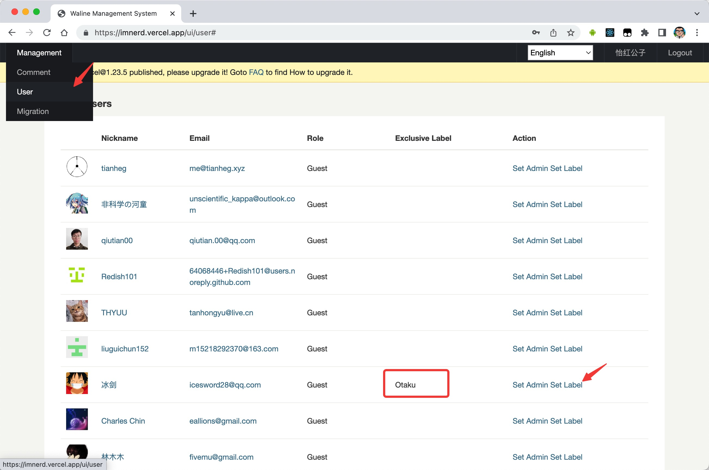
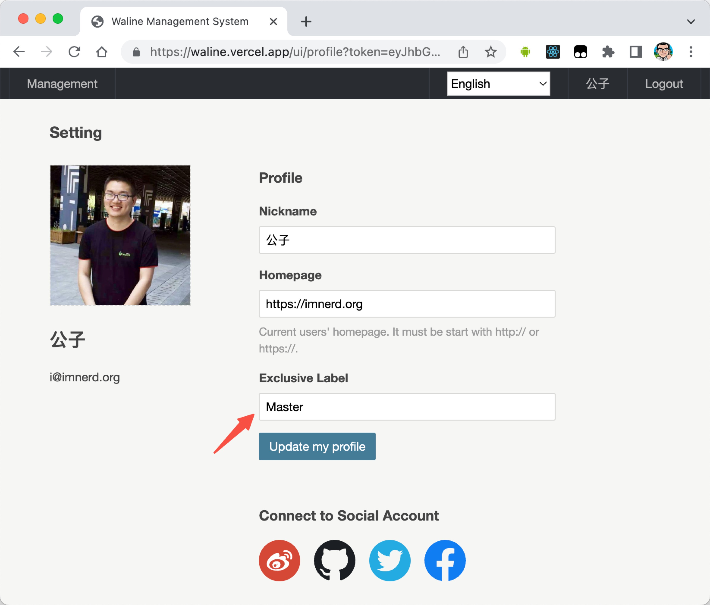

Waline memungkinkan Anda menetapkan label tingkat berdasarkan interaksi dan label kustom untuk pengguna yang sudah masuk.

## Label Tingkat

Anda perlu mengkonfigurasi variabel `LEVELS` di server untuk mengaktifkan fungsi ini. Lihat [Konfigurasi Variabel Lingkungan Server](../../reference/server/env.md#display).

Anda dapat mengkustomisasi label tingkat ini melalui opsi locales. Lihat [Multibahasa](./i18n.md#customize)

## Label Eksklusif

Anda dapat mengkustomisasi label untuk pengguna melalui sisi manajemen.

Sebagai pengguna yang sudah masuk, Anda juga dapat memperbarui label eksklusif Anda di halaman profil.

