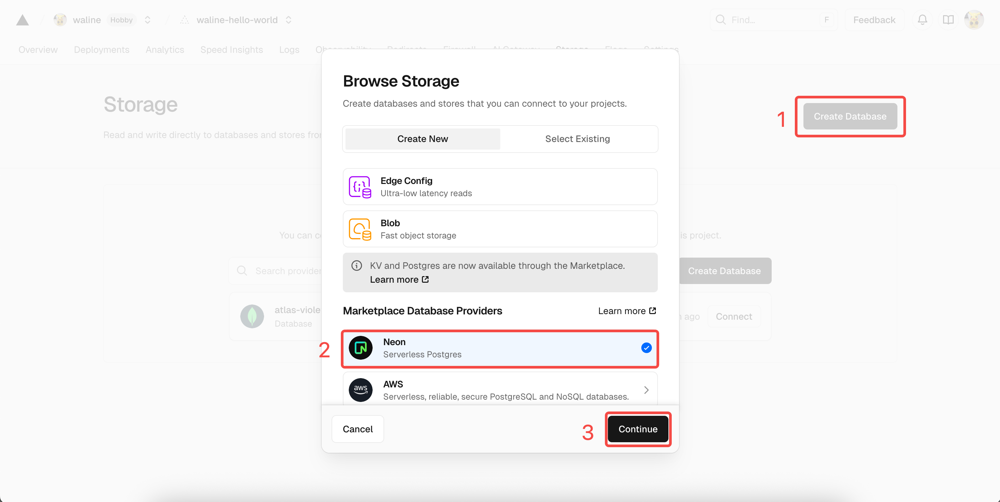
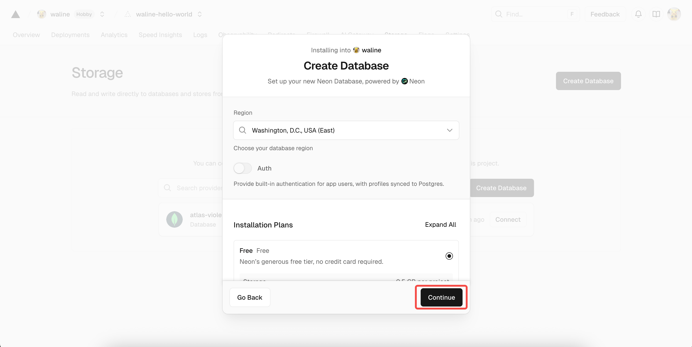
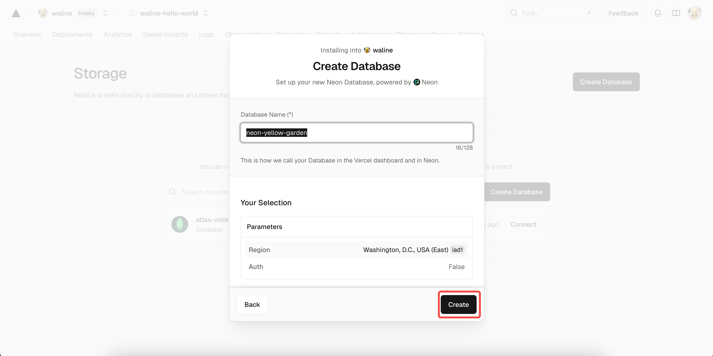
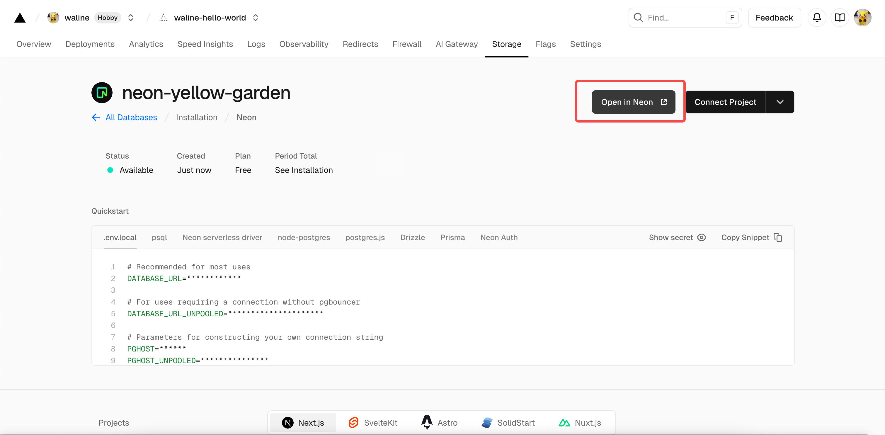
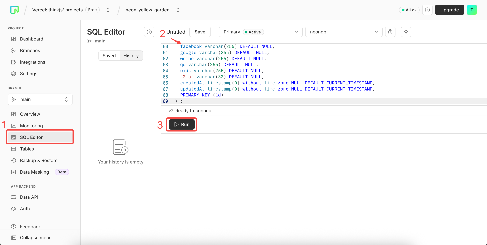
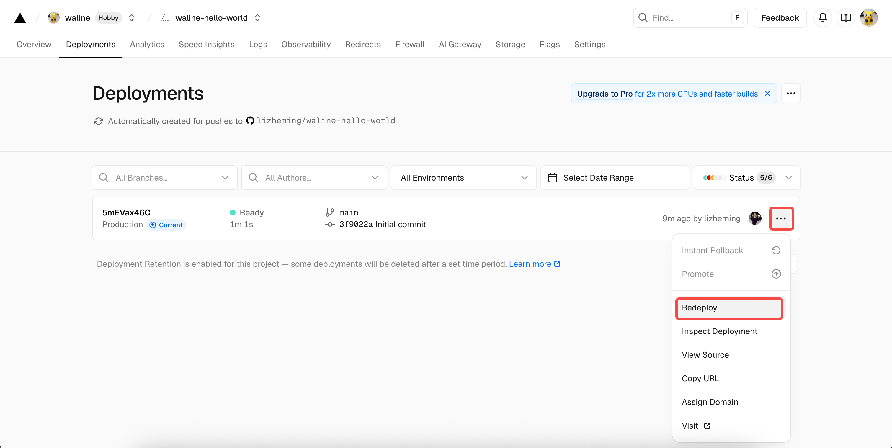
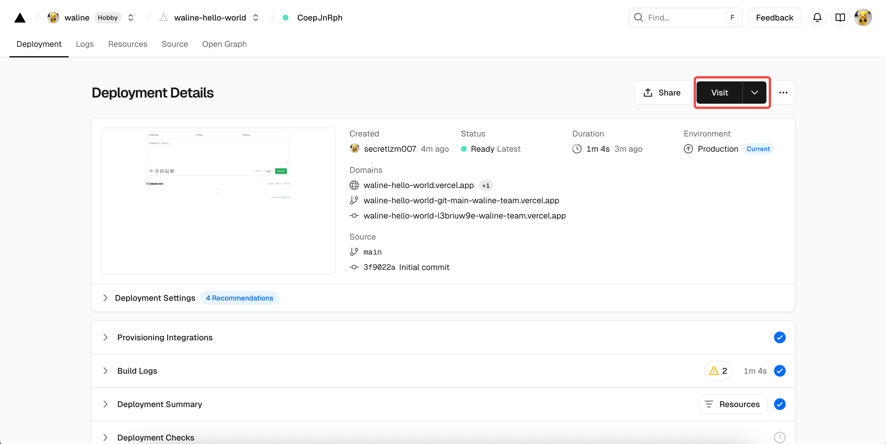
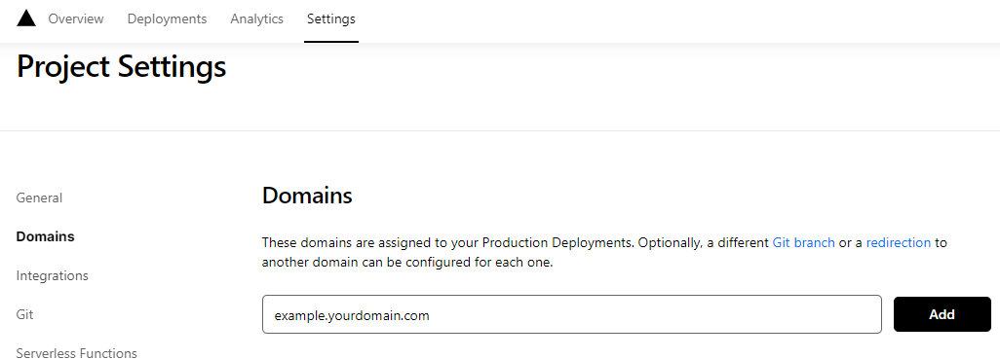
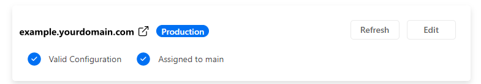

Selamat datang di Waline. Hanya dalam beberapa langkah, Anda dapat mengaktifkan Waline untuk menyediakan komentar dan penghitung halaman di situs Anda.

<!-- more -->

## Deploy Server

[](https://vercel.com/new/clone?repository-url=https%3A%2F%2Fgithub.com%2Fwalinejs%2Fwaline%2Ftree%2Fmain%2Fexample)

1. Klik tombol di atas untuk menuju Vercel dan men-deploy server.

   ::: note

   Jika belum login, Vercel akan meminta Anda untuk mendaftar atau masuk. Silakan gunakan akun GitHub untuk login cepat.

   :::

1. Masukkan nama proyek Vercel yang Anda sukai dan klik `Create` untuk melanjutkan:

   

1. Vercel akan membuat dan menginisialisasi repositori baru berdasarkan template Waline. Nama repositori akan sama dengan nama proyek yang baru saja Anda masukkan.

   

   Setelah satu atau dua menit, kembang api akan muncul di layar untuk merayakan deployment yang berhasil. Klik `Go to Dashboard` untuk berpindah ke dashboard aplikasi.

   

## Membuat Database

1. Klik `Storage` di bagian atas untuk masuk ke halaman konfigurasi penyimpanan, kemudian pilih `Create Database`. Pilih `Neon` sebagai `Marketplace Database Providers`, dan klik `Continue` untuk melanjutkan.

   

1. Anda akan diminta untuk membuat akun Neon. Klik `Accept and Create` untuk menerima dan membuatnya. Selanjutnya, Anda akan memilih paket database, termasuk region dan kuota. Anda dapat membiarkan semua default dan klik `Continue`.

   

1. Anda kemudian akan diminta untuk mendefinisikan nama database. Anda juga dapat membiarkannya tidak berubah dan klik `Continue`.

   

1. Sekarang Anda akan melihat layanan database yang baru saja dibuat di bagian `Storage`. Klik dan pilih `Open in Neon` untuk berpindah ke Neon. Di antarmuka Neon, pilih `SQL Editor` dari sidebar kiri, tempelkan pernyataan SQL dari [waline.pgsql](https://github.com/walinejs/waline/blob/main/assets/waline.pgsql) ke dalam editor, dan klik `Run` untuk membuat tabel.

   

   

1. Setelah beberapa saat, Anda akan diberitahu bahwa pembuatan berhasil. Kembali ke Vercel, klik `Deployments` di bagian atas, dan klik tombol `Redeploy` di sebelah kanan deployment terbaru. Langkah ini memastikan layanan database yang baru dikonfigurasi berlaku.

   

1. Anda akan diarahkan ke halaman `Overview` dan deployment akan dimulai. Setelah beberapa saat, `STATUS` akan berubah menjadi `Ready`. Klik `Visit` untuk membuka website yang di-deploy. URL ini adalah alamat server Anda.

   

## Mengikat Domain Kustom

1. Klik `Settings` → `Domains` di bagian atas untuk masuk ke halaman konfigurasi domain.

1. Masukkan domain yang ingin Anda ikat dan klik `Add`.

   

1. Tambahkan record `CNAME` baru di penyedia domain Anda:

   | Type  | Name    | Value                |
   | ----- | ------- | -------------------- |
   | CNAME | example | cname.vercel-dns.com |

1. Tunggu record DNS berlaku. Anda kemudian dapat mengakses Waline menggunakan domain Anda sendiri 🎉
   - Sistem komentar: example.yourdomain.com
   - Manajemen komentar: example.yourdomain.com/ui

   

## Import di HTML

Berikut cara menambahkan Waline ke halaman web atau website Anda:

1. Import stylesheet `https://unpkg.com/@waline/client@v3/dist/waline.css` di `<head>`

1. Buat tag `<script>` dan inisialisasi dengan `init()` dari `https://unpkg.com/@waline/client@v3/dist/waline.js` sambil meneruskan opsi wajib `el` dan `serverURL`.
   - Opsi `el` adalah elemen yang digunakan untuk rendering Waline. Anda dapat mengatur CSS selector dalam bentuk string atau objek HTMLElement.
   - `serverURL` adalah tautan ke server deployment Anda, yang baru saja dibuat di Vercel.
   - Untuk opsi lainnya, kunjungi [halaman Component Props](https://waline.js.org/id/reference/client/props.html)

   Berikut adalah contohnya:

   ```html {3-7,12-18}:line-numbers
   <head>
     <!-- ... -->
     <link rel="stylesheet" href="https://unpkg.com/@waline/client@v3/dist/waline.css" />
   </head>
   <body>
     <!-- ... -->
     <div id="waline"></div>
     <script type="module">
       import { init } from 'https://unpkg.com/@waline/client@v3/dist/waline.js';

       init({
         el: '#waline',
         serverURL: 'https://your-domain.vercel.app',
         lang: 'en',
       });
     </script>
   </body>
   ```

1. Layanan komentar kini akan berjalan dengan sukses di website Anda :tada:!

## Manajemen Komentar (Admin)

1. Setelah deployment selesai, kunjungi `<serverURL>/ui/register` untuk mendaftar. Orang pertama yang mendaftar akan ditetapkan sebagai administrator.

1. Setelah Anda login sebagai administrator, Anda dapat mengakses dashboard manajemen komentar. Anda dapat mengedit, menandai, atau menghapus komentar di sini.

1. Pengguna juga dapat mendaftar akun melalui kotak komentar, dan akan diarahkan ke halaman profil mereka setelah login.

## Tutorial Video

Pengguna Waline yang antusias membuat tutorial video berikut. Jika petunjuk di atas kurang jelas, Anda dapat merujuk ke video berikut:

<VidStack src="https://www.youtube.com/watch?v=SzEHzsme8uY" />
