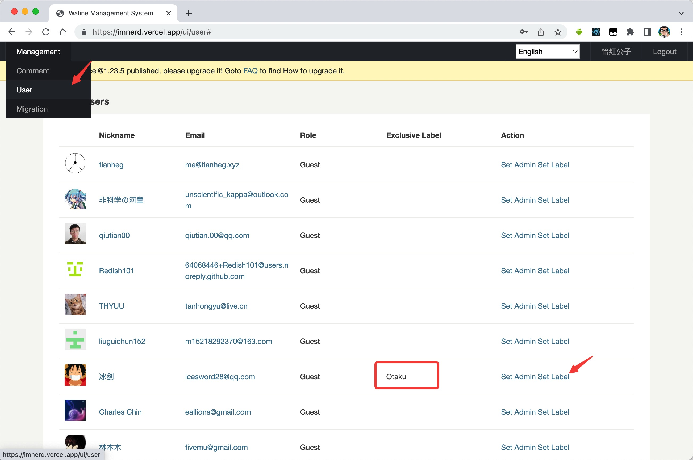
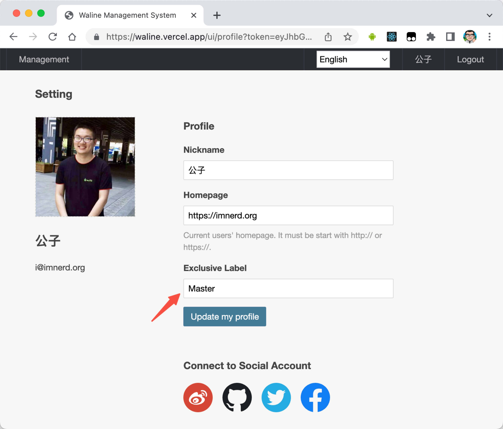

Waline allows you to set level labels based on interactions and custom labels for logged-in users.

## Grade labels

You need to configure the `LEVELS` variable on the server to enable this function, see [Server Environment Variable Configuration](../../reference/server/env.md#display).

You can customize these level labels via the locales option, see [Multilingual](./i18n.md#customize)

## Exclusive Label

You can customize labels for users through the management side.

As a login user, you can also update your exclusive label at profile page.

